# 第一模块 计算机发展史基础知识和操作系统的安装

## 1-1 计算机功能介绍
  
本章节主要介绍计算机的概念，起源和发展

**培训人:** 庚振源

**wifi:** Node-Student

**Password:** www.china-node.com

`计算机`来源于拉丁文字`computare`

计算机是一种可编程机器，在用户给出的输入时能自动并按顺序执行算数和逻辑运算，并在处理后提供所需的输出。

## 1-2 计算机两大组件

计算机组件分为两大类，即`硬件`和`软件`。硬件是机器及其连接的设备，如显示器，键盘，鼠标等。

软件是利用硬件执行各种功能的一组程序。

## 1-3 计算机硬件基础介绍

计算机的通用硬件:

**CPU**需要有专门的风扇。否则开机的时候会检测到CPU上面温度过高。

整个计算机，cpu和显卡是最占用电源功率的设备，考虑功率能不能带起来cpu和显卡。一般服务器的电源功率都在2kw以上，和个人机都不一样。相比笔记本，很耗电，而且声音很大

**硬盘**分为蓝盘红盘黑盘，3.5寸和2.5寸（笔记本用2.5寸的硬盘）。

**内存**，台式的内存卡和笔记本的不一样。厉害的服务器的性能都可能2个TB，插条都很多

**主板**(mother board)，整个计算机除了电源之外最重要的硬件。购买主板的时候肯定给你一个说明书。说这个电源线接什么设备。主板上面还有硬盘的SATA接口、内存插槽，还有CPU的槽位。现在基本都是CPU和风扇紧贴着的。而且CPU上一般还会摸一个硅脂方便散热。

**网卡**，可能会有板载网卡(集成网卡)，主板上就带一个网卡的，主板自带的，如果显卡是板载显卡估计性能打游戏不太好。

**声卡**，

**显卡**，

**风扇**，

**电源**，

## 1-4 机械计算机发展历史

人类祖先计数方式: 把多少根木棍捆一起就是几

后来有算盘，可以进行比较复杂的运算，有大写数字作为数字符号

1623年，德国科学家切克卡德(W.Wchickaed)制造了人类有史以来的第一台机械计算机，这台机器能够进行6位数的加减乘除运算

1642年，法国科学家帕斯卡(B.Pascal)发明了著名的帕斯卡机械计算机，首次确立了计算机的概念。

1674年，莱布尼茨改进了帕斯卡的计算机，使之成为一种能够连续运算的机器，并且提出了二进制的概念。

1725年，法国纺织机械师布乔(B.Bouchon)发明了穿孔纸带的思想。

1805年，法国机械师杰卡德(J.Jacquard)根据布乔'穿孔纸带'的构想完成了"自动提花编织机"的设计制作，在后来电子计算机开始发展的最初几年，在多款著名计算机中我们均能找到自动提花机的身影。

注：以上设备都是不带电的

1822年，英国科学家巴贝奇(C.Babbage)制造出第一台差分机，它可以处理3个不同的5位数，计算精度达到6位小数。

1834年，巴贝奇提出了分析及的概念，机器共分为3个部分：堆栈、运算器、控制器。他的助手，英国著名诗人拜伦的独生女 阿达.奥古斯塔(Ada Augusta)为分析机编制了人类历史上第一批计算机程序。阿达和巴贝奇为计算机的发展创造了不朽的功勋，他们对计算机的预见起码超前了一个世纪以上，正是他们的辛勤努力，为后来计算机的出现奠定了坚实的基础。

1847年，英国数学家布尔（G.Boole）发表著作《逻辑的数学分析》

1854年，布尔发表《思维规律的研究--逻辑与概率的数学理论基础》，并综合自己的另一篇文章《逻辑的数学分析》，从而创立了一门全新的学科-布尔代数，为百年后出现的数字计算机的开关电路设计提供了重要的数学方法和理论基础

1868年，美国新闻工作者克里斯托弗.肖尔斯(C.Sholes)发明了沿用至今的QWERT键盘

1890年，美国第12次人口普查中，使用了统计学家霍列瑞斯(H.Hollerith)博士发明的制表机，从而完成了人类历史上第一次大规模数据处理。此后霍列瑞斯根据自己的发明创立了自己的制表机公司，并最终演变成IBM公司。

1904年，世界上第一支电子二极管在英国物理学家 弗莱明 的手下发明了。佛莱明 获得了这项发明的专利权。


## 1-5 电子管计算机发展历史

#### IBM公司起源

1911年，6.15，美国华尔街金融投资家 弗林特(C.Flent)投资霍列瑞斯的制表机公司，成立了全新的CTR公司，但公司创立之初并没有涉足任何电子领域，反而生产诸如碎纸机或者土豆削皮机之类的产品。

1912年，美国青年发明家 德.弗雷斯特(L.De Forest) 在帕洛阿托小镇首次发现了电子管的放大作用，为电子工业奠定了基础，而今日的帕洛阿托小镇也已成为硅谷的中心地带。

1913年，美国麻省理工学院教授 万.布什（V.Bush） 领导制造了模拟计算机`微分分析仪`。机器采用一系列电机驱动，利用齿轮转动的角度来模拟计算结果。（开始用点了）

1924年，硅谷之父特曼担任斯坦福大学教授，对创建HP、成立斯坦福工业园区起到决定性作用。2月，由霍列瑞斯创办的制表机公司几经演变，最终更名为国际商用机器公司，即我们今天看到的IBM。(internation business machines corporation)

1935年，IBM制造了IBM601穿孔卡片式计算机，该计算机能够在一秒内计算出乘法运算。

1936年，20多岁的德国工程师 楚泽(K.Zuse) 研制出了机械可编程计算机Z1，并采用了二进制形式，其理论基础来源于布尔代数。

1939年，元旦，美国斯坦福大学研究生 比尔.休利特(B.Hewllet) 和 戴维.帕卡德(D.Packard)正式签署企业合伙协议，创办了Hewllet-Packard(HP 公司，即国内通称的惠普公司)

同年9月，贝尔实验室研制出M-1型计算机。

1939年，10月， 约翰.阿塔纳索夫 (John Vincent Atanasoff(1903-1995))制造了后来举世闻名的ABC计算机的第一台样机，并提出了计算机的三条原则：

1. 以二进制的逻辑基础来实现数字运算，以保证精度
2. 利用电子技术实现控制，逻辑运算和算术运算以保证计算速度
3. 采用计算功能和二进制数更新存贮的功能相分离的结构

这就是著名的计算机三原则

1940年9月，贝尔实验室在美国达特默斯大学演示M-1型机。他们用电报线把安置在校园内的M-1型机和相连，当场把一个数学问题打印并传输到纽约，M-1型机在达特默斯大学的成功表演，首次实现了人类对计算机进行的远距离控制的梦想。控制论之父维纳提出了计算机五原则：

1. 不是模拟式，而是数字式
2. 由电子元件构成，尽量减少机械部件
3. 采用二进制，而不是十进制
4. 内部存放计算表
5. 在计算机内部存贮数据

1941年，楚泽完成了Z3计算机的研制工作。这是第一台可编程的电子计算机，可处理7位指数、14位小数。使用大量的真空管。每秒钟能作3到4次加法运算，一次乘法需要3-5秒

1943年10月，绰号为`巨人` 的用来破译德军密码的计算机在英国布雷契莱庄园制造成功，此后又制造多台，为二战胜利立下汗马功劳

1944年，8月7日，IBM出资，美国人霍德华.艾肯(H.Aiken)负责研制的马克1号计算机在哈佛大学正式运行，它装备了15万个元件和长达800公里的电线，每分钟能够进行200次以上的运算。女数学家 雷斯.霍伯(G.Hopper)为他编制了计算程序，并声称该计算机可以进行微分方程的求解。马克1号计算机的问世不但实现了巴贝奇的夙愿，而且也代表着帕斯卡计算机问世以来机械计算机和电动计算机的最高水平。

1946年，2月14日，美国宾夕法尼亚州摩尔学院教授莫契利(J.Mauchiy)和 埃克特(J.Eckert) 共同研制成功了 ENIAC 计算机。这个计算机总共安装了17468只电子管，7200个二极管，70000多电阻器，10000多只电容器和6000只继电器，电路的焊接点多达50万个，机器被安装在一排2.75米高的金属柜里，占地面积为170平方米左右，总重量达到30吨，其运算速度达到每秒5000次加法，可以在3/1000秒时间内做完两个10位数乘法。

1947年，12月23日，贝尔实验室的肖克利，布拉顿，巴丁 创造出世界上第一只半导体放大器件，他们将这种器件重新命名为`晶体管`


## 1-6 晶体管计算机发展历史


1948年，6月10日，香农在《贝尔系统技术杂志》(Bell System Technical Journal)上连载发表了他影响深远的论文《通讯的数学原理》，并于次年在同一杂志上发表了自己的另一著名论文《噪声下的通信》。这两篇论文中，香浓阐明了通信的基本问题，给出了通信系统的模型，提出了信息量的数学表达式，并解决了信道容量、信源统计特性、信源编码、信道编码等一系列基本技术问题。两篇论文成为了信息论的奠基性著作，此时尚不满32岁的香农也成为了信息论的奠基人。

1942年，12月，ENAIC的两位缔造者共同创办了世界上第一家电脑公司`埃克特-莫契利计算机公司(EMCC)`(这个公司做的最牛逼的事情就是过去100万美元收购了VMware公司)

1949年，美国哈佛大学计算机实验室的上海籍留学生王安向美国国家专利局申请了磁芯的专利

贝尔实验室制造了M系列计算机的最后一个型号: M-6 并从此不再涉足计算机的研制与生产

贝尔实验室所研制的M系列继电器计算机，是从机械计算机过渡到电子计算机的重要桥梁

1949年，9月，马克3号计算机研制成功，马克3号也是霍德华.艾肯研制的第一台内存程序的大型计算机，他在这台计算机上手先使用了磁鼓作为数与指令的存储器。这是计算机发展史上的一项重大改进，从此磁鼓成为了第一代电子计算机中广泛使用的存储器

英国剑桥大学数学实验室Wikes和他的小组建成了一台存储程序的计算机EDSAC输入输出设备仍是纸带

1950年，东京帝国大学的中松义郎发明了软磁盘，开创了计算机存储的新纪元

1951年，6.14,当时仍在雷明顿-兰德(Remington-Rand)公司任职的莫契利和埃克特再次联手制作的UNIVAC计算机正式移交美国人口普查局使用，从而使电脑走出了实验室，开始为人类社会服务，人类社会进入了计算机时代。

1951年6月，王安创办了王安实验室，即王安电脑公司的前身，从此开始了王安电脑传奇般的经历。

1952年，1月，计算机之父，冯诺依曼设计的IAS电子计算机EDVAC问世。这台IAS计算机总共采用了2300个电子管，运算速度却比拥有18000个电子管的 埃尼阿克提高了十倍，冯诺依曼的设想在这台计算机上得到了圆满的体现

1953年，4.7，IBM正式对外发布自己的第一台电子计算机IBM701。并邀请了冯诺依曼、肖克利、奥本海默等人共150各界名人出席揭幕仪式，为自己的第一台计算机宣传。

8月，IBM发布了应用与会计行业的IBM702计算机，后续IVM推出了中型计算机IBM650，以低廉的价格和优异的性能在市场中获得了极大的成功，至此，IBM在市场中确立了领导者的地位。

1955年，贝尔计算机使用800只晶体管组装了世界上第一台晶体管计算机

1956年，9月，IBM的一个工程小组向世界展示了第一台磁盘存储系统 IBM 350 RAMAC(Random Access Method of Accounting and Control)

1957年，8月，`数字设备公司(DEC)`在美国波士顿成立。创立者是来自麻省理工学院的肯.奥尔森(K.Olsen)。此后的数十年中，DEC公司依靠自己的PDP系列，开创了小型机时代

1957年，`八才叛逆`从晶体管之父 肖克利(这个人喜欢又打又骂) 的实验室走出，创办了仙童(fairchild)公司，才有了intel、AMD等一大批目前我们熟知的公司。

1958年，11月，IBM推出了自己的IBM709大型机，这是IBM公司自IBM701以来性能最为优秀的电子管计算机，但同时他也是IBM最后一款电子计算机。


## 1-7 半导体集成电路计算机发展历史

1959年，2月6日，来自曾开发出第一台晶体管收音机的基尔比(J.Kilby)向美国专利局申报专利`半导体集成电路`（他用的是金属 锗）成功研究出世界上第一块集成电路

7.30仙童公司申请专利`半导体集成电路`（他用的是金属 硅）

1960年，麻省理工学院的 约瑟夫.立克里德(J.Licklider)发表了著名的计算机研究论文《人机共生关系》，从而提出了分时操作系统的构想，并第一次实现了计算机网络的设想。

1962年，供职于兰德公司的保罗.巴兰发表了一篇具有里程碑式意义的学术报告《论分布式的通信》，文中首次提出了‘分布式自适应信息块交换’，这就是我们现在称之为'分组交换' 的通信技术

1963年，8月，控制数据公司(CDC)的西蒙.克雷(S.Cray)博士带领自己的研发小组研制成功CDC6600巨型机，CDC6600仍然输于第二代电脑，共安装了35万个晶体管

1964年，4.7，在IBM成立50周年之际，由年仅40岁的 基恩.阿姆达尔 (G.Amdahl)担任主设计师，历时四年研发的IBM360问世，标志着第三代计算机的全面登场，这也是IBM历史上最为成功的机型

1965年，DEC公司推出了PDP-8型计算机，标志着小型机时代的到来

当时尚在仙童公司的摩尔发表了一篇仅有三页的论文，就是对今后半导体发展有着深远意义的摩尔定律。
积体电路上可容纳的电晶管数目，约每隔两年就回增加一倍，经常被引用的18个月，式英特尔首席执行官 大卫.豪斯 所说，预计18个月会将芯片的性能提高一倍(即更多的晶体管使其更快)

1966年，国防部启用了(ARPA)阿帕网

1968年，IBM公司首次提出了 温彻斯特(Winchester) 技术，探讨对硬盘技术做重大改造的可能性

4月，`通用数据公司(DGC)` 成立，创办人为从DEC离职的PDP-8设计是卡斯特罗

7.18，从仙童公司辞职的 戈登.摩尔(Gordon.Moore)，罗伯特.诺伊斯(Robert.Noyce)，威廉.肖克利(William.Shockley)共同创建了Intel公司，从此为计算机的发展和普及做出了不可磨灭的贡献

1969年，12.9，美国加利福尼亚大学的恩格巴特(Douglas Englebart)发明了世界上第一只鼠标。他的工作原理通过底部小球的滚动带动枢轴转动，并带动变阻器阻值来产生位移信号，信号经计算机处理，屏幕上的光标就可以移动。

恩格巴特博士设计鼠标的初衷就是想通过这种简便的操作方式来代替繁琐的键盘操作。但是在鼠标诞生的最初的十多年人们并没有意识到这种操作方式的简便性，直到1984年苹果Macintosh的诞生才改变人们的陈旧观念

1969年，DGC公司推出了自己的小型机Nova，成功的打入了一直被DEC把持的小型机市场，并成为当年最为红火的新兴企业。1999年破产

1969年，贝尔实验室在一部PDP-7上开发了Unix操作系统

1969年，5.1，桑德斯(Jerry Sanders)从仙童公司辞职，利用10万美元创立了AMD公司

1969年，10.29，阿帕网美国加州大学洛杉矶分校(UCLA)节点与斯坦福研究院(SRI)实现了第一次分组交换技术的远程通讯，这也标志着互联网的正式诞生。

1970年，10月，美国施乐公司(Xerox)在硅谷的帕洛阿托成立了

Palo Alto Research Center(PARC)研究中心，更为重要的是施乐并没有为来到这里的科学家指定任何的研究计划，而是让他们自由的发挥。

此后的几年中，PARC诞生了以太网、鼠标、面向对象、图标、菜单、视窗等等一系列改变今后计算机发展方向的全新概念，并间接孵化了Windows、Office、Macintosh等划时代的软件作品，从其间走出的科学家还创立了Abobe、3Com（后来的H3C）、Novell等等改变IT世界格局的企业

1971年，来自《电子新闻》的记者 唐.赫夫勒(Don Hoefler)依据半导体的主要成分 硅 命名了当时的帕洛阿托地区，硅谷由此得名

Donald C.Hoefler 是一位美国记者，因为首次使用`硅谷`一词而闻名。他的朋友Ralph Vaerst在1971年1.11开始的每周贸易报纸《电子新闻》上发表了一系列名为`美国硅谷`的文章中提到了`硅谷`这个名字。

**第一枚微处理器**

1971年1月，Intel的特德.霍夫研制成功了第一枚能够实际工作的微处理器4004,该处理器在面积约12平方毫米的芯片上集成了2250个晶体管，运算能力足以超过ENICA。Intel于同年11.15正式对外公布了这款处理器。

**C语言诞生**

1972年，曾经开发了Unix操作系统的Dennis Ritchie领导开发出C语言

全世界大部分的操作系统都是c语言开发的，剩下的语言是c++

1973年5.22,施乐PARC研究中心的 鲍勃梅特卡夫(Bob Metcalfe)组建的世界上第一个个人计算机局域网络--ALTO ALOHA网络开始正式运转，梅特卡夫将该网络命名为`以太网`


1974年,4.1,Intel推出了自己的第一款8位微处理芯片8080

1974年12月，电脑爱好者 爱德华.罗伯茨 (E.Roberts)发布了自己制作的装配有8080处理器的计算机`牛郎星`，这也是世界上第一台装配有微处理器的计算机，从此掀开了个人电脑的序幕

1975年，克雷完成了自己的第一个超级计算机`克雷一号(CARY-1)`，实现了每秒一亿次的运算速度。该机占地不到7平方米，重量不超过5吨，共安装了约35万块集成电路，同时这也标志着巨型机跨进了第三代电脑的行列

1975年，7月，比尔盖茨成功为牛郎星配上了BASIC语言后从哈佛大学退学，与好友保罗艾伦(Paul Allen)一同创建了微软公司，并为公司制定了奋斗目标:每一张桌子上都有一部微型电脑运行着微软的程序

1976年，4.1，斯蒂夫沃兹尼亚克(Stephen Wozinak)和斯蒂夫乔布斯(Stephen Jobs)创建了苹果公司，推出了自己的第一款计算机: Apple-1

1977年，6月，拉里埃利森(Larry Ellison)与自己的好友Bob Miner和Edward Oates一起创立了甲骨文公司(Oracle Corporation)

1979年，6月，鲍勃梅特卡夫离开了PARC，创造了3Com公司

3com开始是美国的，后来和华为合作成为了H3c，在后来华为不合作了，被惠普收购又卖出去。最终被紫光集团收购，可以理解为既是国产又不是国产的单位

1980年，不知名的Novell公司推出了NetWare网络操作系统

1980年9月30日，DEC、Intel、Xerox共同发布了`以太网`技术规范，这就是著名的以太网蓝皮书，后来DIX 2.0更名为Ethernet

1981年7月，沈望傅创立了创新科技公司，生产了世界上第一块声卡`声霸卡`，让PC具备了发声的能力，多媒体时代开启。

1980年，8.12,经过1年的开发，IBM内部尊称的PC之父的 唐埃斯特奇(D.Estridge)领导的开发团队完成了IBM个人电脑的研发，IBM宣布了IBM PC的诞生，由此掀开了改变世界历史的一页。同时微软推出MS-DOS1.0版本作为IBM PC的操作系统

1982年，2月，康柏公司成立(Compaq)

1982年，2月，Intel发布了80286处理器。时钟频率提升到20Mhz，并且增加了保护模式，可访问16M内存，支持1GB以上的虚拟内存，每秒执行270万条指令，继承了134000个晶体管

1982年,9.29，3Com公司开发了世界上第一款网卡。这是世界上第一款应用于IBM-PC上的ISA接口网络适配器

1982年，康柏公司退出便携式PC机。这也是第一台非IBM制造的PC兼容机

1983年，苹果公司推出了研制费用高达5000万美元的丽萨(LISA)电脑，这也是世界上第一台商品化的图形用户界面的个人计算机，同时这款电脑也第一次装备了鼠标。

1983年，5.8,IBM推出了IBM PC的改进型号 IBM PC/XT，并在其中内置了硬盘

1984年，迈克尔.戴尔成立了DELL公司

1984年，柳传志创立了联想公司(Lenovo)

1984年，1.24,苹果公司推出了划时代的Macintosh计算机，不仅首次采用了图形化界面的操作系统，并且第一次使个人计算机具有了多媒体处理能力

IDE接口诞生

1984.8.14,IBM推出了采用Intel 80286处理器的IBM PC/AT电脑

1984年年底，康铂开始开发IDE接口

1985年，Philips和Sony合作推出了`CD-ROM`驱动器

1985.7，Intel推出了计算机历史上举足轻重的80386处理器，这是intel公司的第一枚32位处理器

(x86系列就是Intel处理器数字以`86`结尾的处理器)

1985年.11.20,经历了多次延期之后，微软公司正式推出了windows操作系统，基于MS-DOS2.0

1986.9，康柏公司第一次退出领先于IBM的桌上型386个人电脑Deskpro PC

1986年.9月，Amstrad Annocunced发布便宜且功能强大，面向家庭设计的计算机 Amstrad PC 1512。该机具有CGA图形适配器，512KB内存，8086处理器20兆硬盘驱动器，并采用了鼠标器和图形用户界面

1987.4.2，IBM推出PS/2(Personal System/2)，这是IBM出的第三代个人电脑，采用Intel386处理器、微通道总线和OS/2操作系统。该系统定义了一些包括键盘与鼠标在内的外设使用的接口(一般称位PS/2接口)，使用非常广泛，一直到多年之后才逐渐被USB等后来开发的界面规格所取代

1987.11，微软推出了Windows 2.0版本，相比于上一个版本，微软加入了动态数据交换和覆盖式窗口等先进技术

互联网第一次威胁

1988年.11.2,由23岁研究生罗伯特.莫里斯(R.T.Morris)编制的 蠕虫 病毒 在互联网上大规模发作，这也是互联网第一次遭受病毒的侵袭，从此计算机病毒逐渐传播开来。1990.5.5纽约地方法院正式开庭，判处88年蠕虫病毒作者莫里斯3年缓刑，罚款1万美金和400小时公益劳动

1989.4.10，英特尔公司在拉斯维加斯电脑大展上首度发表继承有120万晶体管的486处理器

1989.4，华硕(ASUS)在台湾成立

1989年11月，声霸声卡正式发布。Sound Blaster(声霸卡)是一个电脑声卡系列产品，曾经是IBM个人电脑声效的非正式标准，由新加坡创新科技开发。推出后有多代版本

1990年，苹果和Motorola(摩托罗拉)和IBM一同开发了基于RISC结构的微处理器PowerPC，为的就是能够和Intel公司的x86系列处理器抗衡

1990.5.22，微软宣布推出windows3.0操作系统，并在年底创下销售100万套的记录。当时的windows3.0对多媒体、网络等众多最先进技术的支持，从而被成为软件技术的一场革命

1992.4，微软推出3.1 ...

ID software在1991.2.1创办。因为当时电脑有图形、声音了，就专门开发游戏了

1991.10.5,芬兰大学生Linus,Torvalds开发了一种基于UNIX的操作系统-Linux，并且源代码全部公布开放在网络上，从而引发了全世界的源代码开放行动。Linux本身经过全世界无数程序员的改进后逐渐成长为一个成熟的操作系统

Internet正式成立。互联网协会(ISOC（Internet Society）)由美国非营利性组织成立于1992年，提供领先的互联网相关标准，教育、访问、策略。使命是`促进开放发展，演变以及利用互联网为世界各地的所有人民的利益`

1993年1月，nVidia在美国正式成立（现在基本上电脑上只要有独立显卡就有这个公司的东西）

1993.3.2，我国接入了Internet的第一根专线。中科院高能物理研究所租用ATT公司的国际卫星接入美国斯坦福线性加速器中心的64K专线正式开通

1993.3.22，Intel公司正式发布了奔腾处理器(pentium)。初期发布的奔腾处理器集成了300万个晶体管，工作在60-66MHz，每秒钟可执行1亿条指令。

1994.11.7，美国弗吉尼亚林克伯格学员数学教授发现崩腾处理器进行除法运算时会发生错误。这个消息瞬间传遍互联网。IBM12.12宣布停止采用崩腾处理器。12.20Intel总裁葛洛夫举行新闻发布会向用户道歉，无条件为奔腾处理器用户免费更换CPU。高达数十亿美元代价挽回了自己的声誉

微软发布了Windows NT操作系统，这也是第一个不依赖于DOS的视窗操作系统

1993年12.10，id Soft公司的FPS游戏作品《DOOM》正式提供下载。这个游戏也被评价为计算机历史上最优秀的作品，因为第一次让玩家体验到了流畅的三维空间，此时3D加速卡还没有问世，DOOM实现了一次巨大的技术飞跃。

1994年.3,Linux1.0发布，代码量17万行，当时是按照完全自由免费的协议发布，随后正式采用GPL协议。至此，Linux的代码开发进入良性循环，越来越多的人开始在自己的PC上尝试Linux操作系统

1994，3Dfx成立，专门研发显卡，但是更著名的是研发了很多厉害的游戏

1995年，3月，美国华裔青年杨致远和斯坦福大学的同学戴维菲洛共同创办了Yahoo公司（这是最早的搜索引擎，但是因为数据泄露的原因现在不太行了）

## 1-8 当代计算机发展历史

**计算机的功能介绍**

**计算机的组成**

**计算机的硬件**

**计算机的硬件发展历史**

公认的四个阶段

1. 电子管计算机
2. 晶体管计算机
3. 中小规模集成电路计算机
4. 大规模和超大规模集成电路计算机

当代计算机的定义

计算机由硬件和软件组成

硬件: CPU，内存，硬盘，主板，网卡，声卡，显卡，鼠标，键盘，显示器等

软件：操作系统。当使用硬件安装了操作系统之后，会成功被操作系统植入一系列的软件

硬件 + 软件 = 计算机(电子计算机)

## 2-1 操作系统工作原理

计算机 : cpu  mem  disk  hardware

操作系统(OS(Operation system))

操作系统中有个最核心的东西叫做kernel（内核），内核里有大量的drivers(驱动)，只要是个硬件，就需要使用驱动驱使硬件运行

由于内核和硬件很贴近，机器最直接能理解的是`机器语言`，有个语言比机器语言稍微高级一点，叫做汇编语言。

不同的硬件，不同的汇编语言不一样。比如，联想的汇编语言，在戴尔上运行不了。B语言是比汇编高级一点，C语言是集成了市面上所有的语言开发的。

python和shell不适合写操作系统是因为工作的层次很高，c语言适合写操作系统，主要写内核、操作系统

之后操作系统除了内核最重要的就是shell。无论GUI还是CLI，都直接连接着shell，shell将应用命令翻译成内核要执行的语言

操作系统要运行程序使用到的库主要由函数和库组成的

**OS**

cpu, mem, disk, hardware, kernel, Shell

世界上任何一个操作系统都会有`内核`,内核里有大量的`driver(驱动)`

**驱动**：为了能够良好的使用软件，必须使用驱动

---
#### 语言

**汇编语言**： 不同硬件的汇编语言不一样。联想的汇编语言放DELL上运行不了的。

**B语言**：比汇编语言高级一些，1969年前后贝尔实验室发明的。

**C语言**：写操作系统主要写内核。驱动也主要写C。
操作系统百分之75的代码是C语言写得，剩下百分之15的是C++。


---
#### Shell

shell分 GUI 和 CLI

GUI： graphical user interface
CLI： command line interface

函数库 是让外面安装进来的app能调用

shell将用户输入的命令调用给内核(系统调用)，进而调用硬件。内核感觉声卡有空闲的时候，就让声卡说话。

用户 -> APP -> Shell -> 内核(绝对C和C++写得) -> HardWare

## 2-2 操作系统发展阶段

**百度** -> `操作系统发展史`

1. 手工操作
2. 批处理系统
3. 多道程序系统
4. 分时系统
5. 实时系统
6. 通用操作系统 (操作系统OS)

**手工操作系统**

1946年

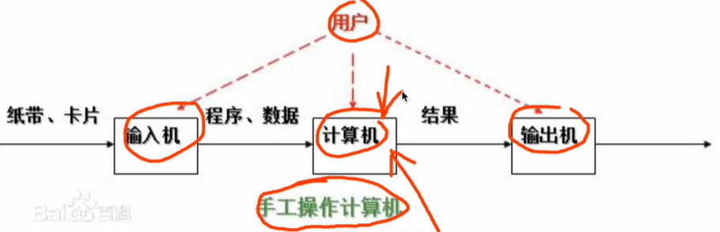

最早的手工操作系统，但是手工的速度永远都追不上计算机的计算速度

手工操作方式的两个特点:

1. 用户独占全机。不会出现因为资源已被其他用户占用而等待的现象，但资源的利用率低

2. CPU等待手工操作。CPU的利用不充分

20世纪50年代后期，出现人机矛盾：手工速度的慢速度和计算机的高速度之间形成了尖锐矛盾。唯一的解决方法: 摆脱人工的手动操作

**批处理操作系统**

批处理系统：加载在计算机上的一个系统软件，在他的控制下，计算机能够自动的、成批的处理一个或者多个用户的作业（包括程序、数据和命令）

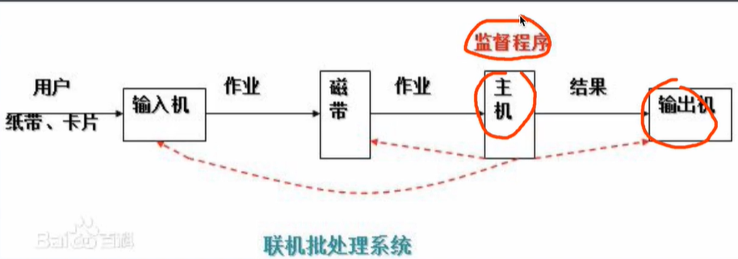

这其中的`监督程序`就是最基础的操作系统

首先出现的`联机批处理操作系统`，就是cpu来处理输入和输出

然后出现`脱机批处理操作系统`。（IOPS（每秒输入输出 Input Output Per Second）计算机就这个发展的慢）

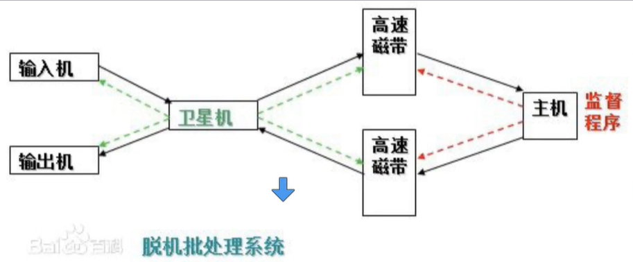

U盘的速度可能比计算机硬盘的速度块，但是U盘真正的读写速度取决于短板效应，这就是IO

离CPU越近的存储设备速度越快，容量越小

  **当代计算机离CPU远近排行榜**

寄存器 -> CPU的L1 cache(一级缓存) -> CPU的L2 cache（二级缓存） -> CPU的L3cache（三级缓存） -> 计算机的内存(Memory) -> 计算机的硬盘（disk） -> 输入设备(input device)

批处理操作系统给我们带来的就是人们意识到了操作系统的概念

人或者用户在对计算机进行操作的时候只需要提供输入即可，不需要进行计算和调节输出的作用。

**多道程序操作系统**

允许多个程序同时进入内存并运行。

下图为`单道程序工作示例`

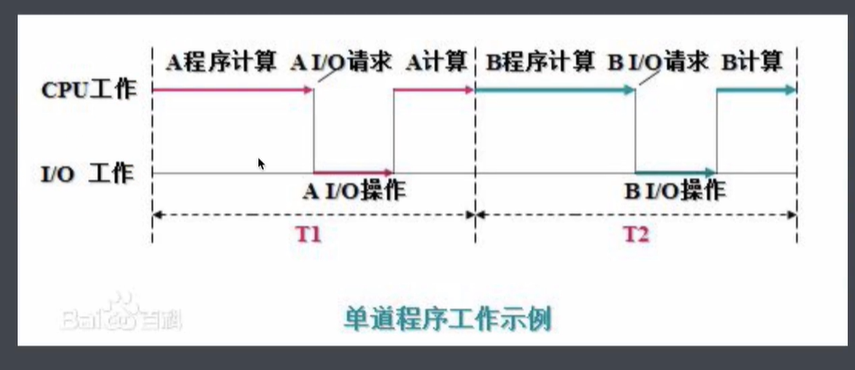

20世纪60年代开始了多道程序操作系统

**分时系统系统**

**实时系统系统**

1. 及时响应。对每一个信息接受、分析处理和发送的过程必须在严格的时间限制内完成

2. 高可靠性。需采取冗余措施，双机系统前后台工作·，也包括必须的保密措施

**通用系统系统**

具有多种类型操作特征的操作系统。可以同时兼有多道批处理、分时、实时处理的功能，或其中两种以上的功能。

当今的操作系统是通用操作系统，同时具备前人开发操作系统的所有的优势。

## 2-3 操作系统历史之windows

当今世界上三大主流操作系统: Windows, Linux, Unix

安卓系统底层基于linux，IOS底层基于Unix

1965年以前计算机的输入复杂并且缓慢，而相对而言，计算机

`美国电话电报实验室(AT&T)`的Bell实验室，`美国麻省理工学院`的人工智能(MIT)和`美国通用电气公司(GE)`连和研发一套多任务多用户的操作系统，称为`Multics (cs 是 computer system)`。该操作系统能实现多个用户同时操作计算机。

但是以当时的技术水平，想实现这个研究很困难。虽然已经研究出了Multics的雏形，但是达不到三家顶尖公司的目标，所以该项目后来迷失了。

当时Bell实验室很多工程师已经依赖于multics系统工作了，但是由于bell实验室的推出不能继续使用multics。其中有一个(Ken Thompson)正在开发一款游戏，叫做`space travel`。但是由于multics已经无法使用了，所以游戏项目就搁置了。

为了能让游戏继续开发，根据multics系统设计思想，使用汇编语言写了一款操作系统叫做Unics。由于参考了Multics的设计思想，所以Unics并不完全表示Uni。unics也可以实现多个用户同时使用。由于他写了一个Os，所以他的space travel项目的时候是运行在Unics上的。大家对游戏不感兴趣但是对游戏感兴趣，发现unics只能在PDP-7上运行。因为unics是使用汇编语言写得。

后来贝尔实验室的另一个人(Dennis Richie)想加入unics的研究，这俩人合伙儿了。手先要解决的就是这个系统的可移植性。当时他们采用B语言重新写了unics发现B语言太垃圾了，所以根据市面上的汇编语言加上B语言设计出了伟大的C语言。然后他们俩用C语言重写了unics(有朋友说这个词在西班牙语言是厕所的意思)，最终改名为Unix。

(
注: 1975年微软公司诞生，1976年苹果公司诞生

比尔盖茨1977年正式退学加入微软公司。
Bob写了个操作系统，Bill花5万买了Bob的操作系统。
然后Bill改了改这个系统成为了MS-DOS操作系统。
)

1977年，Berkeley大学的Bill Joy(Sun公司的创始人)针对他的机器修改Unix源码，称BSD(Berkeley Software Distribution)。从BSD开始，各大厂商根据自身公司架构，并以BSD系统为基础进行Unix系统的研发，从而产生了许多不同版本的unix操作系统。 

AT&T公司由于反垄断法卖不了OS。

1979年，Bell实验室从AT&T独立出来，不再受到之前法院对AT&T的反垄断法的约束了。Unix的开放权被Bell实验室收回(一个操作系统要收$20)，各机构纷纷因为付不起Unix的版权费而放弃使用Unix。经包装Unix获取商业利益的公司，如HP,IBM,SUN,Microsoft等，Bell实验室的一系列举动引起许多商业纠纷，这是对UNIX的一次重要的打击。

1980年8月12日，经过一年的艰苦开发，由后来被IBM内部尊称为PC之父的唐·埃斯特奇 领导的开发团队完成了IBM个人电脑的研发，IBM宣布了IBM PC的诞生，由此掀开了改变世界历史的一页。同时微软推出MS-DOS1.0版本作为IBM PC的操作系统。

windows操作系统的历史版本

从1975到现在有四十五年左右了

1985年 windows 1.0

1987-1990 windows2.0

1990 windows3.0

1995 windows95

1998 windows98

2000 windows ME

2001-2005 windows XP

2006-2008 windows Vista

2007 windows 7

2012 windows 8/8.1   win8只有这两个版本，寿命非常短

2015 windows 10

windows最大的特点就是蓝屏，但是win10是一个非常优秀被优化的产品了

---

:(

---

## 2-4 操作系统历史之unix

1976年，Apple诞生

苹果公司(Apple Inc)是美国的一家高科技公司。买了BSD，乔布斯的mac OS和手机里面的IOS都是非常纯正的unix

当初unix打官司最终结果是两败俱伤。最终的结果，是将BSD中的UNIX代码收回了90%,导致BSD的OS中unix的代码不足10%。虽然收回了，但是对方也没有赔多少钱。

BSD后来加入了很多自己写的东西，结果发现运行效果还很不错。

所以UNIX的发展出现了BSD这样一个操作系统，但实际上BSD并不算发展自unix

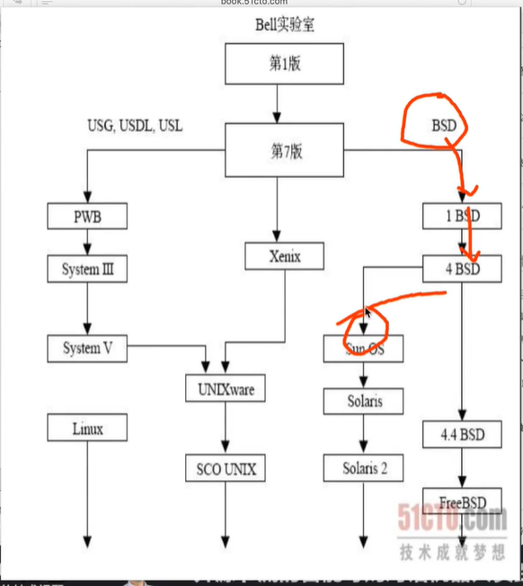

BSD 是免费的，可以认为是Unix目前比较大的一个分支。

unix目前主流的有:

* HP-UX是

* IBM-AX

* Sun solaris(Oracle solaris)

## 2-5 操作系统历史之Linux

1985年，GNU诞生 (GNU's Not Unix)

Richard Stallman在1983.9.27公开发起

终极目标: 创建一款OS，名字就叫GNU，让全世界的人类来使用。因为很多人都很穷，所以很多人都非常支持这个计划

开源: open source

C语言 -> `编译` -> 010101(二进制可执行文件)

二进制文件几乎不能还原成最开始的代码

为了防止开源人的代码被资本家拿去封装后卖然后饿死开发人员，所以有开源协议。GPL(GNU General Public License,GPL) 就是开源协议。

1991年Linux诞生。

Unix的版权被回收之后，各大学无法继续自由使用了。芬兰赫尔辛基大学教授Andrew为了给学生讲操作系统，自己参照Unix的思想 5000行代码左右写了一个Mini Unix操作系统。Linus想给这个OS完善代码，写了驱动等东西。教授为了保证代码的纯正性，拒绝了学生的添加代码的好意。Linux的正常发音(来呢克斯)。1991年8月25号Linus自己用c语言写完了linux(针对80386的Cpu)。9月1号公开了这个OS。

经过两年后Richard Stallman一直希望Linus去进行开源，但是此期间一直不想开源因为Os可能还不足够完善。

1993年Linux转向GPL进行了开源。此时Linux其实仅仅是个内核。但是Linux家上GNU的各种出色的软件，和GNU相辅相成。Linux这时候其实才是真正的诞生，Linux全名其实是GNU/Linux。linux遵循GPL开源的协定。

linux在服务器行业非常受到欢迎。Linux诞生出很多发行版:linux distribution。linux是一个改变世界的操作。任何人都可以通过www.linux.org, www.linux.org 去下载内核。

x.x.x(主版本号.次版本号.修改号)一般修改号比较大的时候，会增加次版本，有重大修改后会升一个大的版本号。linux分稳定版本内核和不稳定版本内核，我们下载的时候应该下载稳定版本的内核。所以linux天生适合作为服务器跑。

linux发行版，是linux kernel + open source + logo/photo 。其一分支: slackware,其中最有名的是SUSE；接着slackware是RedHat，十年前非常有名，有fedro，不过红帽的主线是RHEL，是企业级操作系统；CentOS；Debian，著名的发行版是ubuntu，还有kali(集成了大量的攻防工具)

知名的Linux发行版本
1. Fedora(更新时间3-6个月)
2. CentOS
3. Ubuntu
4. Debian
5. Open SUSE
6. SuSE Linux
7. RHEL(Red Hat Enterprise Linux)(更新时间3-5年)
8. 

RHEL和centos几乎一模一样。Centos几年前被红帽收购了。红帽公司最早的linux发行版本叫做`Red Hat Linux`。红帽将这个拆分为两个分支，一个是针对任何用户的Fedora。另一个针对企业用户RHEL。RHEL中的软件都是经过Fedora的严格测试的，服务是99999,有问题找红帽解决就好了。

windows在2000之后分成了server版本和个人版本。

win10和win7不适合作为服务器运行，因为稳定性不好。比尔盖茨这样可以收两个License。

Unix的版权费用比较贵，基本运行在小型机上；windows的95%以上的用户是PC，不到10%的是服务器上。

谷歌基于Linux做了很多层的封装才生成安卓机，正因为这个样子手机才比较慢，运行时间长了手机会比较卡。linux一开始的定位是服务器，现在是面对个人也是没问题的。安卓和苹果的应用商场是收费的，但是fedora也有应用商城，而且还是免费的。

## 2-6 自由软件介绍和开源的影响

网站: `www.gnu.org`

GNU是一个自由软件操作系统，尊重使用者的自由。GNU操作系统包括GNU软件包(专门由GNU工程发布的程序)和由第三方发布的自由软件。GNU的开发使你能够使用电脑而无需安装可能会侵害你自由的软件。

GNU自己的内核 the hard(GNU 本身也有OS)，但是比较烂，不如linux的

自由软件运动: 自由软件的用户可以自主控制自己的计算机，非自由软件使用户受制于软件开发者

开源一直促进着redhat的增长，目前年营收20亿美元。开源产品卖的是license，一般是一年卖多少多少钱这个样子卖。

GPL协议，说的就是你不能拿人家的项目进行商业行为，不然你就等着吃官司

WEB应用是世界上最广泛的应用。最流行的两个WEB软件，apache和nginx占80%的市场。著名的wireshark这个软件也是免费的。VLC也是一个开源软件。开源带来的就是IT行业的快速发展。中小规模和大规模的企业都可以使用开源软件。收费软件为啥不敢开放源代码，就是因为代码可能写的太差了。而开源软件一般写的都非常厉害。

阿里巴巴用在双十一确实用的是mysql，一般而言这样子是不可能的，因为mysql定位就是中小型企业，但是阿里巴巴有非常厉害的人改了mysql让他变得更适合阿里巴巴。

红旗linux把红帽linux的logo换成了红旗自己的一个linux壳子，曾经zf要求所有服务器换成红帽linux，但是发现非常失败。红旗倒闭了。

## 2-7 浅谈windows和linux

windows走进家家户户。

linux到现在也没有个人版，因为缺失一个软件，游戏。

linux确实比windows稳定。

windows的确比linux难学，因为windows是闭源的。而linux好学因为知道底层是怎么回事儿，知道内核代码。

windows光盘镜像下载位置:`https://msdn.itellyou.cn`

装系统多的话，淘宝上花几十块钱买个永久激活的也不亏。支持重装这种还是比较好的

## 2-8 下载linux发行版本光盘

安装windows分两步，先是下载光盘镜像，然后下载个激活码

Linux就比较简单。

如何获得Linux？

Linux也分为免费版本和商业版本

主流免费版本

* Fedora

* CentOS

* Ubuntu

* Open SUSE

商业版本

* RHEL

* SUSE Linux

* RHEL

下载红帽得登录红帽网站。镜像一般都只是内部人员使用。

下载主流免费版本的Linux方式:

* 官网

* 开源镜像网站（各个有名的大学基本都有自己的开源镜像网站，比如清华大学开镜像站，网易开源镜像站，搜狐、ali）

`x86-64`有时候会简称为`x64`，是64位处理器架构及其相应指令集的一种，也是intel x86 架构的延伸产品

## 3-1 普通PC硬件介绍

ThinkPad比较有名，耐用，价格相对贵一些。E系列是商务本，性能比较次一些。

普通PC硬件：

计算机核心硬件-主板

主板分为北桥南桥，高速设备一般放在北桥上，低俗设备一般放在南桥上

主板上有BIOS芯片，BIOS芯片里面有BIOS系统，有独立的电源系统（有专门的给BIOS供电的电池，可以扣掉）。

电脑看上去虽然关机了，但是BIOS里面有个时钟。

电源

磁盘

闪存  SSD

软盘

输入设备：  键盘 鼠标 扫描仪 摄像头 麦克风

## 3-2 CPU和内存详解

CPU(Central Processing Unit)，中央处理器。

CPU从出行发展到今天，由于制造技术越来越先进，集成度越来越高。内部的晶体管达到几百万个，从最初的CPU发展到现在晶体管增加了几十倍。但是CPU内部结构依然分为 控制单元 、 逻辑单元 、 存储单元  三大部分。CPU的性能大致上反应出配置的那部分微机的性能，因此CPU的性能指标十分重要。CPU的性能主要取决于主频和工作效率。

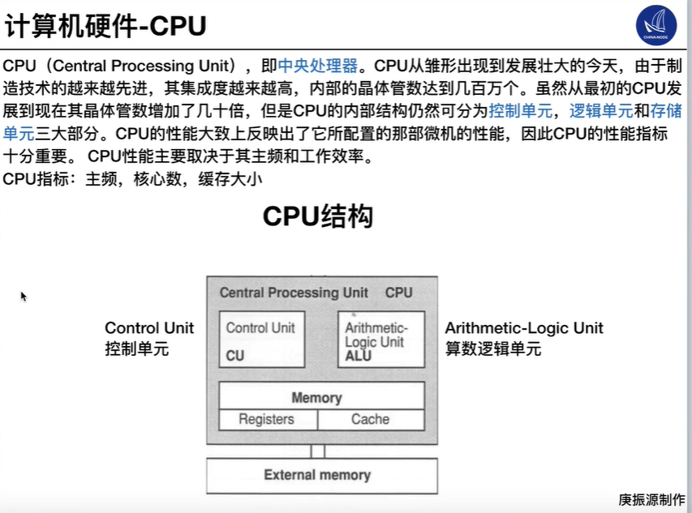

* 控制单元(Control Unit): 控制CPU工作的，是CPU的大脑

* 算术逻辑单元(Arithmetic-Logic Unit)： 提供计算

* 寄存器

* 一级缓存

* 二级缓存

* 三级缓存

一个数据被访问的频率越高，它的`热度`就越高

后来有了PCI这个东西，北桥南桥分的也不是很清楚了

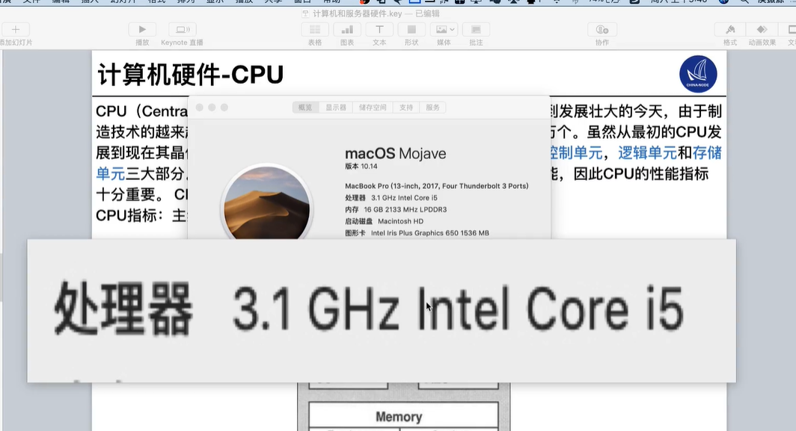

CPU指标: 主频、核心数、缓存大小

时钟频率： 理论上这个cpu一秒可运行31亿次

主频 也就是CPU的时钟频率，简单地说就是CPU的工作频率

一般来说，一个时钟周期完成的指令数是固定的，所以主频越高，CPU的速度也就越快。不过由于各种CPU的内部结构不尽相同，所以并不能完全用主频来概括CPU的性能。至于 外频 就是系统总线的工作频率；而 倍频 则指 CPU外频 与 主频 相差的倍数。

用公式表示就是:  主频 = 外频 * 倍频。 我们常说的赛扬433 、 PIII 550 都是指CPU的主频而言的。

三级缓存技术

* L1

* L2

* L3

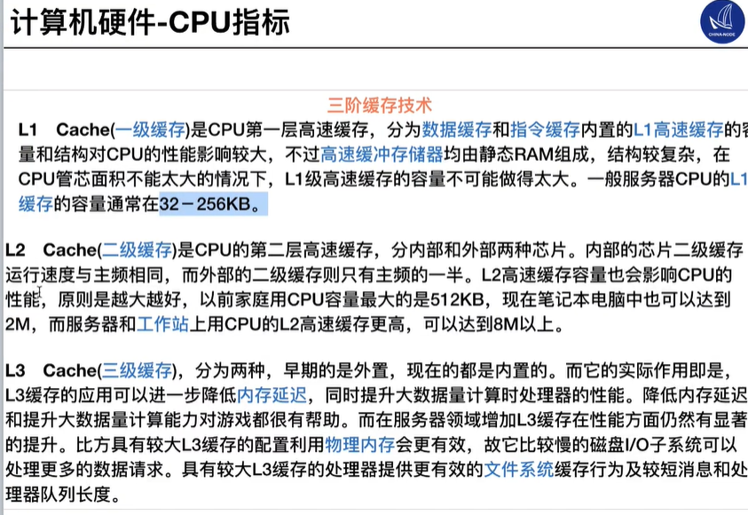

内存也叫主存

内存是计算机中重要的部件之一。内存是易失性存储，断电即消失(RAM)。

内存的指标是 频率 (单位: Mhz)

## 3-3 硬盘分类详解

根据工作原理，硬盘分为`机械硬盘`和`固态硬盘`

根据接口可分为:

* IDE或ATA（已淘汰）

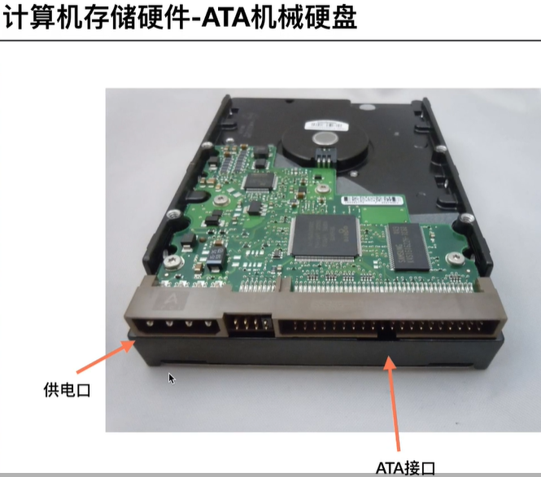

* SATA (99%的PC硬盘接口都是SATA)

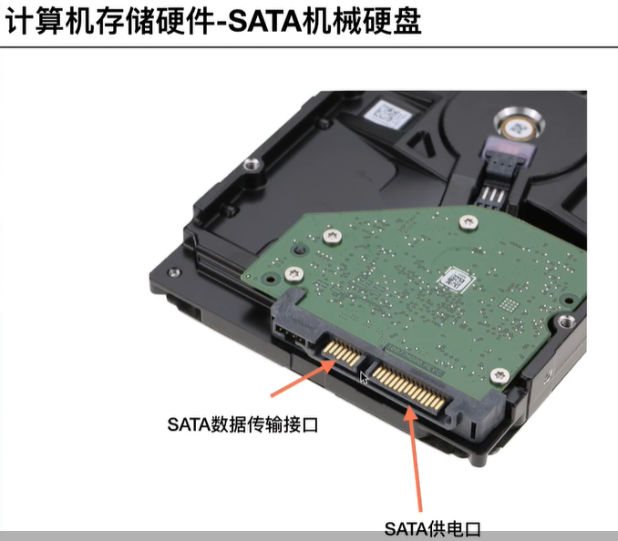

* SCSI（特点：贵，而且也被淘汰了）

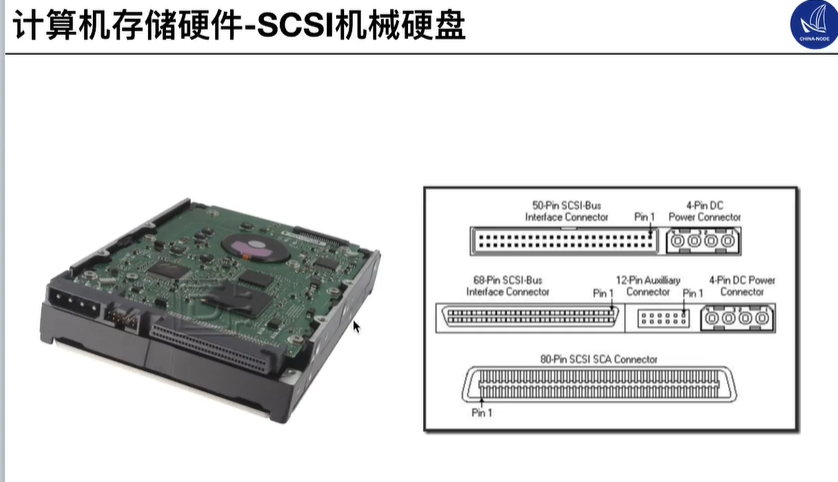

* SAS（比较贵，但是稳定性很号）

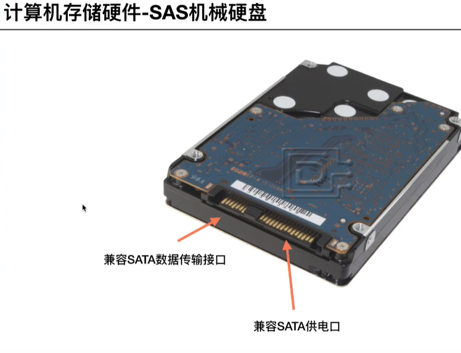

500G的SAS盘得几千块钱。

机械硬盘根据大小分为:

* 3.5寸大盘（台式机）
* 2.5寸小盘（笔记本）

服务器可以插大盘和小盘

颜色分类:

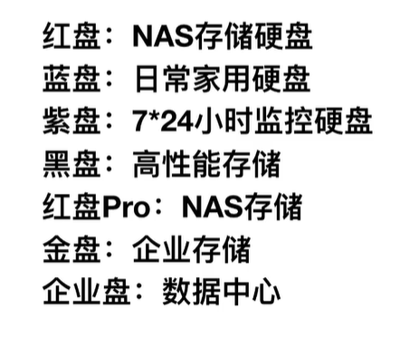

## 3-4 机械硬盘工作原理详解

硬盘分为机械硬盘和固态硬盘，硬盘的核心指标是IO

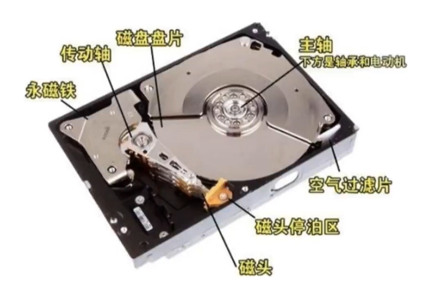

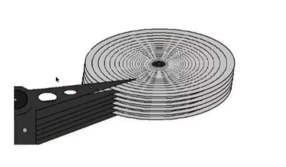

磁盘上的数据分布在磁道中的一段一段的

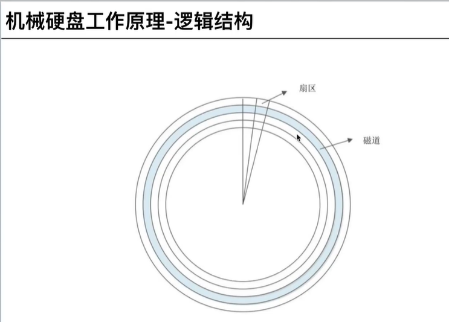

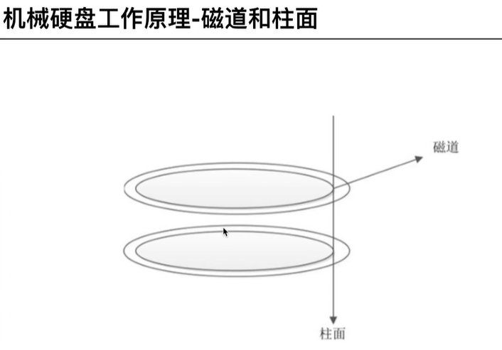

磁片之间是真空的，避免空气中的灰尘和水汽

## 3-5 windows系统C盘数据多卡顿原因

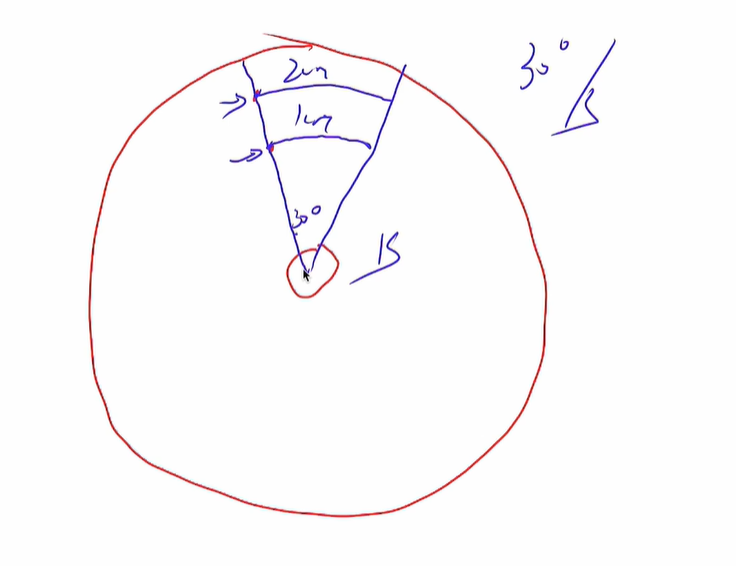

数据是从外往内写在磁盘上的，1s内靠外的磁道被读取的数据比靠内的磁道读取的数据多

CPU再快，磁盘慢计算机也会慢

只要C盘装成固态，就不会受到机械硬盘的这种问题了

## 3-6 固态硬盘介绍

固态硬盘的接口如下：

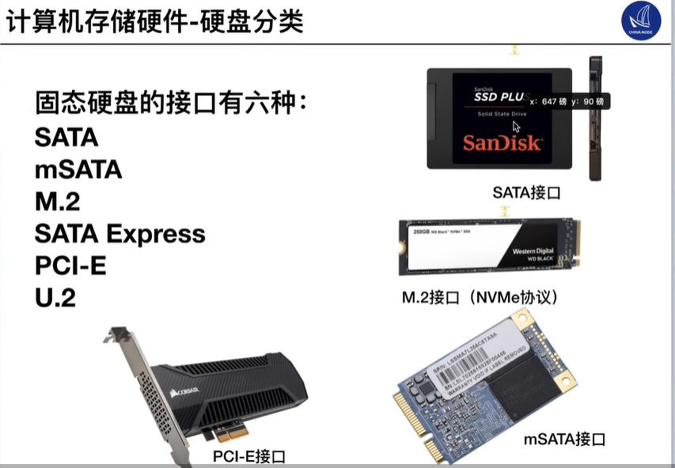

笔记本的主要用到的接口是SATA2(5400r/m(笔记本一般这个转数),7200r/m(台式机一般这个转数))和PCI-E。

机械硬盘的SAS一般分为10k r/m , 12k r/m

可见也有SATA接口。机械硬盘的寿命比固态硬盘长，固态硬盘是通过电磁流读写数据的。固态硬盘的读写次数是有寿命的，容量会逐渐变小，不过固态硬盘芯片会自己记录坏了的地方自动缩减容量。

苹果的固态硬盘可达到10G/s。

硬盘这个东西最怕静电，所以我们去机方操作硬盘的时候要带上防静电手套

## 4-1 服务器介绍

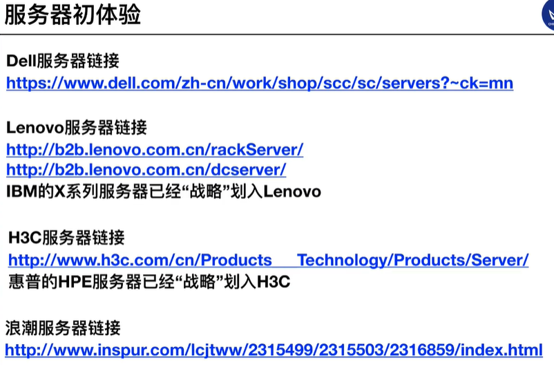

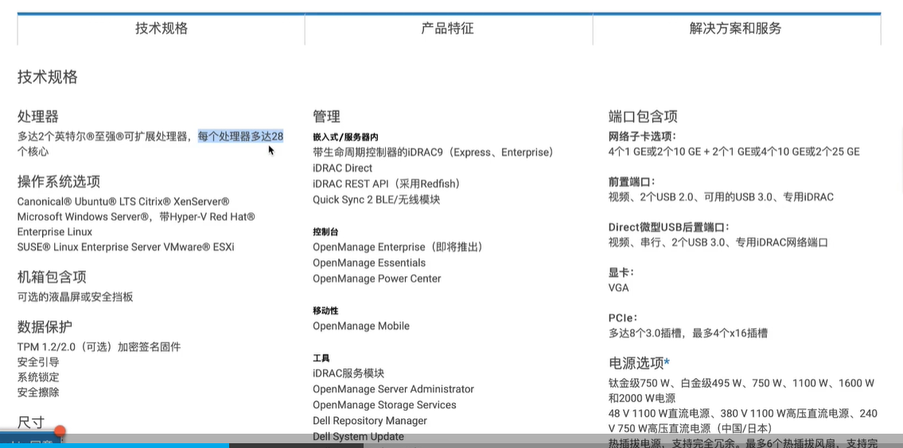

说明里面有两个CPU插槽

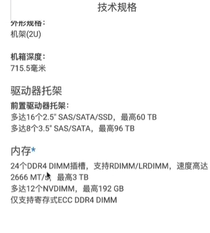

## 4-2 塔式服务器介绍

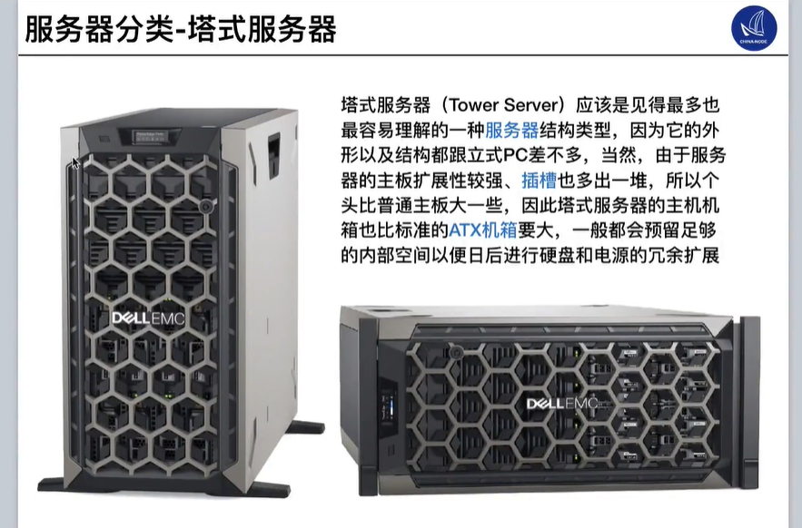

## 4-3 机架式服务器和机柜介绍

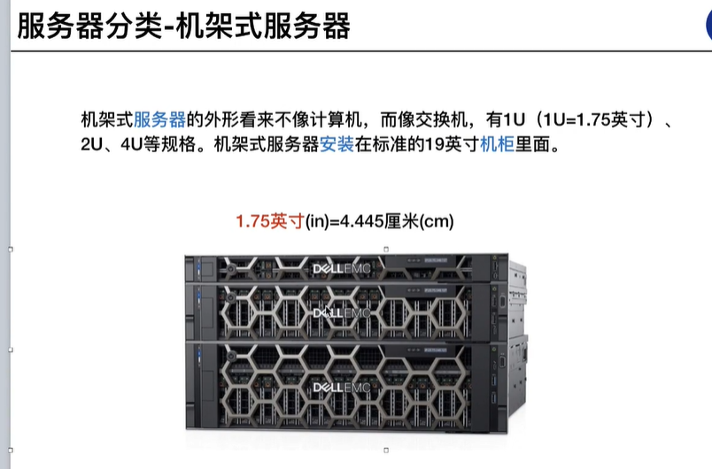

机架式服务器能放进机柜里，因为按U轮高度的大小且带有滑轨。1U=1.75英寸=4.445cm

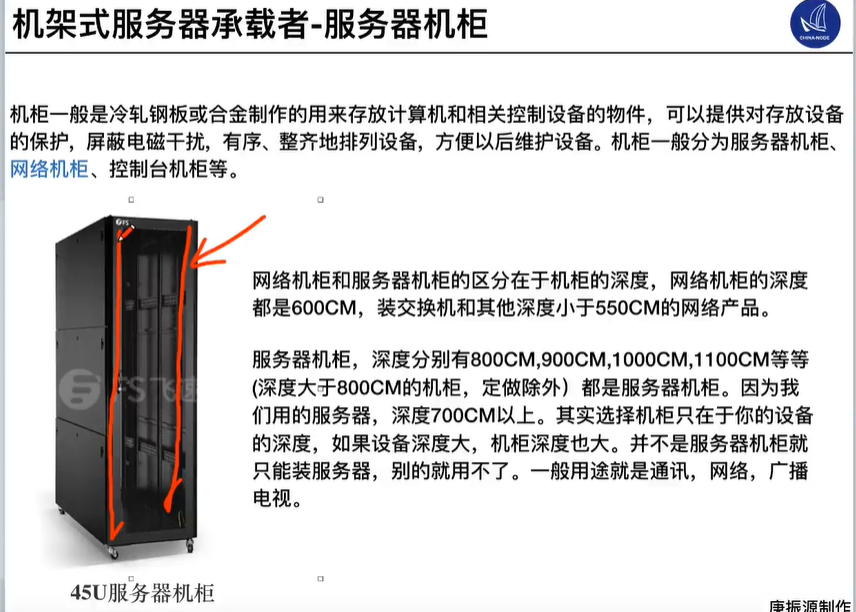

这是机柜，也叫机架


机柜之间要留有空隙，机房里还会有空调

## 4-4 刀片式服务器和刀箱介绍

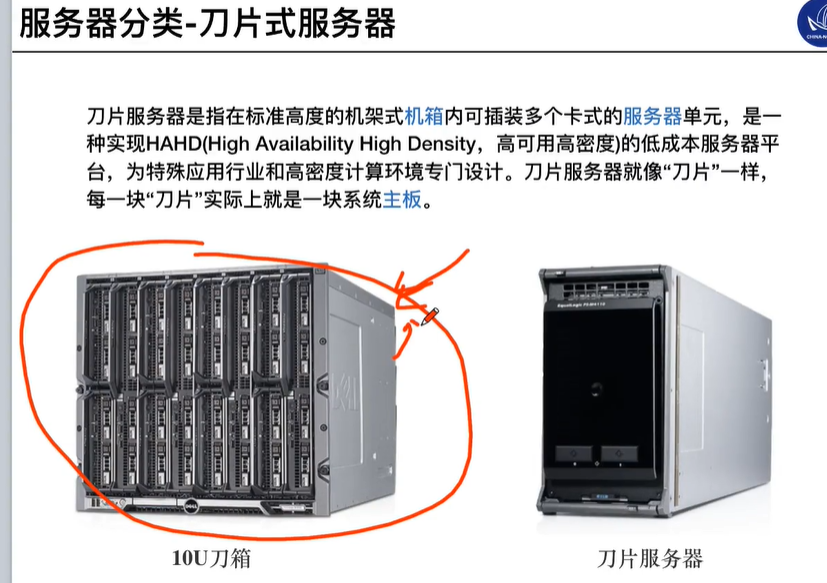

刀片式服务器性能挺好，老贵了，但是能极大的节省空间

比如，10U的机柜，能放几个2U的服务器？上2U空1U，这样子10U的机柜能够放3个服务器

而图中的10U的刀箱能放16个2U的服务器

做虚拟化的时候使用刀片服务器不错，因为密度大

一般政府用刀片式服务器用的多，因为政府办公室多机房小。

## 4-5 普通PC和服务器的区别

一般来说企业级的服务器等高出家用级别的服务器价格要高2-3倍以上

因为企业级的服务器硬件适用于持续性工作。PC自己连着开几天，肯定会有什么部件烧坏。

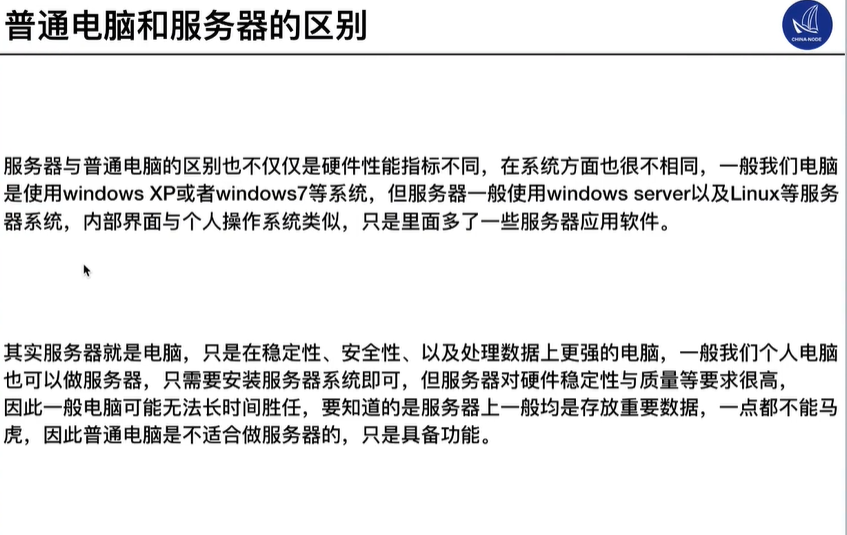

## 4-6 服务器重要硬件-电源详解

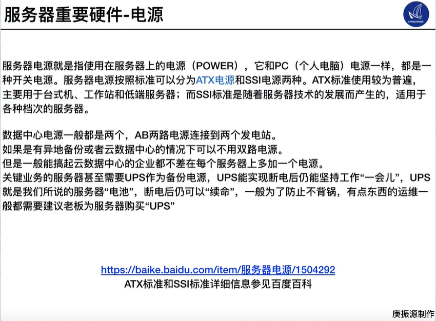

一般服务器上有至少一个电源口，也可以让对方送一个电源口在服务器的屁股上

关键业务的服务器甚至需要UPS作为备份电源。UPS可以给服务器续命一会儿，一般为了防止不背锅，有点东西的运维一般建议老板购买UPS。

之前携程宕机几个小时，损失数亿

## 4-7 服务器重要硬件-网卡详解


网卡有贵的，再贵就用网卡模块。网卡模块有千兆和万兆的。一般是千兆模块。

千兆交换机和万兆交换机的价格都很贵，而且五倍以上。

## 4-8 服务器重要硬件-远程管理卡

远程管理卡叫BMC。BMC是个芯片，后面其实有一个网卡

服务器断电的时候你是不是连不到这个服务器啦，你要连接这个服务器

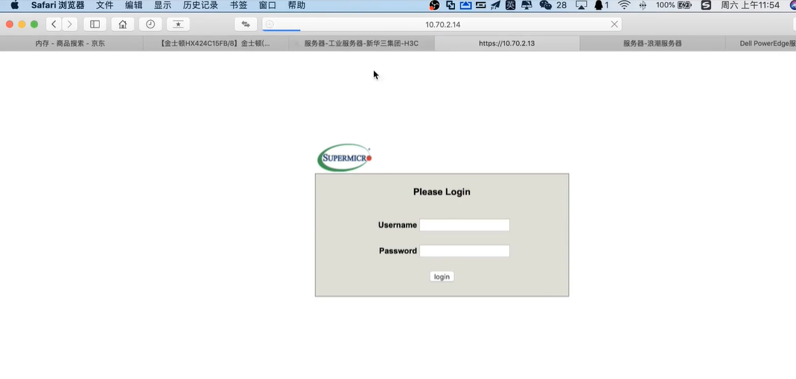

这个是庚老师的服务器的BMC

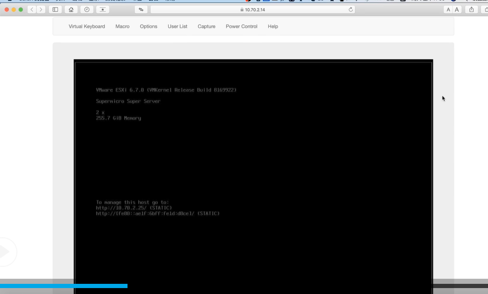

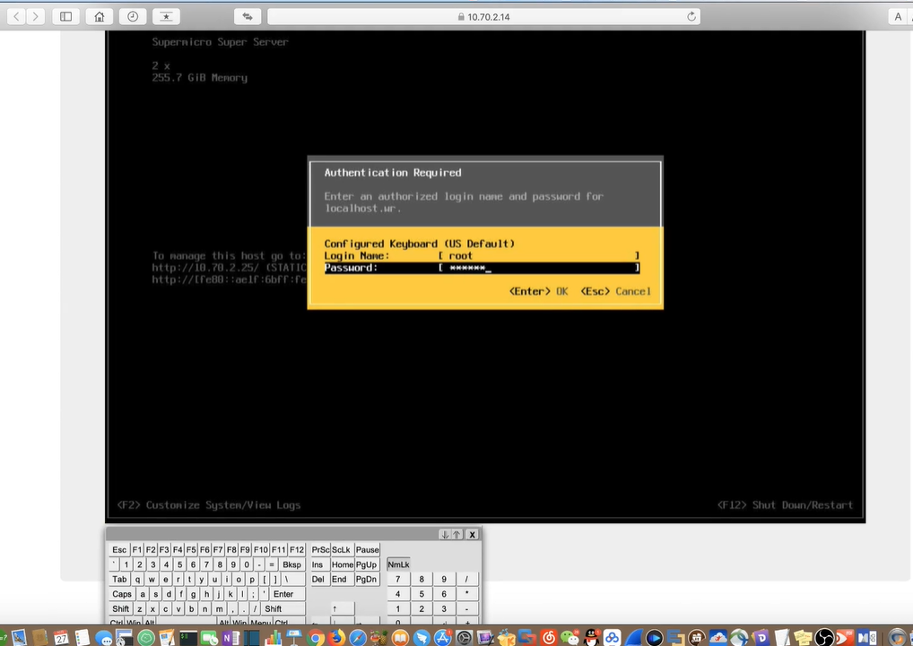


服务器不管是不是蓝屏了，通过BMC可以直接控制服务器开机关机等行为。

一般如果甲方公司出问题了，需要乙方公司在N个小时内解决问题。一般乙方通过VPN连进来然后登录BMC进行连接。

刀箱服务器直接就有个管理系统。

机方不适合人长久呆，这些人生女孩的概率比较高。噪音、电磁对身体有害。

## 4-9 服务器重要硬件-硬盘

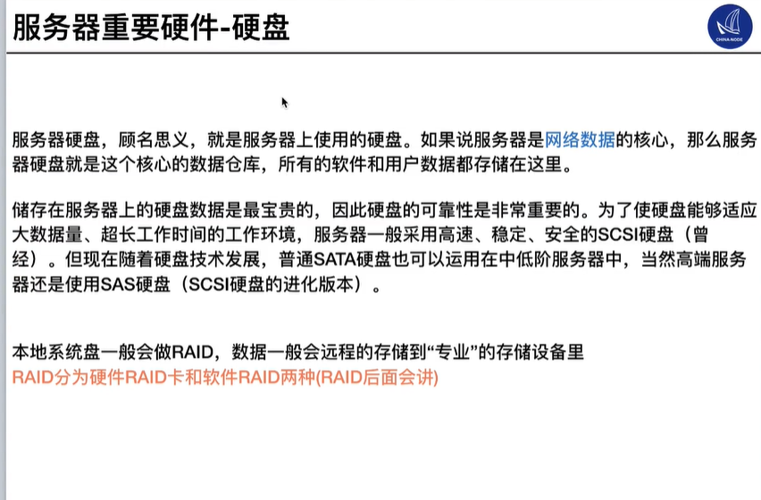

服务器的硬盘一般要长时间进行运行。所以服务器硬盘的质量和价格高于PC。

SATA 2T 放PC的话也就 6、7百块钱
服务器的SATA 的 2T 会达到2k左右

300G 的 SAS硬盘会在3k-4k ， 500G的话会在5k以上


磁盘阵列RAID

RAID 0  1 3 5 6 10  01  50

1. RAID可用来提升硬盘的IO。
2. 可提升磁盘容量。
3. 带来冗余（备份）

两块磁盘做RAID1，A盘和B盘的数据是完全一样的。

RAID分为硬件RAID和软件RAID。硬件RAID会有个卡，不是插在主板上? 软件RAID是用来模拟出RAID的，但是性能比硬件RAID低。

在服务器里一定要用企业级别的硬盘，不要贪便宜用PC的硬盘，否则一定会出问题的。

## 4-10 服务器CPU选型

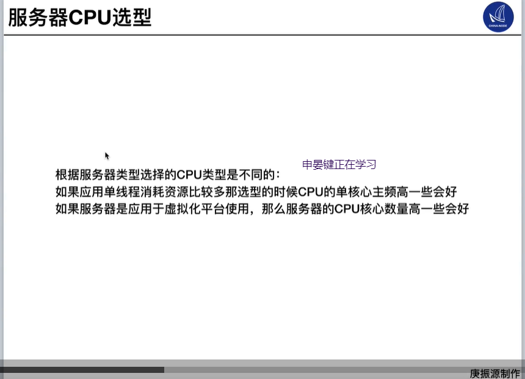

选取CPU型号的话要参考应用。

## 4-11 企业案例一 极端并发案例

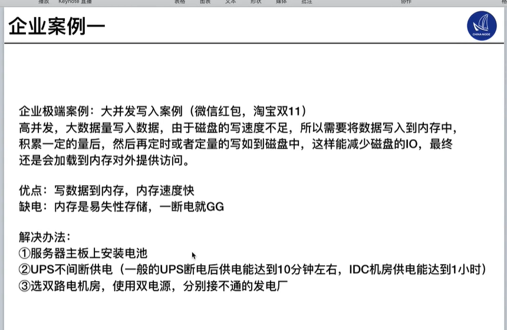

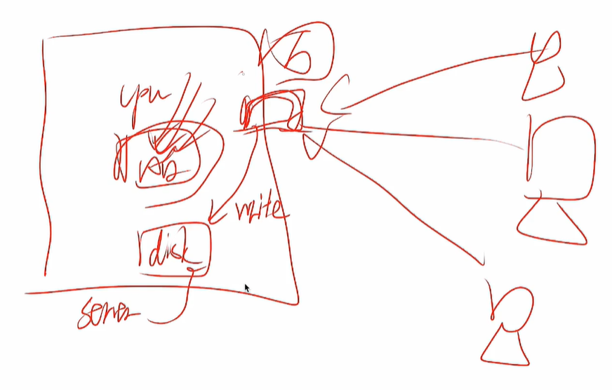

双十一、微信qq红包等情况，并发量大但是硬盘的读写速度慢，远不及内存读写速度。解决要将最终的目的是要把数据写进硬盘中

解决办法，这里是先存到内存中进行处理。这个就是**缓冲**，减少对硬盘的冲击力。

原因: 硬盘的IO比较弱

## 4-12 企业案例二 应用缓存技术

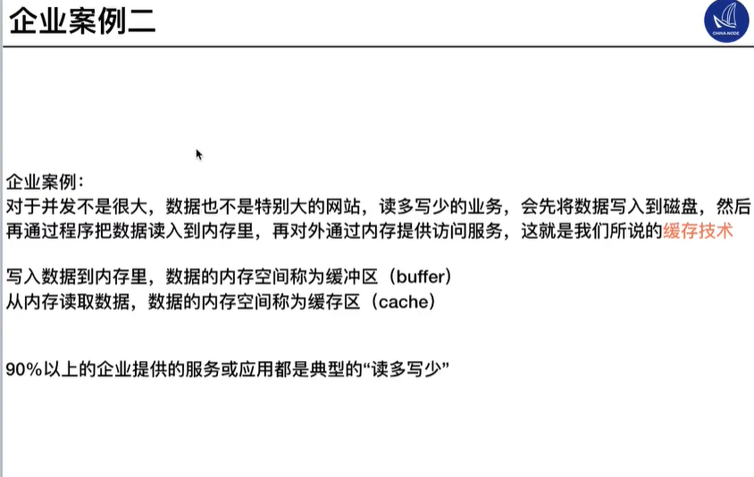

**缓存**和**缓冲**不一样

缓存技术无数不在，大多数情况是`读`大于`写`

## 4-13 企业案例三 硬盘热点数据优化

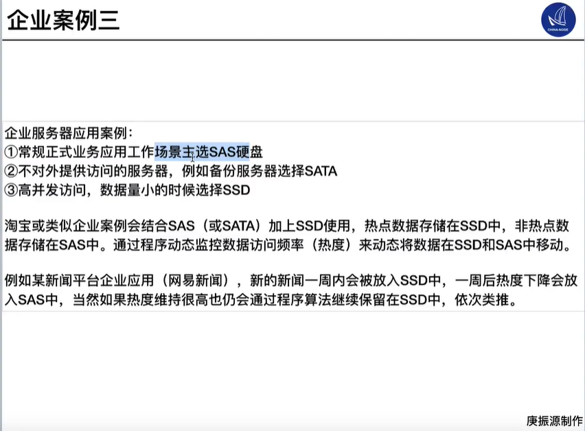

SATA比SAS盘便宜些，一般备份可以使用便宜一些的这种盘

热点数据会放在SSD中

## 4-14 企业案例总结 存储服务器介绍

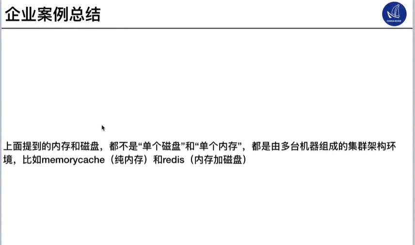

HBA卡  存储服务器

备份放同一个城市，叫备份；容灾，数据不放在一个城市里

云数据中心，数据放在云上，但是云数据也会考虑选址地点

## 5-1 到底要不要学习Linux（一）

IT-信息技术（可以理解为服务器）

CT-通信技术（可以理解为网络）

以上是华为提出的概念，两个都要学，叫`ICT`

```
老庚语录

我问你，服务器宕机了，第一个杀头的是谁？运维吧！服务器数据丢了，第一个背锅的是谁？运维吧，对吧。开发骂人，第一个骂的是谁，运维。你懂吧，那我们现在学的是什么，运维！但是，运维这个工作，属于刀口舔血的。服务器，正常还好，服务器有问题，肯定我背锅。
```

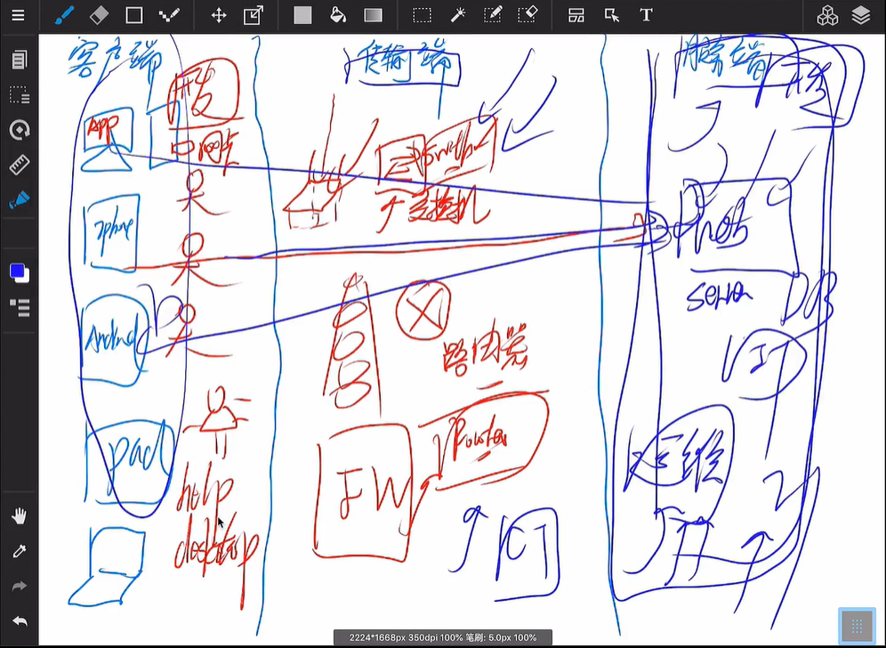

## 5-2 到底要不要学习Linux（二）

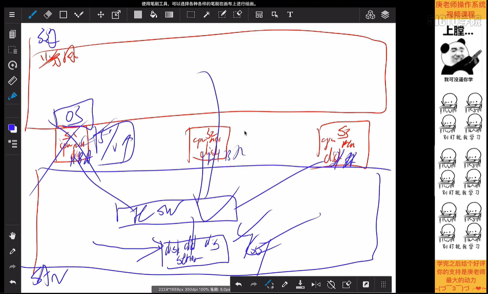

单服务器的CPU利用率比较低，所以后来出现了虚拟化技术

服务器后来出现了`Hyper Visor`这么个东西

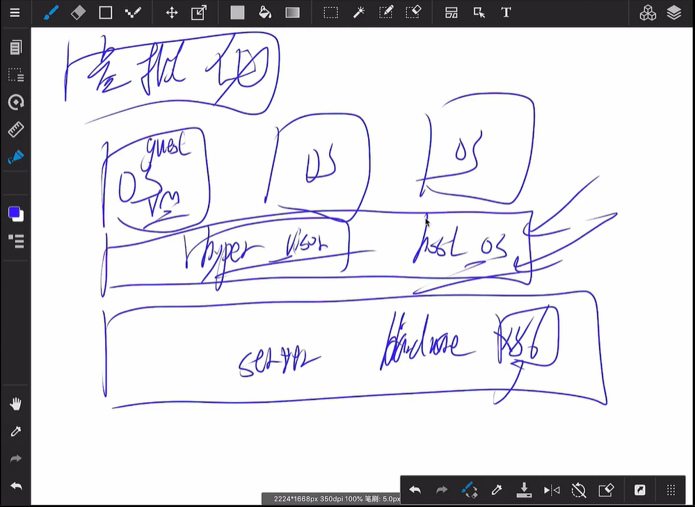

再后来有`云`这个概念。虚拟化是技术，但是云不算技术，是一个理念、框架。云的底层就是虚拟化，没有云行不行，不行，没有云肯定没有云玩的好。

最早玩云的公司是AWS。

50万个服务器，一个月的电费得3亿6。马老板也承受不了这个电费的价格，所以马老板开始租服务器。亚马逊最早有云的概念。所以开始租服务器，租出去，可以收获商业服务。

学容器、虚拟化、云计算，都得先学linux

## 5-3 Linux无数分支到底选择哪个

学习linux从红帽开始学习

全世界做linux课程开发的只有红帽，只有红帽进行了课程体系的开发

红帽系统管理一  RH124

自动化运维Ansible

最好自学OpenStack技术

## 5-4 Linux学习阶段介绍

Linux -> 基本硬件 -> OS -> 文件管理 -> 权限管理 -> 用户 -> 进程

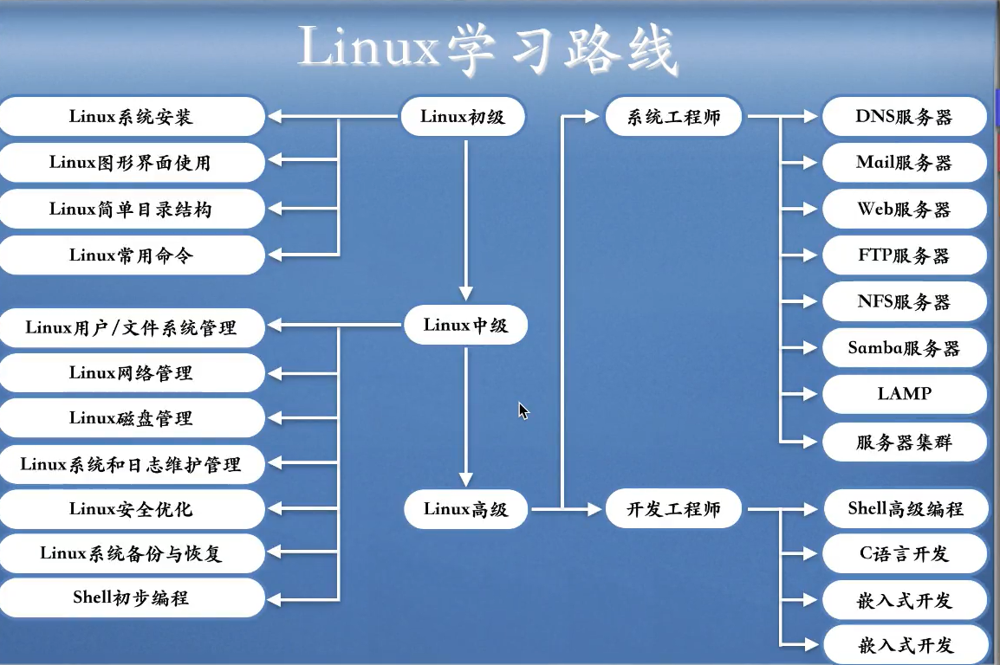

## 5-5 碰到问题如何解决，如何提问

谨慎回答问题。因为有人工作上问问题，如果出了事儿，但是可能会导致意外发生，谁来背锅？因为我就真的只是个讲课的，所以课外询问是要求劳务费的。

## 6-1 物理机装系统前的准备

装系统的步骤:

1. 准备材料

* 一个可用的windows操作系统
* 大于等于8GB的U盘
* 想要安装的系统光盘镜像(以.iso结尾的文件)
* U盘`烧录`工具（一款软件）（软碟通）

2. 通过U盘烧录工具制作可引导的系统U盘

3. 通过烧录好的U盘安装系统

## 6-2 装windows系统U盘烧录步骤

光盘镜像iso结尾的文件

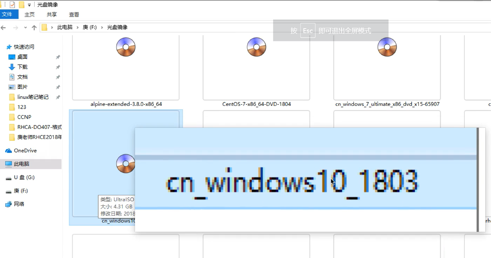

如何获得软碟通


我们一直试用这个软件就行了

接下来使用软碟通打开准备好的iso镜像文件。直接右击iso文件使用软碟通打开

iso本身是压缩文件，不建议直接粘贴复制到U盘中，否则自己要去写引导。要点击`启动`，点击`写入硬盘映像`。然后`硬盘驱动器`选择U盘，写入方式就建议`USB-HDD+`。因为很多硬件支持`USB-HDD+`。最后点击写入。

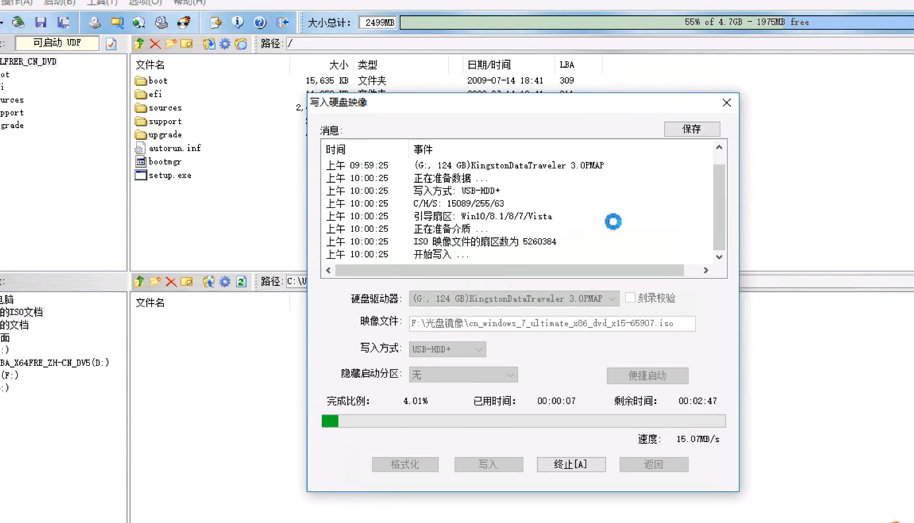

下载iso镜像最害怕的是由于网络环境不太好下载iso镜像不完整，这也会导致启动U盘不完整

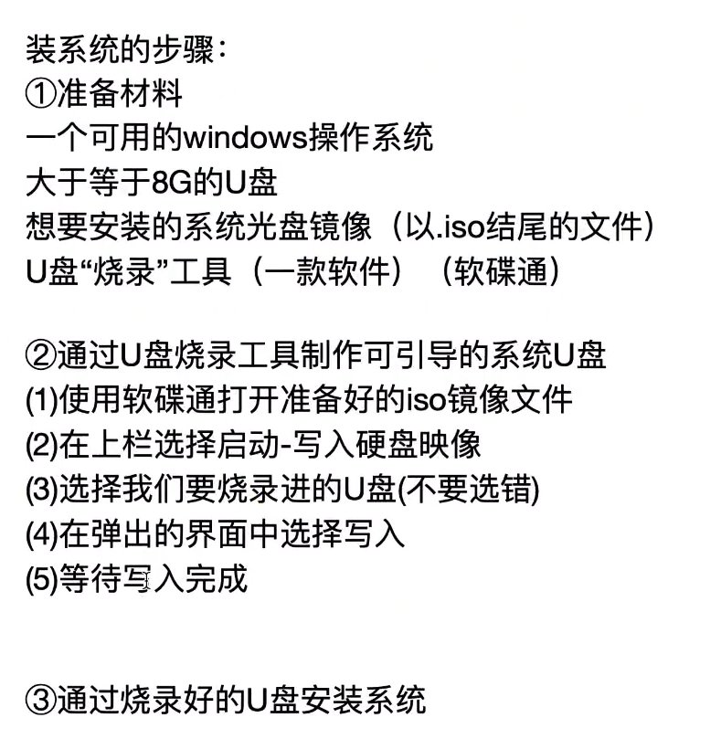

最后出现`刻录成功`后，安全弹出U盘

## 6-3 使用烧录好的U盘安装物理机windows系统

物理机进入BIOS得百度，百度相应机型对应的进入BIOS方法

有一种新型的引导方式叫UEFI(区别于BIOS)

有个方式是在BIOS中把U盘设置为第一个启动的(永久式的)

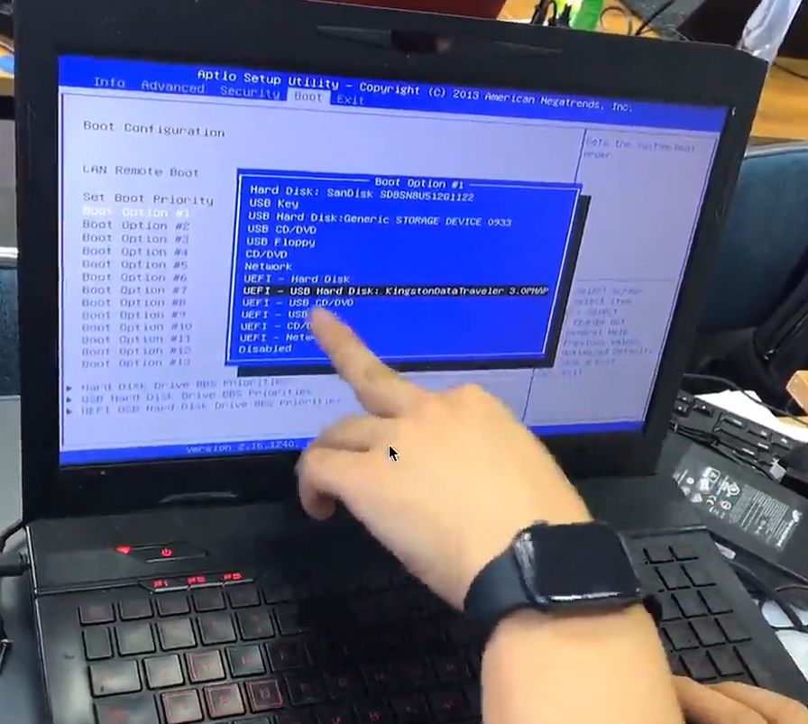

但是这么做有个问题，装完系统之后需要再去BIOS中把U盘挪到后位。否则再插着U盘开机，电脑自己就去又重装系统去了

`Advanced`或者`Security`把`Intel Virtuallization Technology`开了

另外还有临时改动的方法,笔记本如果支持boot `menu`功能

按F10？在这里会看到临时的引导设备

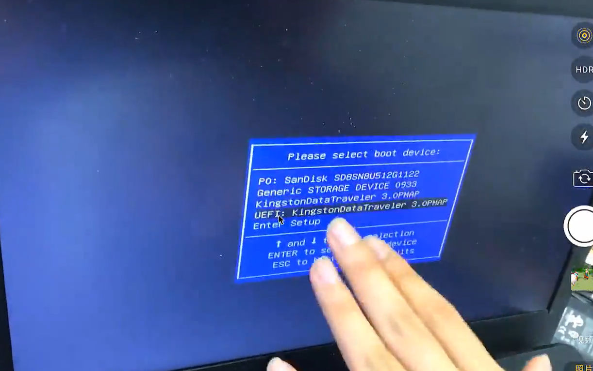

可以把分区全都删了，然后自己新建分区，再把系统安装到其中一个盘里，这就是C盘了。

U盘记得装到USB 3.0的位置

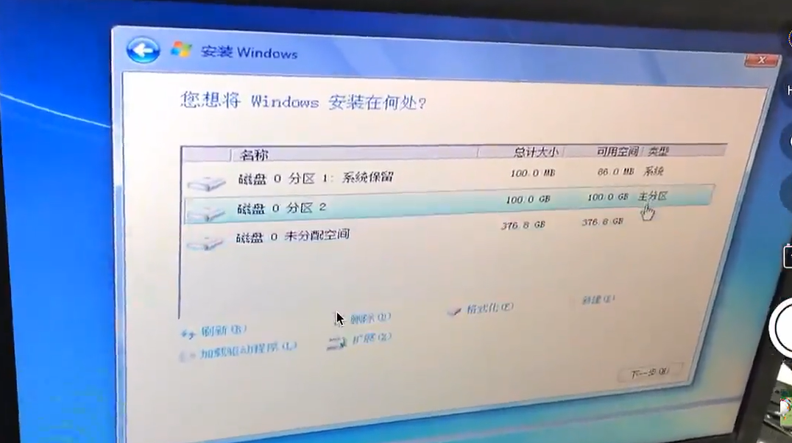

## 6-4 虚拟机和虚拟机操作系统安装准备

如何在你的笔记本上安装一个虚拟机

1. 准备材料

* 一个可用的windows操作系统或者mac操作系统
* 虚拟化软件。如果windows首选VMwareworkstation；如果是mac首选VM Fusion；windows和mac都可以使用VM Fusion；windows和mac都可以使用Oracle VirtualBox；mac可以使用PT；我们只用VMware，无论是VMware workstation还是VM Fusion都是Vmware公司针对个人PC的虚拟化软件。由于VMware的虚拟化软件是收费的，所以我们要有相关的破解工具(注册码)
* 安装的系统光盘镜像(.iso镜像)

2. 安装虚拟化软件

3. 通过虚拟化软件创建虚拟机

4. 通过光盘ISO文件安装虚拟机操作系统

## 6-5 虚拟化软件vmware workstation安装

## 6-6 虚拟化原理简单介绍

Intel CPU x86架构以前不支持虚拟化技术，以前转换需要通过另一种技术，转换效率极低

之后Intel的CPU支持了虚拟化技术，转换效率提升了很多

以前的虚拟机，转换效率比较低

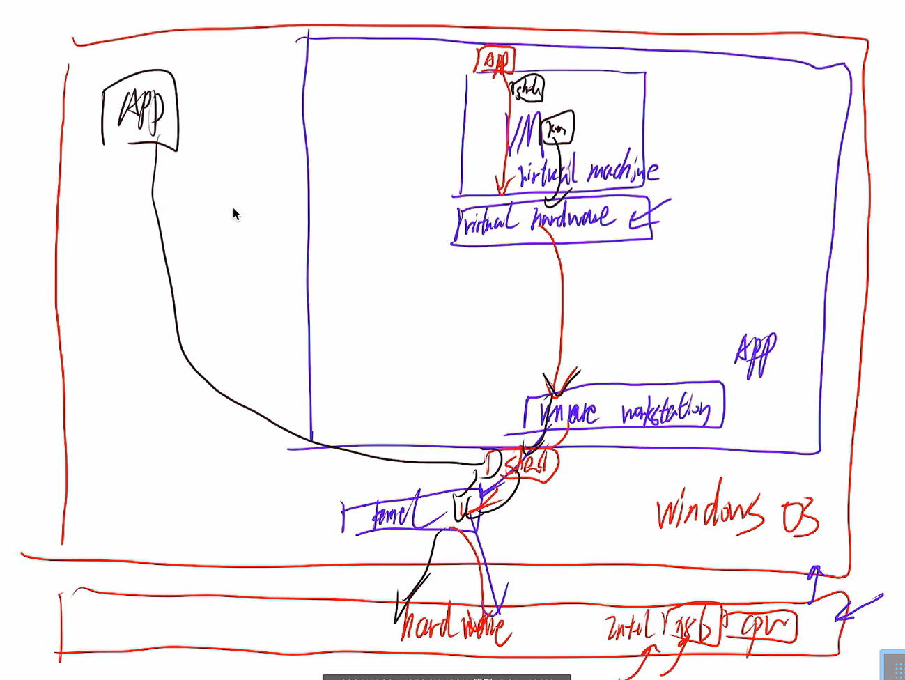

但是CPU支持了虚拟化技术之后，可以同时运行多个操作系统

## 6-7 通过虚拟化软件创建第一个虚拟机

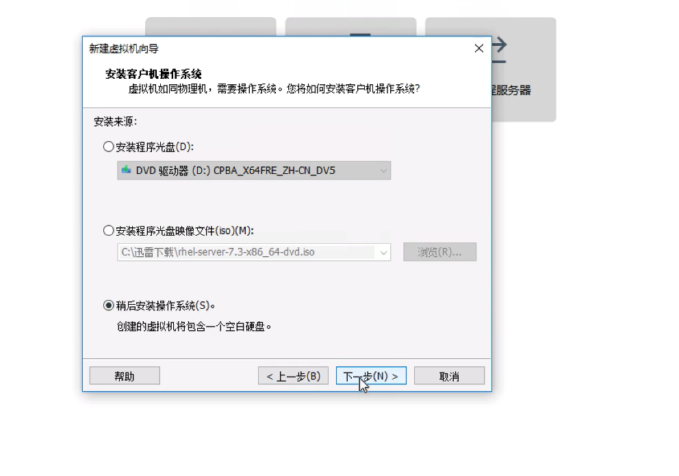

## 6-8 安装第一个虚拟化操作系统

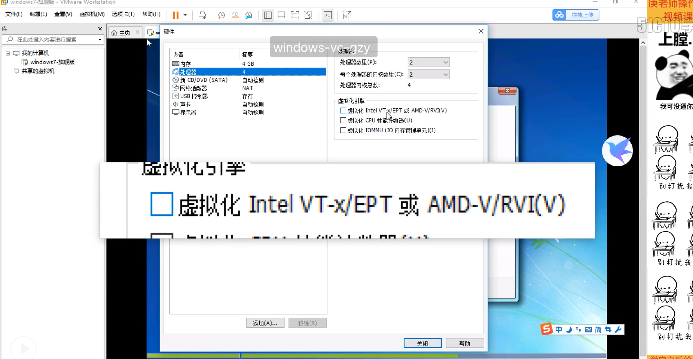

问虚拟机里能不能再创建虚拟机？

能，前提是你也得开启虚拟机的CPU的虚拟化支持

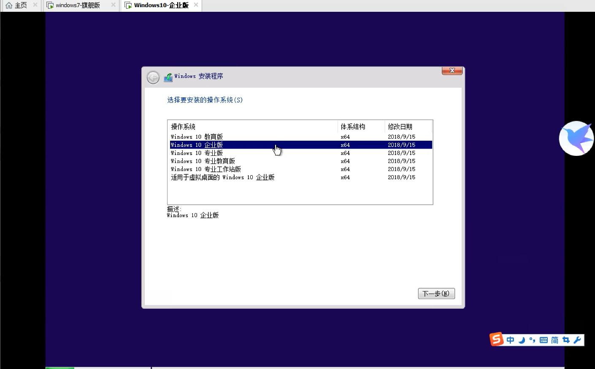

我们也不知道企业版专业版家庭版有什么区别，但是装的适合我们做技术的不要装家庭版。

## 6-9 安装windows10虚拟机并安装vmware tools

## 6-10 安装fedora workstation

## 6-11 简单使用fedora workstation

装双系统的话，一定要先装windows再装linux。因为先装linux的话windows的引导分区肯定会把linux的引导分区给干坏。

## 6-12 安装和使用fedora-server

安装workstation你能选择的东西并不多，因为那是个人的安装

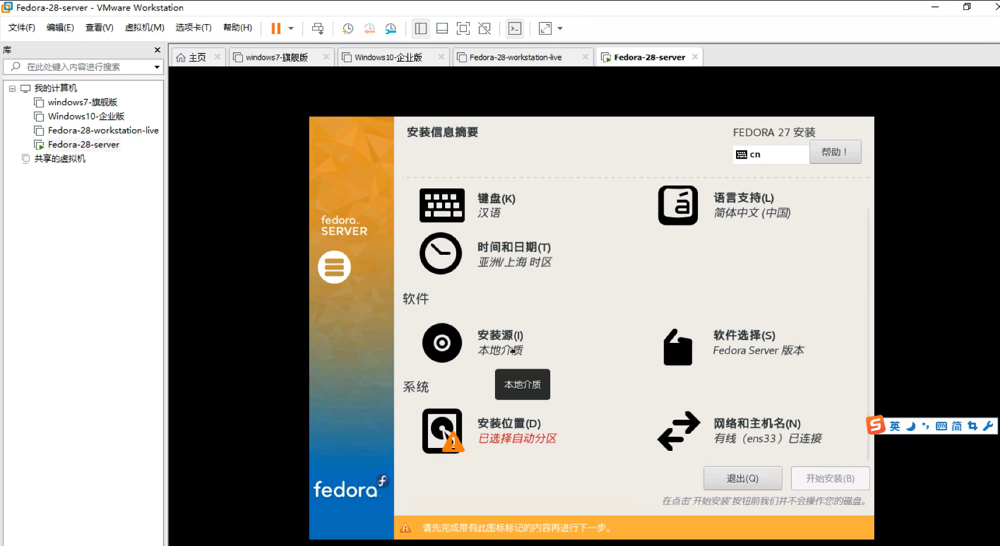

安装server的时候你能够选择很多，因为他知道安装server的人肯定是计算机的管理员

## 6-13 安装ubuntu和vmware tools

ubuntu的官方网站

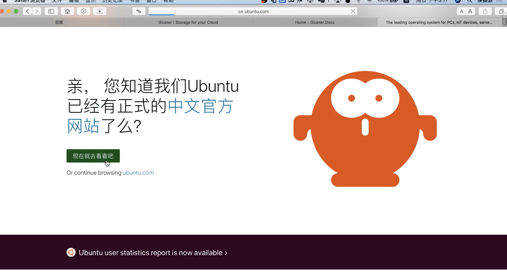

ubuntu的虚拟机安装vmware-tools

先点击虚拟机的`安装vmware-tools的指令`

然后ubuntu的桌面上会出现vmware-tools的光盘

cd /media/gzy/Vmware\ Tools/

因为光盘是制度的，需要把这个拷贝出来

cp -a VMware\ Tools/ ~

tar xvf VMwareTools.tar.gz


解压出来后有个.pl结尾的文件

可以`vim INSTALL`看怎么安装这个tools

想安装执行这个命令就可以`./vmware-install.pl`

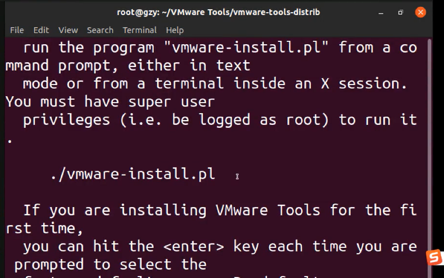

## 6-14 详解安装RHEL7.6虚拟机操作系统

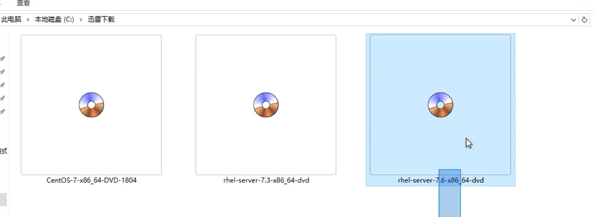

选择**红帽企业版7**

一般来说，5代的i3以上的CPU是支持Intel VT -x的

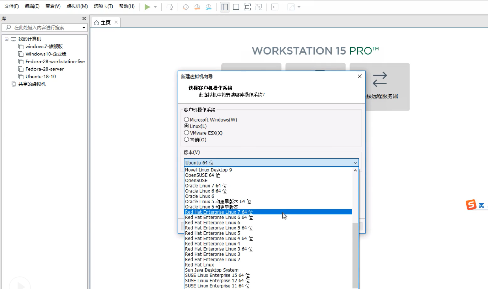

有人问，虚拟机这里选择虚拟机版本能不能随便选？不能随便选，如果有人给的镜像都没告你内核版本，那你就不要用这个版本了

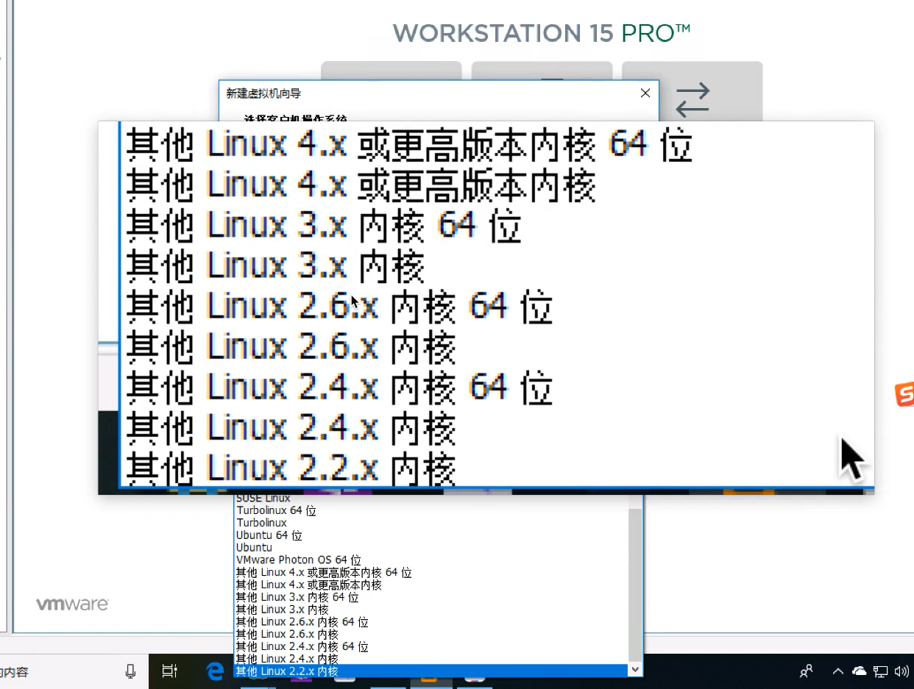

centos的使用率是极高于RHEL的。IBM以334亿美元收购了红帽。

在生产环境中,只选择`最小安装`

选择`最小安装`，右边不需要选择`系统管理工具`

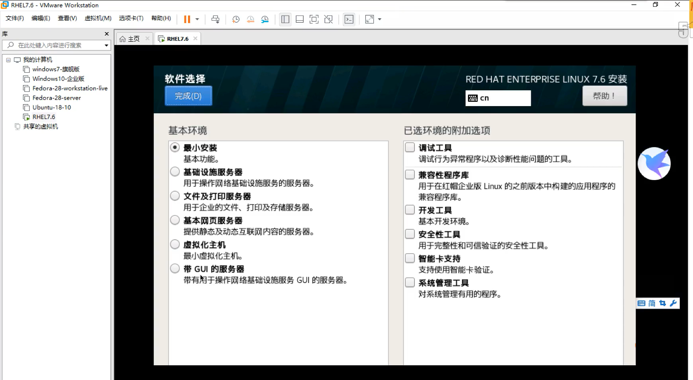

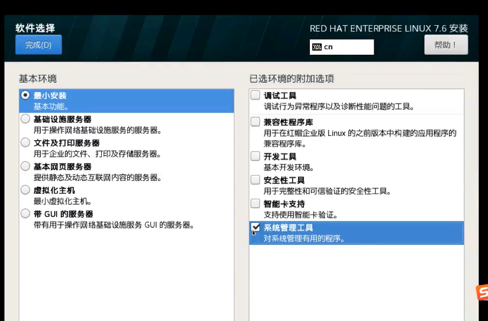

因为对于操作系统来说，最小安装的安装包是最小的。对于企业环境而言，软件越少，BUG越少

最小安装不带GUI的服务器。初学者要带上GUI的服务器。这俩都要装。

安装位置: 分区 如果是个新的硬件，可以选择自动分配分区

如果你安装OS的时候，这个硬盘里有其他的数据，想干掉这些数据可以点击这个`我想让额外空间可用`，英文里这儿是`More Space`。但是如果你没做备份就点击这个，可能数据就回不来了

所以在处理安装OS的时候，我们尽量遵循`只加不删`的策略。

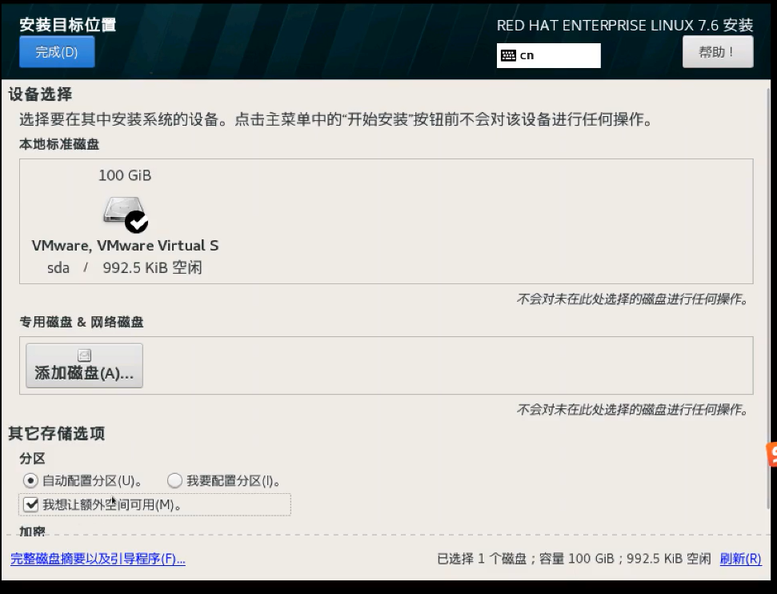

要删特定数据在这里删除特定分区的数据

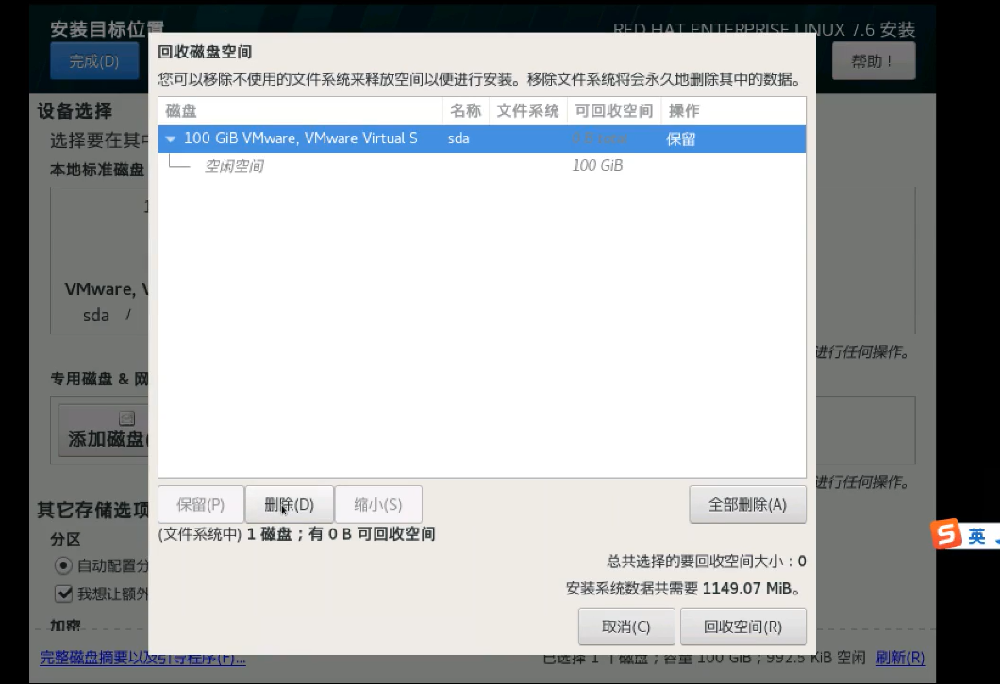

最小安装会装300个包，GUI安装会装一千多个包

kdump：系统奔溃了为什么还能捕捉到问题？因为kdump会消耗一部分内存用于存储内部的信息。一般来说测试环境把这个关掉，生产环境把这个给开了。 

NIC（Network Interface Card）:
设置网卡后，每次开机后都可以自动连接上这个网

在严苛的生产环境下，可以开启`安全策略`（Security policy）。过去生产环境不开这些，现在倡导生产环境下安全策略全开。

## 6-15 安装图形化界面(不需要操作)

linux安装的时候，可以进行最小安装。但是可以安装上其他所有的东西，没有问题的。

`mount /dev/sr0 /mnt`

现在搭建一个软件仓库

庚老师在服务器上挂了一个光盘装这些东西

yum-config-manager --add-repo=file://mnt

搭建软件仓库

`vi /etc/yum.repos.d/iso.repo`
```
[iso]
name = iso
enabled = 1
baseurl = file:///mnt
```

`yum list`

`yum group list`

`yum group install`

因为光盘里的软件包都是二进制的已经编译好的，所以在安装的时候基本上一两秒就把软件给安装上去了


```
老庚语录

`unboumd` 这个软件包及其容易发生奔溃，但是如果安装过程中直接过去了，就当我什么也没说。
```

`startx`

就切换到图形化界面了(x就是图形化的协议)

`systemctl isolate`

`system isolate multi-user.target`

`systemctl isolate graphical.target`

`init 3`

reboot

切换到字符界面

上面两种都是临时进入

性能最好肯定是字符的命令行界面，最方便肯定是图形化界面。性能和方便不可兼得


## 6-16 安装CentOS7.5虚拟机操作系统

centos 被红帽收购了，未来可能不免费

最小化安装一定不要使用中文，否则很容易出现乱码


compute node : 计算节点
server with GUI ： 带桌面的
KDE： 和gnome一样，是最主流的俩桌面
gnome更加稳定

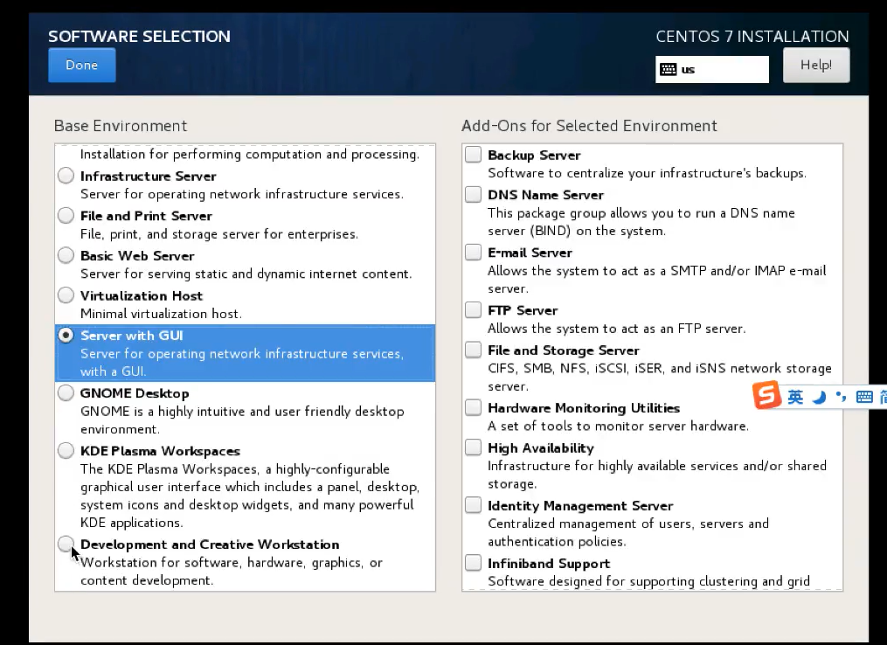

最后一个工作站这个可以办公、开发都行

右边的软件看到一堆常见的软件。

创建用户：

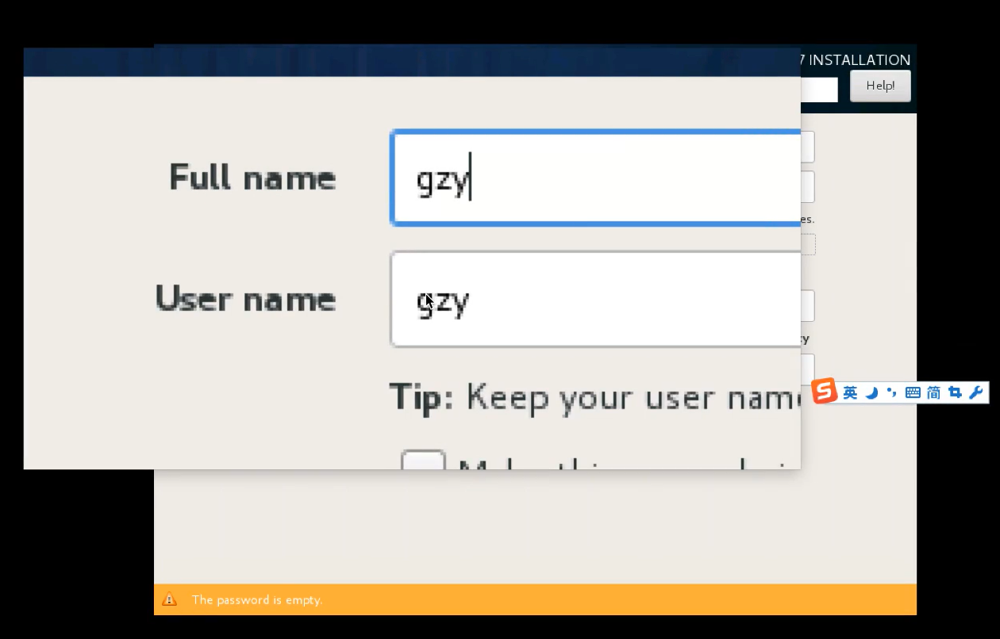

用户登陆的时候选择的是`user name`而不是`full name`

## 7-1 操作系统安装原理详解

主流的操作系统安装

 1. 操作系统安装原理
 2. 操作系统安装实战
 3. 服务器的操作系统安装流程

首先得有硬件。

然后得有个iso文件，这个就是操作系统安装文件，iso文件需要烧录到u盘中

把u盘（一般电脑都有usb接口）插进电脑，启动一个BIOS系统，再从硬盘里加载硬盘里的操作系统。

## 7-2 虚拟化软件介绍

我们运维在学习的时候不可能背着服务器到处跑

所以得安装 VMware Workstation（VM是 Virtual Machine）

disk: 
cpu: 
memory: 
nic： network interface card

在你已经有操作系统（win、macos之类的）就可以借助VM去安装其他的操作系统

## 7-3 虚拟化软件vmware workstation安装

## 7-4 虚拟机硬件兼容性介绍


小白才会选择典型（安装操作系的步骤会非常简单），老手得选择自定义

然后会出现`硬件兼容性`，如果你创建的硬件版本高，需要在高版本去运行（版本越高，支持的硬件更多）

## 7-5 虚拟机硬件资源的分配和创建

安装客户机操作系统（物理机host os, 虚拟机guest os）

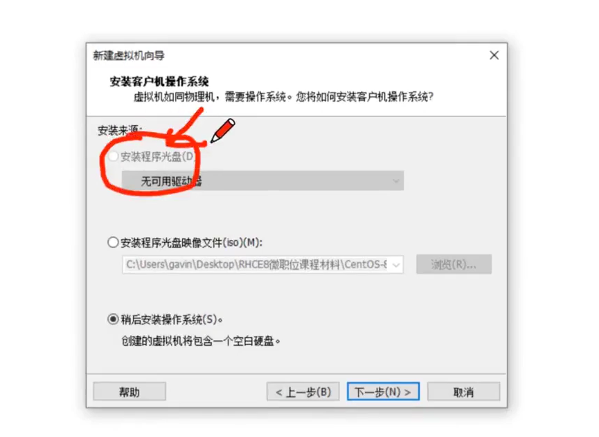

第一个`安装程序光盘`是安装物理机的os

第二个`映像文件`安装本地的iso文件

怎么看自己的处理器的数量？

任务管理器->性能->资源管理器->-cpu>看右边几个块，就是有几个cpu

电脑->右键->设备管理->处理器

怎么看自己的内存的大小？

## 7-7 rhel8和centos8虚拟机对比安装

安装的时千万不要点第二个，因为这是测试硬盘能不能安装系统。这会大量的损耗cpu的性能。如果是生产环境，是需要进行测试的，而且还得进行内存测试。

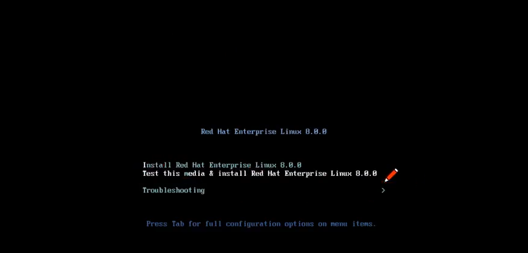

语言安装，选择英文一定没错，不选择英文可能有错

安装的时候可以不插光盘安装，也可以进行网络安装

linux可以选择你去装什么文件，但是windows不行，不给你这个权力，只有专业版、企业版、家庭版的选择。

installation destination 安装目的地，就是vmdk

磁盘分区那里，不懂的话就选择自动分区，懂得话（比如生产环境）选择手动进行分区

kdump是内核奔溃的系统，但是会占用一些性能。一般是关着的

license那个授权信息那里点击接受就行了

结论：centos8和RHEL8安装起来是一模一样的

## 7-8 rhel8和centos8的图形登录

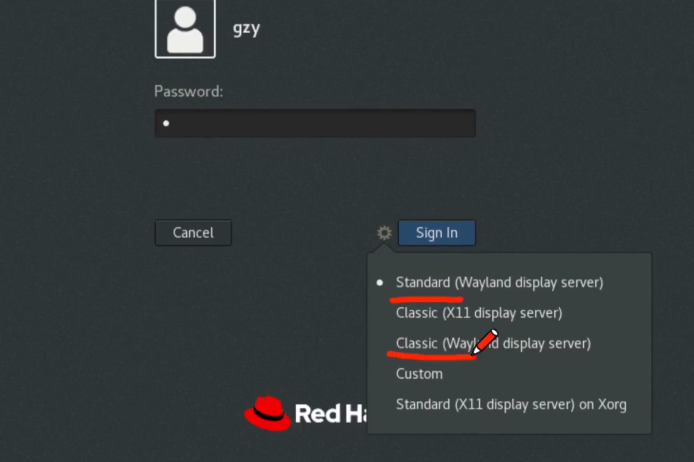

登录的时候默认是第一个（按windows可以看到图标）。第一次登陆的时候会有点卡，因为会加载一些图形。

选第三个登陆的时候右键可以看到`open in terminal`，登陆的时候一般是选择第三个

其实这个看起来比较类似一个平板

ctrl+alt+f3可以切换

linux是一个多用户的操作系统。

rhel8和centos8提供了2个图形界面

`ctrl+alt+f1` 可以切换到图形一

`ctrl+alt+f2` 可以切换图形二

`ctrl+alt+f3-f6` 切换到字符界面

切换图形界面会需要重新登录，切换回已登录的界面不需要登录

## 7-9 物理服务器安装操作系统流程

服务器安装操作系统

安装windows7和windows10

1台服务器的安装

准备iso文件，准备u盘，u盘烧录，烧录完之后插到服务器的USB接口上，调整设备启动项，让服务器选择u盘启动

人在机方咣咣咣把u盘插上去

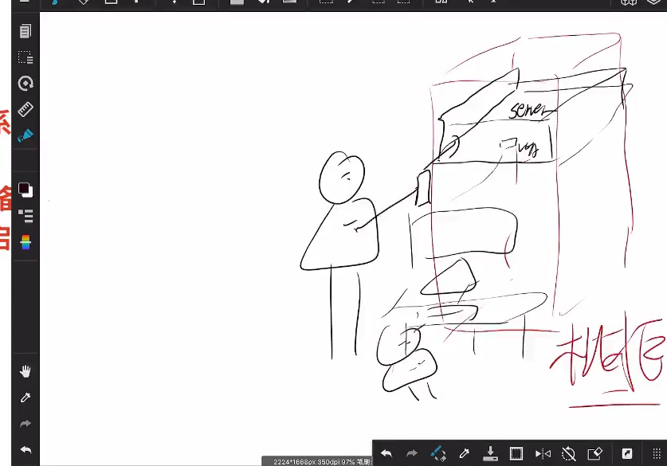

一般服务器有六块网卡（一对数据一对存储一对控制）

还可以有一个远程管理卡（遵守BMC协议）

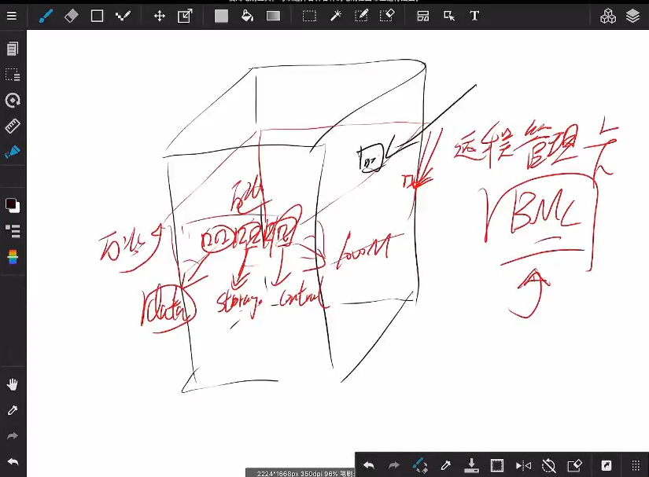

服务器插着电源但是没有开机，算开机还是关机啊。其实通过远程管理卡可以直接远程控制服务器开关机。Dell的服务器一般都有远程管理卡，可以通过web界面操作服务器是开机还是关机。

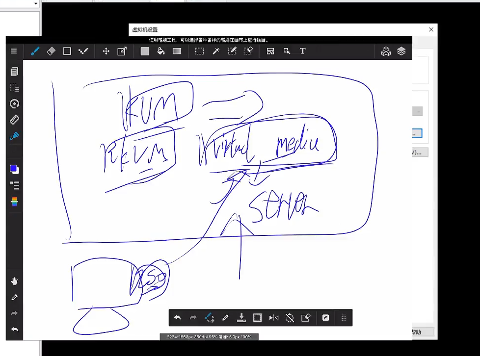

virtual media可以远程把硬盘虚拟成本地

虚拟机选择一个iso文件可以实现操作系统的安装。

人不在服务器面前，需要连到远程管理卡，使用ikvm提供的virtual media功能，关联到本地的iso文件，远程装系统。

多台服务器的安装

比如，500台服务器的安装怎么搞？这已经是一个解决方案的问题了。

PXE通过网络安装，配置RAID，配置Kerver来配置这里的所有的服务器。

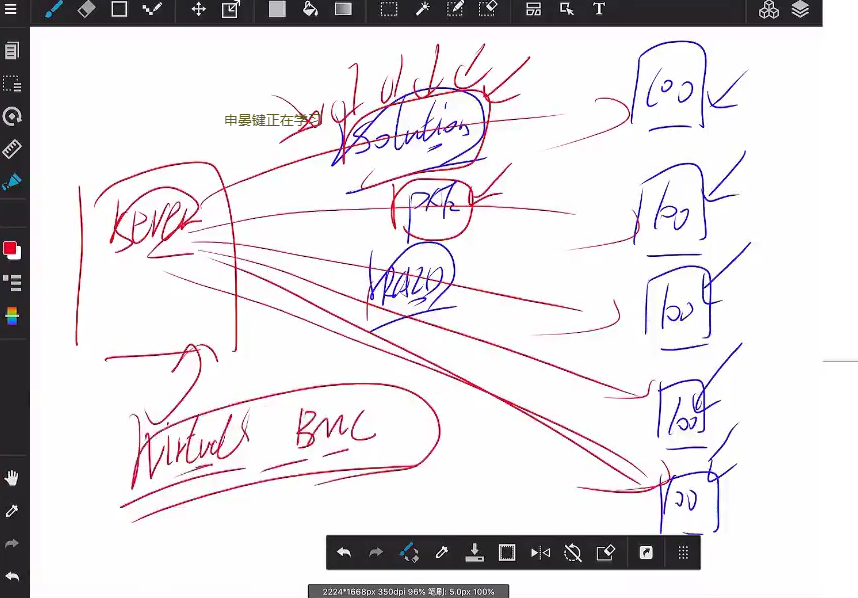

庚老师最后会讲virtual BMC

## 7-10 从internet上获取系统安装镜像

mirrors.163.com，还有阿里镜像、清华大学镜像站

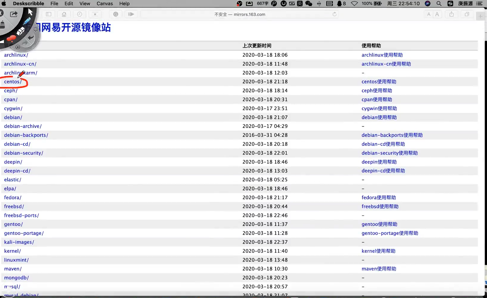

如果找centos就进centos,可以在这里一步一步找到iso镜像文件

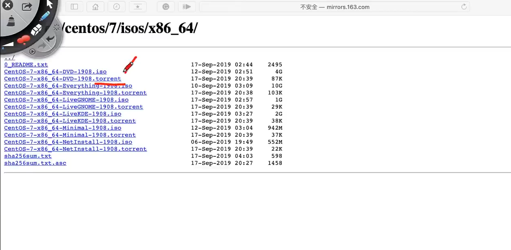

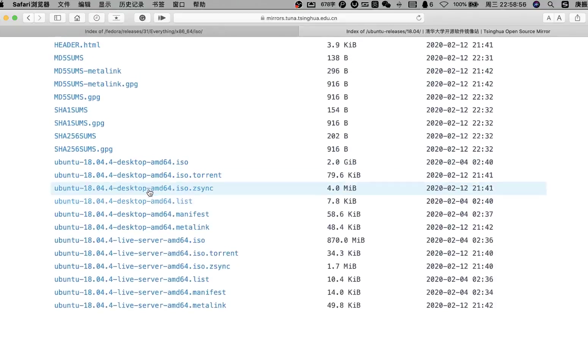

这里写的是amd64就是amd的cpu的64位，但是intel能不能装，也能装

windows可以去msdn网站进行下载

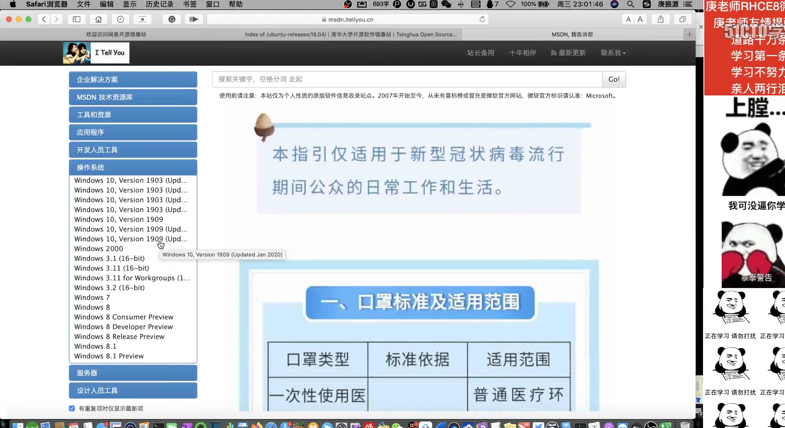

1809的意思就是18年9月

## 8-1 虚拟机vmdk文件和vmem文件介绍

1. 使用虚拟化软件管理虚拟机(vmware workstation)
2. 虚拟机软件快照
3. 图形化管理Linux
4. 命令行管理Linux（基础）

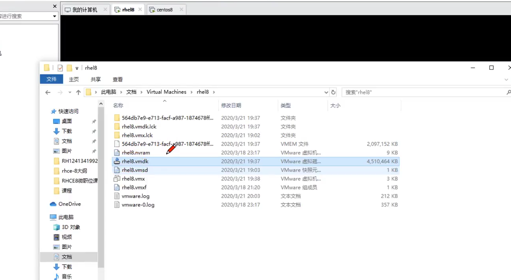

装虚拟机后存储目录中会有vmdk这个文件，这个是虚拟的硬盘。

VMEM文件是啥。我们把虚拟机关机后，vmem就不在了。这个vmem就是虚拟的内存文件。

## 8-2 虚拟机的移除和注册

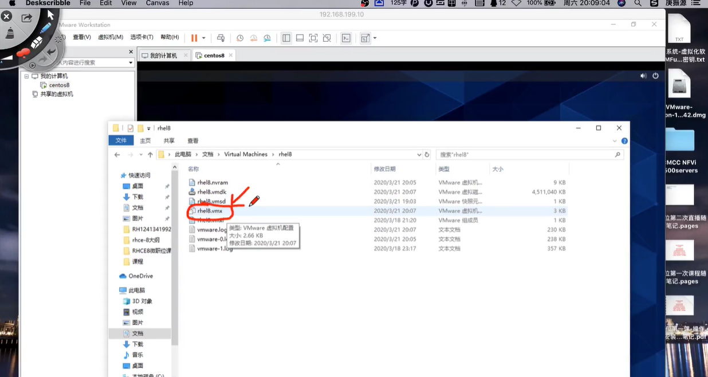

vmx结尾的文件（其实是一个文本文件），描述了关联的一些文件。vm中**移除**一个虚拟机，只是不再管理这个虚拟机，但是虚拟机还是存在的。双击vmx文件可以用vm继续进行管理。

所以拷贝虚拟机的时候使用者的vm兼容的话，是可以直接使用的。

如果选择**管理**->**从磁盘中删除**，就会把整个虚拟机从磁盘中彻底删除（不仅仅是vm不管理这个虚拟机这么简单的事情了）。

```
老庚语录

小孩子不要自己做这个操作，要在大人的陪同下做这个操作
```

## 8-4 使用现有的vmdk文件创建虚拟机

之前创建虚拟机的时候创建了一个新的硬盘

虚拟机创建了cpu，网卡，硬盘，

虚拟机设置不自由的长宽比就不需要拉滚动条控制虚拟机了

给我们vmdk文件我们需要重新安装os么，不需要，因为原有的虚拟磁盘上已经有了一个操作系统了

## 8-5 虚拟机的完整克隆

1. 完全克隆
2. 链接克隆

右键虚拟机 -> 管理 -> 克隆。硬盘如果不是固态的话，就不要这么克隆了。可以在对应目录下可以看到有个目录越来越大，这就是拷贝，非常耗费cpu和磁盘读写。

这就是完整克隆，完全拷贝了一份。那么如果我直接复制一个这个目录一样吗，不太一样。

虚拟机如果是拷贝出来的，虚拟机的元数据是不会变的；如果是克隆出来的，元数据是会改变的。

链接克隆是什么，讲到快照再说。

## 8-6 解决使用现有vmdk创建虚拟机的问题

## 8-7 虚拟机快照使用背景

进入虚拟机的时候，选择第一个或者第三个图形化界面，其他的基本都会卡死。

高级运维里面，都不允许`rm`命令的存在，得把这个命令给删除了。

虚拟机如果关不掉，就打开任务管理器，管理器中可以看到很多`VMX`的进程，每个VMX都代表一个虚拟机

有时候小白直接删除了一个文件导致OS无法登录。很简单，你得重装系统。

## 8-8 虚拟机静态快照的原理和操作

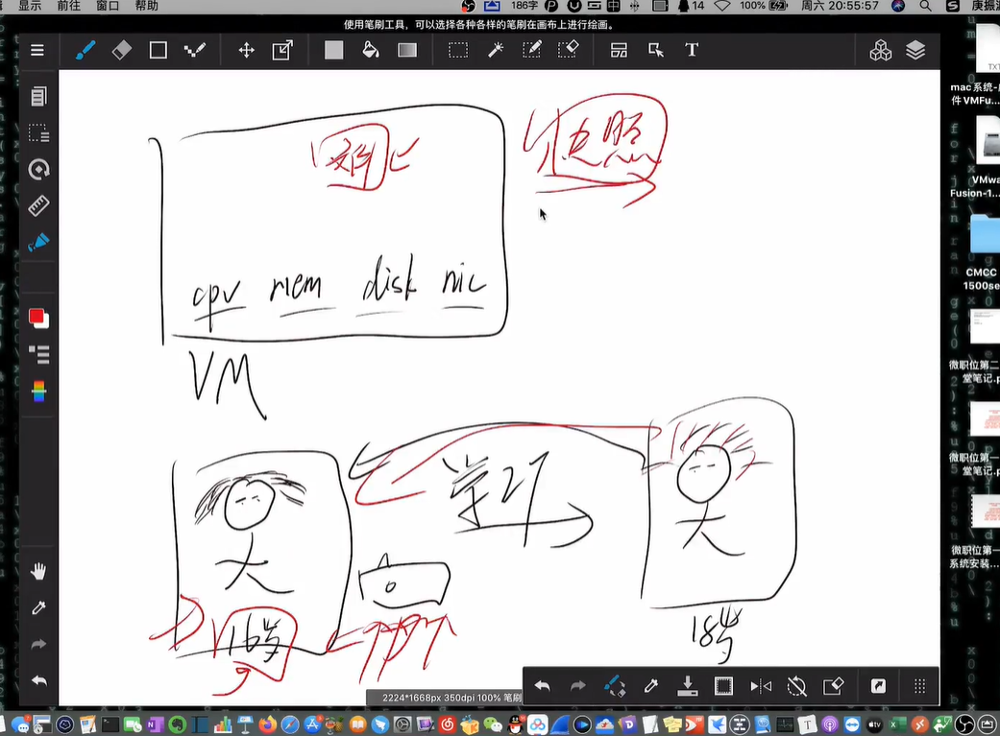

没有做快照之前的文件情况：

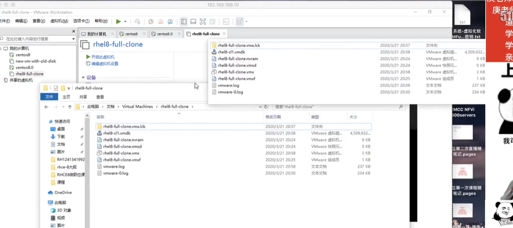

做快照之后的文件情况：

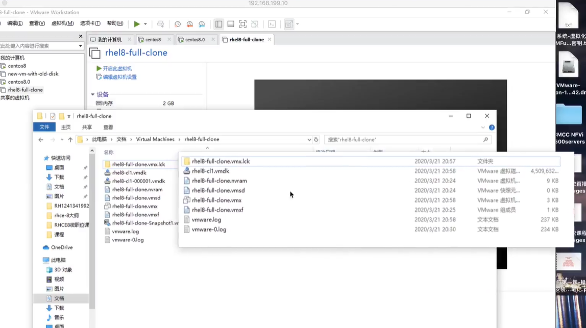

通过比对可以看到，多了一个这样的文件：vmsn，也多了一个vmdk文件。

快照之后多给我创建了一个磁盘文件。创建了一个新的disk，还创建了新的vmdk文件

现在打开虚拟机创建1个G的文件

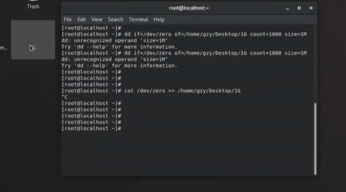

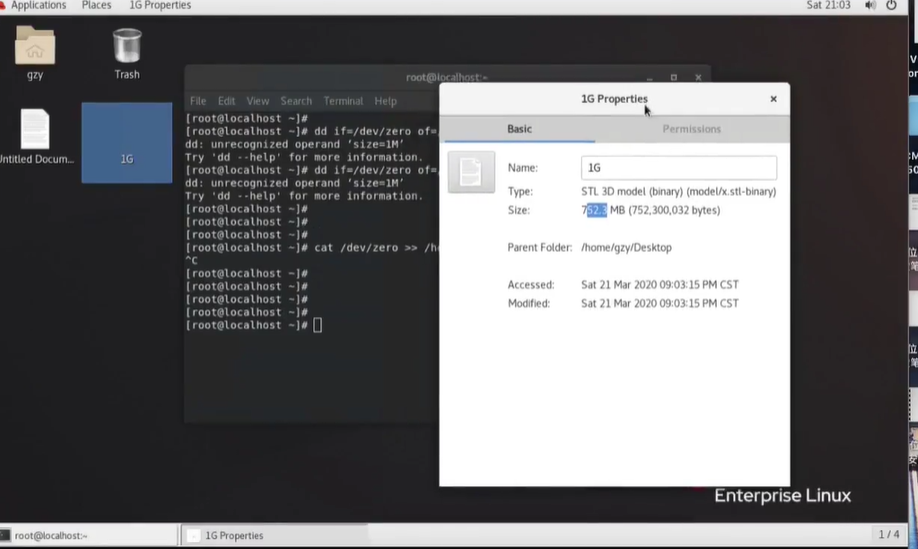

瞬间创建了一个752MB的文件。可以看到最原始的vmdk文件变大了，把他再变成2个G，可以看到vmdk的大小又变大了。

关机做的静态快照叫静态快照。因为关机的情况下做的快照不需要保存内存等信息。

## 8-9 虚拟机动态快照的原理和操作


删掉快照可以看到虚拟机又回到我们熟悉的那几个文件

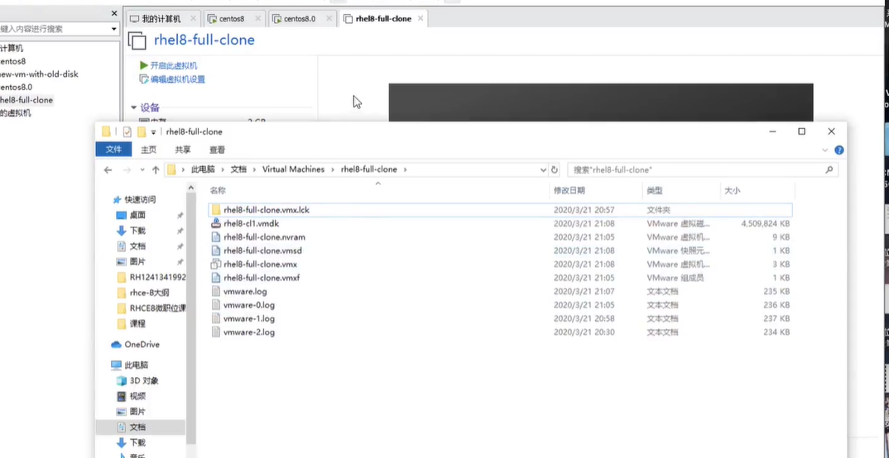

如果开机的话会看到这里会多一个vmem文件，这就是内存文件

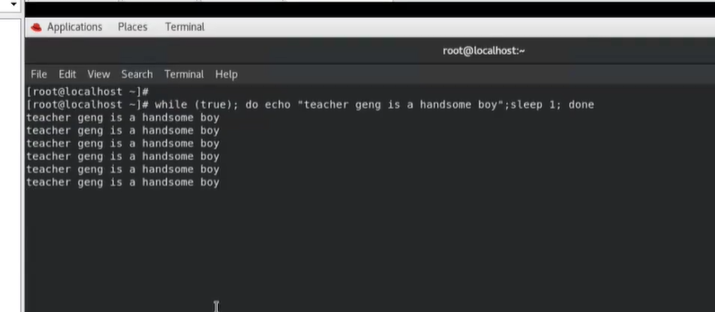

当前OS跑了一个应用

然后我们拍摄一个快照。会看到当前目录下多一个snapshot-vmem这样的一个文件

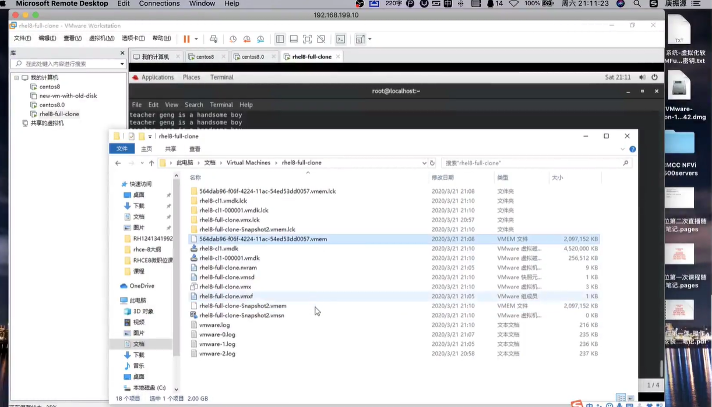

因为是开机做的快照，所以快照需要记录开机的数据。具体多大取决于虚拟机的运行内存。

快照算一个备份，但是他的备份等级不高。在企业环境中，要做快照的话要把vmdk做分布式备份，还得对快照进行备份。

电脑磁盘不足够的话，就做静态快照。动态快照也有点点卡（和你的cpu关系不大，主要和磁盘速度有关）。如果是固态硬盘的话，你的虚拟机也会流畅很多。

## 8-10 虚拟机链接克隆的原理和操作

链接克隆也是克隆，但不是前面提到的是完完整整的克隆出来。

右键，管理，克隆，创建链接克隆。

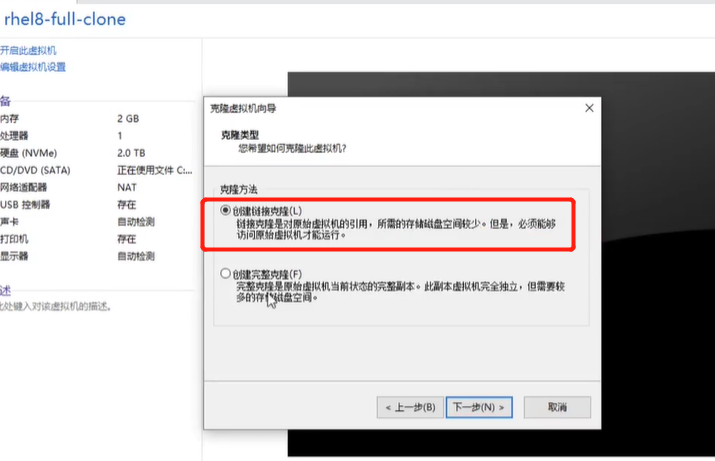

会发现这里什么都没有，就是个200多M的磁盘

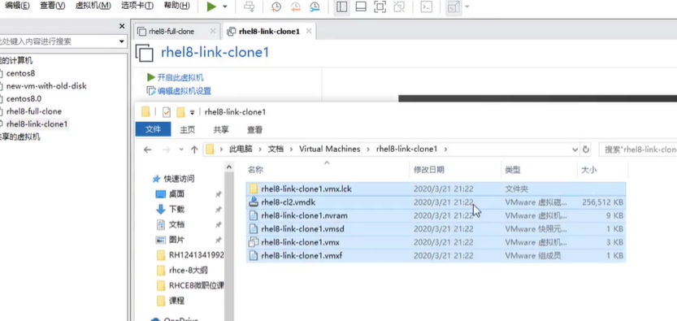

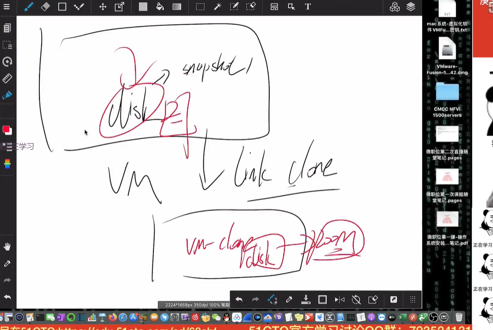

链接克隆是基于快照进行的，必须得访问到父虚拟机

# 第二模块 Linux的基础文件管理和高级文件管理

## 1-1 操作系统工作原理详解

硬件： hardware cpu mem NIC disk

怎么让你的软件调用你的硬件

driver-驱动程序

操作系统最关键的东西是内核，内核里有大量的驱动。如果有一天发现装完系统使用硬件不好使，那可能就是驱动的问题。

应用程序通过内核调用硬件，硬件再把信息反馈给应用

图形化管理Linux

GUI -> graphical user interface 图形化的用户接口，用户操作图形软件，软件通过内核请求资源，内核调用硬件资源，硬件返回信息给图形，用户看到图形显示

命令行管理Linux

CLI -> Command line interface 命令行的接口，用户敲命令，命令向内核请求资源，内核调用硬件资源，硬件处理，硬件返回信息到命令行接口，用户看到命令行显示的结果

## 1-2 操作系统知识模块概述

windows能进行的管理：

文件管理（文件的增删改查）
进程（运行中的程序）（进程的增删改查）
软件管理（软件的增删改查）

权限管理，用户管理（同时一个用户使用系统），网络管理（设置网络，配置IP，wifi，有线），防火墙管理，磁盘管理

以上内容，全都是操作系统的基本管理，只要是操作系统，理论上都需要具备以上功能。

## 1-3 图形化操作Linux

application -> system monitor 可以看到各种进程，是进程管理器

`gnome-system-monitor` 可以打开图形化的任务管理器

只要一直在晃鼠标，就可以看到这个`gnome-shell`会一直占用cpu。无论是GUI还是CLI，都是shell。用户操作的都是shell，shell向内核请求资源

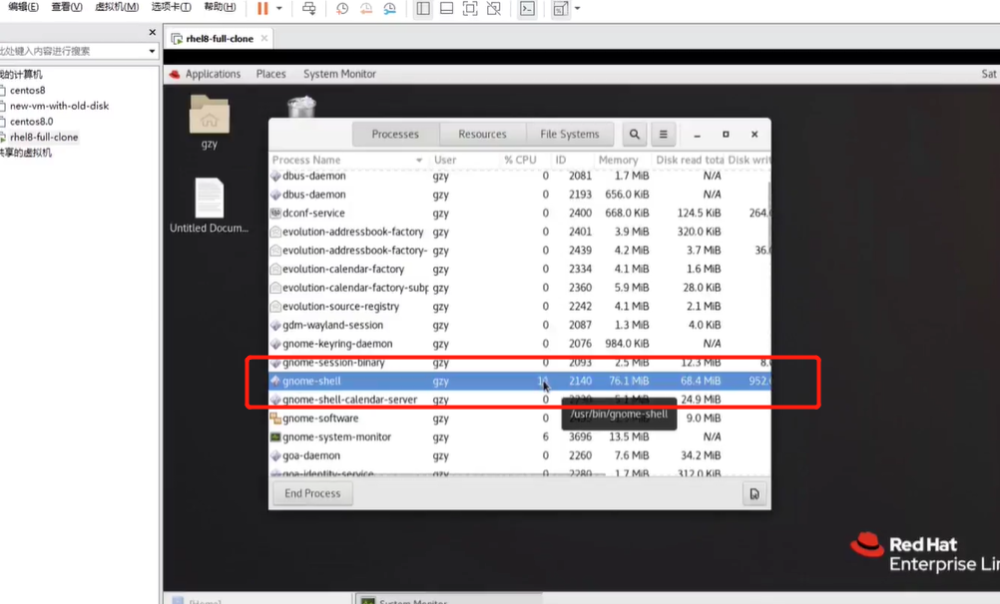

## 1-4 调整终端软件大小和字体

`firewall-config`可以把防火墙的图形操作软件给调用出来。

怎么调整terminal的大小？ctrl+shift+``+``，可以直接把terminal的字体临时调大。

## 1-5 Linux命令行基础命令学习

`echo 123`

`echo -e 123\n456`

`bc`,然后输入`1+1`，`16/2`，`2*4`

`expr 1+1`

bc和expr有什么区别： expr 是直接在命令后面才有结果，bc后面是得多敲表达式才能有结果

`date`显示时间

`hostnamectl set-hostname rhel8`可以更改主机名字

`hostname`可以查看主机的名字

## 1-6 敲linux命令最重要的三个事

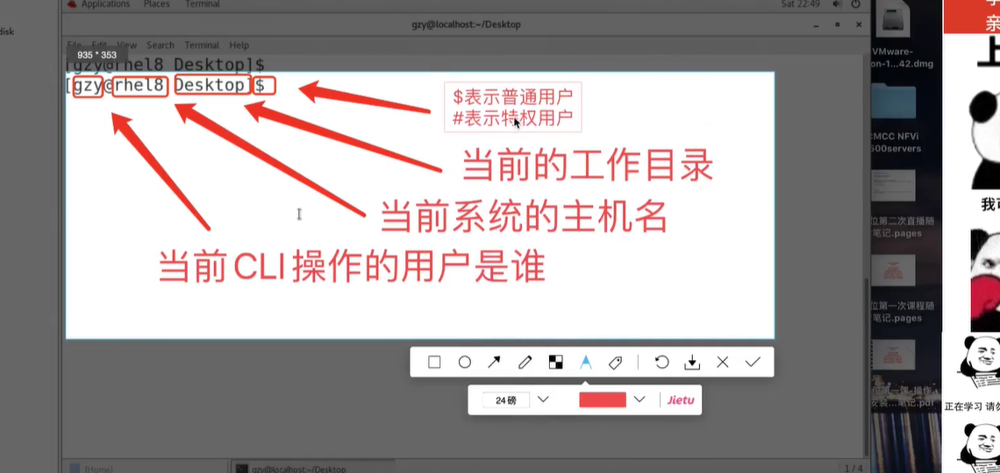

想知道自己是谁： whoami

想知道自己在哪儿：pwd (print working directory)打印当前的工作目录

`export PS1='[ergou@\h \W]\$'`

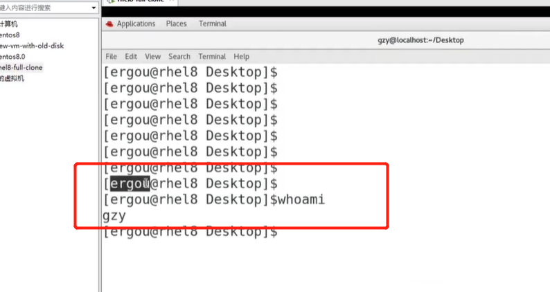

shell提示符的id不一定是真正的id

## 2-1 windows的目录结构介绍

目录结构

## 2-2 Linux系统的目录结构介绍

## 2-3 Linux的一级目录介绍

Linux的目录结构

`/` 表示根目录，根目录是linux目录结构中最顶级的目录

`/boot` 存放系统的启动配置文件和内核文件

`/dev` 存放linux的设备文件

`/etc` 存放linux的配置文件

`/home` 存放linux普通用户的家目录
```
useradd ergou
passwd ergou
可以看到 /home 下有 `ergou` 这个用户
```

`/media` 挂载点目录

`/mnt` 挂载点目录

`/run` 挂载点目录

`/opt` 存放软件文件的目录
```
插了一个U盘

`fdisk -l`

可以看到 `/dev/sda`

`df -Th`

mkdir /mnt/usb1

mount /dev/sda1 /mnt/usb1/

然后进入/mnt/usb1可以看到u盘的内容

linux需要挂载一下才能看到内容

windows其实也可以挂载的，在`计算机管理器`中可以进行挂载操作

```

`/proc` 存放的是进程文件

`/srv` 存放一些资源文件

`/sys` 存放一些资源文件(系统资源)

`/tmp` 存放的是一些临时文件（非常重要）

`/usr` Linux软件默认安装的迷路

`/var` 存放log日志文件的目录（非常重要）

`/etc` 主要放配置文件，改改就行了

注意，上面的非常重要的目录，是因为应用的数据一直在变。备份的频率也比较高。

`/etc` 是配置文件目录，只是部署项目的时候动一次，之后基本不用动。

```
老庚语录: 

在这块你要注意，啊，你可能会说，啊，庚老师，我现在看到网上有一些教程，它上面讲的这个目录结构跟你的不一样。老师我很疑惑，我到底信谁呢？

你这还用选吗？你肯定信我啊！���网上找的花钱了吗？你花钱了吗！？你听我这课你花钱了吗？你是不是花钱了？你听我课，你不花钱能在这儿听我课？你花钱听的，在百分之九十九的情况下，都是要比不花钱的好。你能不能懂我意思，啊，这就是你现在在这儿听我讲课的原因！明白我意思吗，嗷。信我，嗷，就大概率不会有问题。你不信我，信网上找到的那些免费的东西，就可能会有问题，明白我的意思吧。我告你的都是我的经验，你听网上 叭叭叭叭叭叭 ， 没用！你这是花钱学的，但凡有一天��你学到的知识发现和我的不对，你可以来找我。钱肯定不会退，但是我会和你解释为什么不一样。你懂我意思吧。

```

/var 日志目录一定要进行备份，开发

```
老庚语录: 

/var目录，三天备份一次左右。为什么这么说呢？因为这个日志啊，它有些开发人员要看，知道我意思吧。开发一旦看不到日志，你傻逼运维给我日志删了，你让我tm怎么给你排错。我现在排不了错，应用出问题了，现在修改不了，是不是你sb运维背锅？

这个日志你以为是你看的吗？我是运维，我看这sb玩意儿干啥？我看这东西看不懂，日志格式都是开发做的。这个日志都是开发看的，我只是在部署的时候看下log。平常有问题的时候吧日志甩给开发，客户让我三天做一次备份，我把一星期的日志全给你。

你一旦和开发打交道，你要知道，这个日志(指/var)，她像个锅，是黑色的，这我可不是开玩笑的。

```

Linux通过GUI看到右下角有箭头的文件夹快捷方式，这个叫做Linux的快捷方式。

真正的说法叫做 `软链接`

**/bin -> /usr/bin**    存放的是普通用户能够执行的命令

**/lib -> /usr/lib**    存放的是32位的函数文件

**/lib64 -> /usr/lib64**    存放的是64位的函数文件

**/sbin -> /usr/sbin**    存放的是超级用户能够执行的命令


```
老庚语录: 

你不要嫌我讲的磨叽啊，我确实讲的磨叽儿。因为我觉得这块儿很重要。

```

`/root` 是root用户的家目录

windows系统当中有一个管理员 `Administrator`
Linux系统有一个超级用户 `root`

上帝可以为所欲为，可以在Linux中一手遮天

在商用环境或者生产环境，一定要尽量避免直接使用root的操作权限

```
老庚语录: 

你一看到自己是root的时候，你敲这个键盘的时候，你一定要给我慎重，任何一个字母都要给我慎重。

root用户能通过短短几个字母就将Linux全干掉。

你敲root的时候，一旦有人跟你说，啊，我那儿有几个服务器有几个ip，，root的密码是什么什么的时候。你得，嗯？我要root操作，能不能不干这个活儿。你都得有这种想法。那可是生产环境。

我要不要把命令先记下来，看看哪个命令有什么问题，再操作。你可别干蠢事儿。

```

## 2-4 su命令详解

su命令  (switch user)

普通用户切换到任何用户都需要输入密码

root 用户切换到任何用户都不需要输入密码

`su - username`

su命令如果不加 `-` ，只是shell层面的切换，用户的环境变量实际上是没有变的。（可以看看shell提示符前面的用户有没有变化）

```
洪请福

知道怎么重装系统

软碟通烧录/ventory/refush烧录
```


## 2-5 su命令详解

最好不要一个shell里反复横跳切换其他用户
因为这是套娃行为,会导致内存浪费

pstree | grep bash

`su -` 和 `su - root` 是一样的，没区别

Linux的文件管理

文件的增删改查
* 文件的创建 （文本文件的创建，目录文件的创建）
* 文件的删除 （文本文件的删除，目录文件的删除）
* 文件的修改 （文件内容的修改，文件属性的修改）
* 文件的查看 （文件内容的查看，文件属性的查看）

## 2-6 相对路径和根路径概念介绍

#### 什么是绝对路径

以顶级目录开头的路径就是绝对路径

在Linux里面 `/` 就是顶级目录，以 `/` 开头的就是绝对目录

#### 什么是相对路径

不以 `/` 开头的路径就是相对路径

在初学阶段尽量的使用绝对路径，在linux的路径理解后，随便

## 2-7 cd命令详解

cd （change directory）

`cd path` (相对路径 或 绝对路径)

`cd ..` (表示切换到上级目录)

`cd ~` (表示切换到当前shell用户的家目录)

`cd -` (回到上次所在的目录，反复敲会在两个目录下反复切换)

`ctrl+shift+t` 多一个命令行的shell，然后`alt+1~9`来回切换，`ctrl+d`关闭当前的shell

---

老庚语录

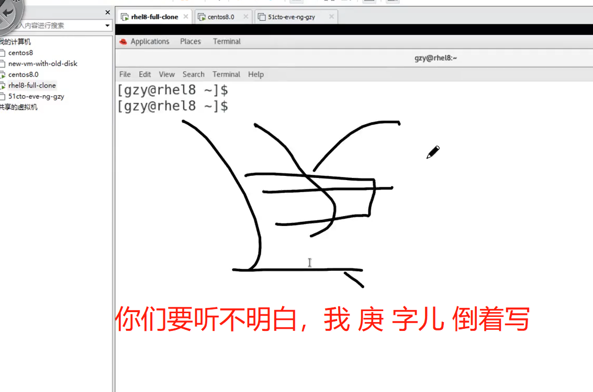

---

## 2-8 ls命令作用和基础用法

文件的增删改查

文件的查看(文件内容的查看，文件属性的查看)

文件属性的查看，ls      (list)

ls 后面如果什么都不架，表示显示当前目录下的所有文件名称

ls 后面加路径，就能显示路径下面的文件内容，如果ls后面跟的是目录下面的文件名字列出来，如果ls后面跟的是普通文件，就把这个普通文件的名字列出来

ls 跟多个路径

文件的创建(文本文件的创建，目录文件的创建)

文件的删除(文本文件的删除，目录文件的删除)

文件的修改(文本内容的修改，文件属性的修改)

## 2-9 ls命令常用参数详解

如果想看文件的详细信息，需要加参数

-l  显示文件的详细信息

-a  显示以`.`开头的文件。在Linux中，以`.`开头的文件是隐藏文件

-d  表示显示目录本身，而不是目录下的内容

参数 在99% 的命令里，参数的顺序是无所谓的

ls -l 显示的内容，第一列表示文件的类别：

 * `-` 表示普通文件
 * `b` 表示块设备(存储设备)
 * `l` 表示快捷方式(软链接)

```
rw-r--r--. 1 root root 180942 Mar 13 2019 config.x86_64
```

**前三列**：文件拥有者对文件的权限

**中三列**：文件所属组对文件的权限

**后三列**：其他人对文件的权限

r:read，读权限
w:write，写权限
x:execute，执行权限

权限9列后面的`.`表示文件具备SELinux的安全上下文

有些时候，权限9列后面可能是`+`，则表示文件有ACL权限

后面一列，数字那列，表示文件有的链接数

再后面的`root root`，是文件的拥有者 和 文件的所属组

文件所属组后面那列表示文件的大小，单位是字节(Byte)

ls -l -h /boot

再后一列就是 月，日，时，分， 表示时间

最后一列表示的是文件名字

-a

隐藏文件，为什么他是隐藏文件，建议不要乱改，因为它就是为了不让你乱改才设置为隐藏文件

-d

不带`-d`显示目录下的文件

带`-d`表示显示目录本身

-h

`-h`参数必须和`-l`参数使用。`-h`参数能让文件的大小显示的更人性化

## 2-10 cat命令查看文件的内容

**回顾:** 上节课的重点讲的是操作系统的目录结构

文件管理

路径(path)
相对路径，绝对路径

ls命令能查看文件的属性
-l
-a
-d
-h

1. 文件内容的查看

文本文件内容的查看

cat

`cat /etc/hosts /etc/hostname`

`cat /etc/passwd`

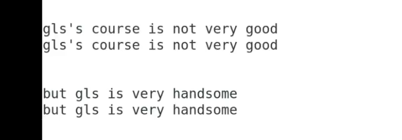

## 2-11 查看文件内容的头部和尾部

head

不加参数默认显示头10行

`head -n 5 /etc/passwd`

`head -5 /etc/passwd  默认是 -n 5 的传参`

tail

不加参数默认显示尾10行

`tail -n 5 /etc/passwd`

`tail -5 /etc/passwd  默认是 -n 5 的传参`

* tailf = tail -f (rhel8没有tail,rhel7有tailf)

`tailf 文件path`

`tail -f /var/log/messages`

more

less

## 2-12 分页查看文件的内容

more 当文件内容非常多的时候，cat命令会一次性将所有的内容输出到屏幕上，假如说有1万行。

对于文本内容较多的文件，more命令可以分页显示这些内容。

加入一个文件有一万行，100页一行，那么more命令就能将这1万行内容分成100页。

回车 可以看到下一行内容
空格 可以看到下一页内容

more命令不支持向前翻页

less和more差不多,less的好处是可以向前翻页,more有的功能less都有

more /etc/passwd

## 2-13 普通文本文件的创建

文件的创建(文本文件的创建，目录文件的创建)

touch aaa

touch bbb

创建多个文件

`touch 文件的path1 文件的path2`

touch创建的文本文件默认都是空的

## 2-14 文件的后缀名和文件类型说明

Linux和windows里所谓的后缀名都是扯淡的

为什么说windows里面要有后缀名？

菜鸡保护机制

file aaa

在Linux里面 file path，显示文件的类型

`find / -name '*.jpg'`

更换后缀名说能打开我庚字儿倒着写

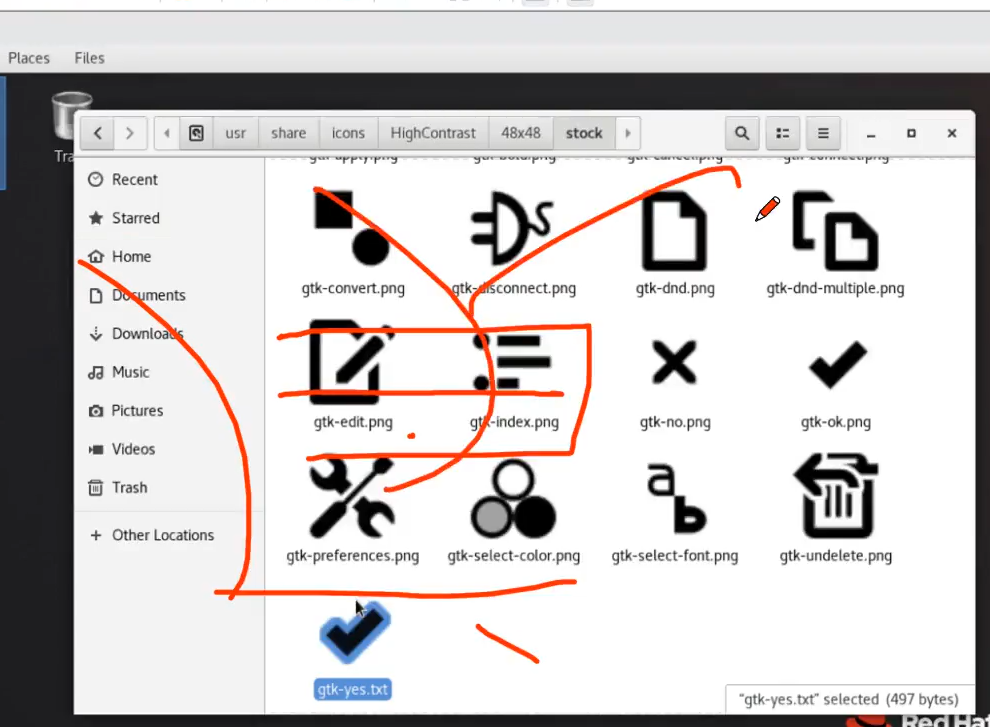

## 2-15 文件的时间戳说明

ls -l

touch aaa

如果touch后面跟的文件已经存在，那么就更新这个文件的时间戳

## 2-16 Linux目录文件的创建

mkdir 目录(一级的子级目录)

创建多个子级目录

mkdir -p 目录

## 2-17 Linux文件的删除

目录的删除

rmdir 目录

`rmdir` 无文件的目录
`rmdir -p` 多子级目录

删除目录就很致命，删除目录一旦删除错误，就很致命

rm命令（remove，下岗命令，能不用就尽量不用，这个命令短短的两个字母透露出这个命令狰狞的面目）

`rm path1 path2`

`rm aaa /root/Desktop/bbb`

此时需要回答`y`或者`n`

`rm -i fff`

会提示你是否真的要删除这个文件，这个`-i`参数非常重要

`-i` 参数能提示是否删除一个文件(root为什么自动提醒，待会儿讲)

`rm passwd`

`touch aa{1..100}`

`rm{1..100}`

如果想删除大量文件不想浪费时间，如果是root删除文件，为了防止不断的提醒，可以加`-f`参数，表示`force`的意思

rm -r aa{1..100}

`-r`参数赋予`rm`删除目录的能力

`-r f`一起用，文件目录都能在不提示的情况下直接删除。删对了，升职加薪，走向人生巅峰。删错了，再见。

`rm -rf aa{1..100}`

`/bin`目录存放着普通用户能够执行的程序

`rm`也在/bin下面

`rm -rf /bin/rm` 就再也用不了rm这个命令了

有些系统不允许删除文件，这个就是一个好方法防止一些人手贱

如果删了rm文件后要进行恢复
```
mount /dev/sr0/mnt/
cd /mnt/
cd BaseOS/
cd Packages/
pwd
ls
ls | grep core -i
rpm -ivh coreuti.......x86_64.rpm
ls /bin/rm
```
这就回来了，能够继续rm

root的rm和普通用户的rm不太一样

## 2-18 Linux的命令别名alias

ls -l = ll

alias叫做别名

alias ergou='ls'

`alias`
可以列出目前的别名

alias rm='rm -i'

创建的命令是临时的，如果想创建永久的alias命令，需要修改环境变量

vim .bash_rc可以修改alias
然后退出当前用户的shell重新登录一下

```
如何让程序整绿

touch aaa

chmod +x aaa
```

## 2-19 Linux的文件拷贝命令

文件的拷贝，文件的剪切

cp(copy)

mv(move)

cp 源文件1 源文件2 ... 目的目录

`rm -rf hosts`

`cp /etc/hosts /etc/hostname /root/Desktop`

`cp /etc/hosts /root/Desktop/hosts.bak`

cp如果最后一个文件是一个存在的目录，就将拷贝的文件放入目录中

`cp 源文件 目的目录(asdasdas)`

拷贝且改名（备份）

cp如果最后一个文件并不是一个存在的目录，就将cp指定的文件拷贝到目标上名字的上层目录，并且将名字更改为目标名字

`cp /etc/hosts /root/Desktop/hosts.bak`

因为没有`/root/Desktop/hosts.bak`这个目录，所以就是拷贝到这个地方并改名为`hosts.bak`

cp -r 可以拷贝目录

`cp -r /etc/ /root/Desktop/etc.backup`

`cp /etc/ . -r`

如果看到一些报错是因为权限问题可能拷贝不了一些文件和目录，但是大部分的文件和目录都是会被拷贝过来的

拷贝过来的文件的属主和属组是当前用户的

而/etc是root/root的

在拷贝过程中，文件的属性发生了变化

**cp -a 可以保留文件的原有属性**

`cp -a /etc/ /home/gzy/Documents/etc.bak`

但是还是会看到属性还是gzy的属主，不是root的

gzy永远是gzy，不是root

gzy有可能创建一个输于root的文件吗？
不可能。

如果以root的权限进行操作

`cp -a /home/gzy/Documents/etc /root/Desktop`

现在ls -l可以看到谁的属组还是谁的属组，没有发生变化哦

root是可以拷贝保留root、gzy的属主的属性

cp的覆盖

涉及文件重名的问题

`cp /etc/hosts /home/gzy/Music` （注意后面这个目标文件后面加不加`/`都是一样的）

`ls Music/`

可以看到hosts

cp的本质，是拷贝到目标目录里

那什么时候不一样？

`cp /etc/hosts /home/gzy/hosts/`

会直接报错: 没有hosts这个目录，拷贝失败

如果`touch hosts`

此时hosts是存在的一个空文件

`cp /etc/hosts /home/gzy/hosts`

可以看到hosts的内容就在`/home/gzy/hosts`中

注: root用户会提示是否要覆盖，而普通用户不会提示这个覆盖。

## 2-20 Linux文件的剪切命令

用法和cp基本一样，唯一的不同就是移动之后，源文件没了，到了新的路径。

`mv /home/gzy/china-japan/ /home/gzy/japan`

如果移动的源文件和目的路径文件一致，就实现了改名的功能

倒是没有-a保留属性的这么一个说法

## 2-21 Linux通配符的使用

通配符是文件管理的神器

`?` 就是通配符的一个， `?` 表示非空的任意一个字符

`ls ??`

`ls ?b`

`touch a?`

如果匹配到`a?`的文件，会更新时间戳

如果没匹配到的东西，这句话其实只创建了一个带问号的文件名的文件

`\`

本质上`touch a\?`

也可以`touch 'a??'`

单引号会让任何特殊符号失去本来的意义，但是双引号不好使

`[]`

`touch abc`

`touch bc`

`ls a[abcdefg]c`

中括号也是表示一个字符，但是那个字符不是任意字符，是中括号里面的字符

`ls a[^g]c`

这个是`a`开头`c`结尾中间不是`g`的文件名,[^字母]表示不要哪个字母

`*`

`*` 表示任意数量字符

`ls *b?`

`cp * /tmp`

```
老庚语录

不要给我传播这个命令，同学们。`rm -rf /*` 是删除根目录下的所有文件。这个命令你在生产环境中敲了，赶紧跑，明白吗？赶紧跑。这个命令你敢敲，你就凉凉了。你要是以`root`敲得，赶紧跑。
```

## 2-22 vim编辑器命令模式的光标操作

1. 编辑文件的内容，命令行编辑工具vi/vim
2. 输出重定向
3. 输入重定向
4. 引入一些shell脚本的思想

vim path(文件)

`touch doc.txt`

`vim doc.txt`

`vim /etc/hosts`

当使用vim指定一个文本文件的时候，会进入该文本文件，并查看到文本文件的内容，此时，默认情况下是不能对文件进行内容修改的。

**vim分为4大模式**

* 命令模式
* 编辑模式（插入模式）
* 末行模式
* 可视化模式

当vim指定文件然后回车，进入的第一个模式是命令模式

`hjkl`分别代表`左下上右`，这四个字母都属于命令模式里面的命令，有些系统提供的命令不支持小键盘

进入的第一个模式是命令模式

无论光标在任何位置，输入`gg`，光标会跳到第一行

输入`G (shift + g)`，切换到最后一行

输入 `nG` 就能切换到第n行

按完3，松手，再按`G`。不是按住3，再按G

光标所在位置按x，可以删除光标所在位置的字符

光标所在位置按X，就能删除光标所在位置的第一个字符。如果练习按X，就回不断的向左删除字符。


按`u`可以撤回上一次的操作。相当于windows的`ctrl + z`

windows的撤回是有限制的，取决于编辑软件的缓冲区设置。

vim的命令模式下，几乎可以无限次撤回到文件内容的最开始处。

## 2-23 vim编辑器的插入模式

在命令模式下，输入 `i,I,o,O,a,A` 都可以进入插入模式，在编辑模式(其实是任何模式)按 `ESC` 就可以退回到命令模式。

经验: 一定能退回到命令模式 - （狂按ESC）

#### 编辑模式

命令模式下按 `i` ，就会开始从光标所在位置的左侧开始插入文本

命令模式下按 `I` ，就会开始从光标所在行的行首开始插入文本

命令模式下按 `a` ，就会开始从光标所在位置的右侧开始插入文本

命令模式下按 `A` ，就会开始从光标所在行的行尾开始插入文本


让你在某个配置文件的第486行配置下面另起一行，添加`Listen 223`

`486G` `o`

## 2-24 vim编辑器命令模式的高级操作

在命令模式下还有很多命令

命令模式下`dd`就能删除光标所在行

命令模式下`5dd`就能删除包括光标在内的下5行

命令模式下`yy`就能复制光标所在行

命令模式下`8yy`就能复制包括光标在内的下8行

如果在命令模式的上一次操作中包含`dd`或者`yy`这种命令，`dd`或者`yy`所删除或者复制的那些行，都可以通过`p`命令粘贴出来。

当在命令模式下输入`p`时，会将上次`dd`或者`yy`指定的行，增加到光标所在行的下面

当在命令模式下输入`P`时，会将上次`dd`或者`yy`指定的行，增加到光标所在行的上面

## 2-25 vim编辑器末行模式的查找操作

在命令模式下输入`/`或者`:`就能进入末行模式

末行模式下常见的操作就如下几种:
 1. 查看指定的字符串

命令模式下输入`/`然后输入要查找的字符串，然后回车，就回将查找到的字符串用高亮的颜色显示出来；如果没找到，则会报错。

如果找到了内容，会以高亮颜色显示。

如果找到了多个，可以`n`切换到下一个找到的字符串，按`N`可以切换到上一个找到的的字符串

 2. 文本内容的替换


 3. 保存文本内容

在命令模式下输入`:`可以切换到末行模式，按`w`然后回车可以将修改的内容保存，即使保存了内容，按命令模式的`u`依然可以撤回。

保存之后可以在`:`的末行模式输入`q(quit)`退出

保存之后可以在`:`的末行模式输入`wq`，相当于`:x`,都是保存退出

`:set number`可以显示行号(可简写 set num)

`:set nonumber`可以去掉行号(可简写 set nonum)


 4. 推出vim编辑器(如果修改的内容没有保存是不能正常退出编辑器的，如果强制退出会导致编辑的内容丢失)

由于Linux是一个多用户的操作系统，所以有可能出现多个用户同时编辑同一个文件的情况，所以要学汇查看vim的异常状态

## 2-26 vim编辑器末行模式的替换操作

`:n1,n2s/old content/new content/global`

上面的操作会将第n1行开始, n2行结束，这些行之间且包含n1和n2行中 old content 替换成 new content

:5,10s/123/456/g

第5行到第10行的`123`全部替换成`456`

:1,$s/1.1.1.1/172.16.33.90/g

第1行到最后一行的所有`1.1.1.1`替换成`172.16.33.90`

`$`表示最后一行

`:1.$s//var//opt/g`

如果要替换特殊字符得写成下面这个样子，得转义

`:1.$s/\/var/\/opt/g`

如果不加`g`，就不是全部替换。只是**每行的第一个匹配到的字符串**去进行匹配

## 2-27 vim编辑器可视化模式操作

可视化模式: 命令模式下按`v`或者`V`，或者`ctrl+v`能够进入到可视化模式

不同模式下使用ctrl和方向键可以选择到不同的内容

## 2-28 vim编辑器异常处理

vim hosts可能会报错说有swp文件

当你vim编辑一个文件的时候，一般会创建一个`.文件名.swp`。如果B用户也想来修改这个文件，也要创建swp文件，但是监测到目前已经有swp文件了。

处理方式:

1. 放弃编辑
2. 删除旧的交换文件
3. 直接覆盖旧有的swp文件
4. 只读模式看

只要不是两个人同时编辑文件导致错误，可以`r`的方式尝试恢复文件

`vimtutor`这个命令会介绍vim的使用指南。如果看中文的tutor，需要`export LANG=zh_CN.utf8`，再`vimtutor`，如果系统中有中文的解释的话就会有中文描述。

vi编辑器和vim编辑器

vim可以理解为vi plus

有些linux的发行版默认没有vim，只有vi，可以选择安装vim

上面讲到的所有操作，都可以在vi中进行操作

## 3-1 输出重定向介绍和使用输入重定向背景

重定向 redirect

默认情况，无论一个命令执行正确与否，结果默认输出到屏幕上

command会产生两个结果： 正确 ， 错误

在有些情况下我可能需要保留命令或脚本输出的结果。当作log。

## 3-2 输出重定向介绍和使用输出重定向背景

command 可以使用 `>` 和 `>>` 将正确的结果输出。使用 `2>` 和 `2>>` 将错误的结果输出

`cat /etc/hosts` 产生的结果是正确的，我们可以使用`>`和`>>`把正确结果输出到一个文件中而不是屏幕上。

`cat /etc/hosts > /root/file1`

`cat /etc/hosts >> /dev/stdout`

`cat /etc/hosts >> /dev/stderr`

`chmod +x /bin/rhcsa8.sh`(这个是考试环境的一个脚本)

`/bin/rhcsa8.sh`

`xxx.sh > qwe.log`

`>` 和 `>>` 是正确的重定向，能将正确的结果。`>>`是文件后追加。`>`是覆盖。

`2>`就是错误的覆盖，`2>>`是错误的追加。

`&>` 正确错误都覆盖

`&>>` 正确错误都追加

`command &> command.result`

`&>> /dev/null`

`/dev/null` 是一个特殊的文件，如果将重定向指向这个文件，那么就相当于将执行结果送到黑洞中。

`md5sum qwe.log`

比如不想别人看到md5值校验的东西

`md5sum qwe.log &>> /dev/null`

有些时候我们不想让这个命令产生结果，就送到黑洞中。

## 3-3 输入重定向详解（一）

mail命令

mail能发送邮件。mail可以发送到qqmail，gmail等，都可以，前提是mail得能够连接邮件服务器

mail -s to-gzy gzy

```
yum search mail

yum -y install evolution

庚老师这里还是没有安上mail命令

```

```
mail -s to-gzy gzy

hi gzy
ihead your lastest course
ni ka lian le
wo you dian xingzai lehuo

```

这个时候切换到gzy的用户
```
mail
1(然后就可以看到邮寄给gzy的信了)

```

输入重定向 `<` 和 `<<` 完全不一样

`mail -s "gzy收" gzy` 回车后，会发现没有弹出能敲下一个命令的界面。此时他需要你输入内容。现在这个命令在等待用户输入一些东西。输入一个 `.` 后，就表示输完了。

现在可以这么搞事儿：

`vim to-gzy.letter`

`mail -s "庚老师收" gzy < to-gzy.letter`

`touch hosts` # 使得当前目录存在hosts文件

`echo y > qwe` # qwe文件中有y

`cat hosts`

`cp /etc/hosts . < qwe` # 加入参数 y

上述命令正确执行，自动覆盖hosts文件

`fdisk /dev/sda` # 可以使用脚本来对磁盘进行操作

## 3-4 输入重定向详解（二）

mail -s "to-zhenyuan" gzy <<qwe

`<` 和 `<<` 完全不一样。


现在就在这里输入 `.` 也不会结束了。

我们只有输入`<<`后面的东西，才会结束这些输入。如果想结束所有输入，得输入`<<`后面的东西才能结束输入。

如果我们仅输入`cat`，我们输入什么屏幕输出什么。

cat <<qwe

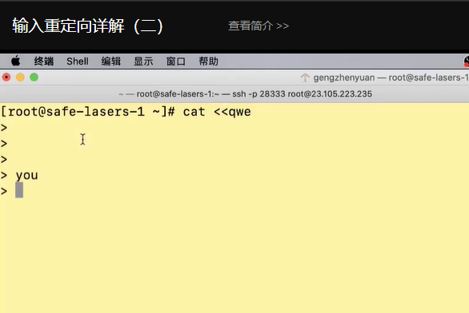

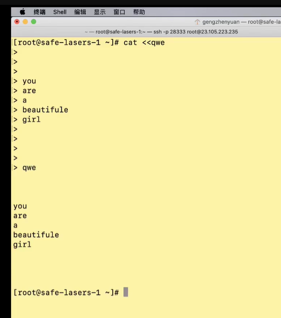

在这里输入`qwe`后，cat会统一输出我们的输入

`cat > clock.txt <<ooo`

```
> this is a good file
> ooo
```

会发现cat没有直接把输入给输出

输出进入了clock.txt这个文件中

如何理解这个命令，得先理解命令是交互式的还是非交互式的。输入重定向可以将交互式命令变成非交互式命令。

shell脚本其实就是Linux命令的集合体。一个脚本里面可以有N个Linux命令，但是shell脚本里面尽可能的是非交互式命令。这样才能让脚本自己动。

## 3-5 Linux管道基础概念操作

管道（文件管理比较重要的东西），管道的左边和右边都有命令

`ls | `

回车后会看到 `>` ，按 `ctrl + c` 结束。

管道能将输出变成输入。 `ls | cat` 

管道右边的命令，总是接受输入的命令。

## 3-6 Linux管道操作

mkdir test

ls

echo 123 >> file

cat file

useradd gzy

`echo 123 | mail -s "to-gzy-mail" gzy`

管道前面的输出作为管道后面的输入

1. 管道的左边和右边都有命令
2. 管道左边的命令会产生输出结果，输出结果经过了管道之后，就会变成输入
3. 管道右边的命令总时接受输入的命令

cat
mail
head
tail
more
less
grep

以上大部分不加参数敲的话会进入等待输入的模式，输入什么回车后就会打印你的输入

`ls|cat`

这里ls会输出目录下文件，这个输出结果作为cat的输入，所以整体命令会输出ls的结果

`ls | xargs cat`

文件管理里面我们大部分讲的命令都有接受输入的能力

## 3-7 Linux过滤文件内容行grep命令详解

grep (中文：抓)

`cat /etc/hosts`

`grep root /etc/passwd`

把passwd文件中的root的行给抓出来

`grep 内容 普通文本文件`

`-i` 不区分大小写

`-v` 反向抓取（我抓去的内容是123，加上-v，就是除了123，都抓取）

`-A` 

`-B` 

`-n` 显示行号

`-E` 正则表达式

在管道的应用场景，grep使用的频聊非常高

cat file | grep a是的

grep a file

ls | gerp 1

ls | xargs grep 1

ls | grep 1

gerp正常操作只能抓取文件的内容。配合管道，可以抓抓任何内容。

`grep fff file -v` 反向抓取，除了fff行的都抓

-A (A是after),在什么之后;-B是在什么之前(Before)

`grep fff file -A 2`

抓那一行并把其之后的两行也列出来

`grep fff file -B 2`

抓那一行并把其之前的两行也列出来

`grep fff file -B 2 -A 3 -n`

`cat file | tail`

把后十行显示出来

`cat -n file | head -3`

cat的 `-n` 参数可以显示行号

cat -n file | head -3 | gerp a

cat -n file | head -3 | gerp a | 

## 3-8 正则表达式基础

* ^ 表示以什么开头
* $ 标识以什么结尾
* . 表示匹配任意一个字符(不包括`\n`)
* \*
* ?

正则表达式存在的意义是为了匹配文件内容，log(日志)分析

`grep a file`

`grep ^a file`

`grep w file`

`grep w$ file`

`grep a file`

`grep ^a file`

`grep ^ac$ file`

这并不是以a开头c结尾。可以使用`grep ^a file | grep b$`

`grep ^aa file`

这是以`aa`开头

`grep a. file`

单独的`a`是匹配不出来的，`a`字母后还得有个字母才能匹配到

`grep .* file -n`

`.*`表示匹配任意非空字符串。`.*`有1~n个`.`。

`grep .? file -n`

表示匹配任意两个非空字符。? 表示可以重复前面的字符1次或0次

`grep a? file`

这个能不能抓出来`aa`，可以但是可能是有问题的。

`grep -E a? file`

-E表示正则表达式

`cat /etc/chrony.conf -n `

这是几千行的配置文件

`grep ^# /etc/chrony.conf -v | grep ^$ -n -v`

`^$`表示空行。`^#`表示以`#`开头的行

## 3-9 获取Linux帮助

文件管理命令，linux命令本身并不难记，难的是命令包含非常多的参数。

1. man    所有参数大杂烩
2. info   更像是一本书（根功能将参数分类）
3. help 命令  --help
4. 红帽官方文档
5. 百度
6. 谷歌
7. 软件本身的帮助文档

man(manual)

man命令其实指向一个目录`/usr/share/man/`这里的目录

`info ls`

`ls --help | grep '\-d'`

公司的开发，做一个自动化运维的工具，没有man手册，百度不可能找到的命令，但一定会做一个--help的命令的基本用法。

红帽官方文档: access.redhat.com。看这个的话最大的难点就是，无法分辨庞大的文档库中，哪些是我需要的

谷歌查询：谷歌里英语搜索

软件本身的帮助文档：安装一些第三方软件，第三方软件里面都有README

获取帮助只是辅助，硬实力

解决需求（运维），使用Linux命令

shell脚本

## 3-10 Linux命令行常用的快捷键和补全

Ctrl + l 清理屏幕

**ctrl + a 光标移到最左侧**

**ctrl + e 光标移到最右侧**

ctrl + u 光标移到所在位置的最左侧

**上箭头 上次使用的命令，下箭头 相反。本质上是history中的命令。**

ctrl + y 还原删除操作

**ctrl + w 光标到左侧的删除一个word**

history 能够查看历史命令

!l  叹号后面加一个字符，会找到最近的以某字符开头的命令。但是建议这种命令不要随便使用。

命令的不全，不支持参数不全，仅限于基础linux。

支持path的补全。

两下tab可以看到支持的补全，按一下tab会尝试去补全。

# 第三模块 用户用户组管理和用户密码和用户组密码管理

## 1 Linux用户管理北京和知识模块概述

用户管理（考试必考，2道题）

1. 用户的增删改查
2. 用户组的增删改查
3. 用户密码的增删改查
4. 用户组密码的增删改查

用户管理在linux中使用频率并不高

虽然linux是一个多用户管理的操作系统，但是很少有非常多的用户（用户名）登录同一个系统

在windows中通常是administrator用户开启web、dns、DB、storage服务，如果 win server 中web被攻克后，那么整台机器的所有服务全部都被攻克了。但是在linux中不会，因为linux开不同的服务用的用户都不一样。

所以我们有时候需要创建的服务用户比普通用户的权限高，但是比root用户权限低。

## 2 Linux用户的增删改查和用户信息配置文件详解

用户的增删改查

* useradd   增加用户的命令
* userdel   删除用户的命令
* id        查看用户的命令
* usermod   修改用户的命令

用户信息都存放在`/etc/passwd`，用户密码信息存放在`/etc/shadow`，用户组信息存放在`/etc/group`，用户组密码信息存放在`/etc/gshadow`。

useradd cangls
grep cangls /etc/passwd
useradd mudong
grep mudong /etc/passwd

使用useradd命令添加用户，会在`/etc/passwd`里面产生信息。

/etc/passwd里面的信息分为7列，被6个冒号隔开。

第一列表示username (login name)

第二列表示密码列，但是该列已经被移除，用x表示，密码信息已经存放在了/etc/shadow文件

第三列表示用户的UID (user ID)，和身份证号差不多，绝对不能重复

第四列表示用户所属组的ID，用户的private group ID。

private group, primary group, attached group

任何用户都要属于一个用户组的。

第五列表示描述信息，邮箱，电话

第六列表示用户的家目录信息

第七列表示用户的登录shell

`useradd wjx -u 5000 -d /wjx -s /bin/sh`

`grep wjx /etc/passwd`

-u是指定uid为5000。

修改用户信息（一般没有修改家目录的）：

`usermod wjx -u 5001 -d /wjx1 -s /bin/bash`

`grep wjx /etc/passwd`

个人实践了下，useradd使用-d指定增加家目录之后，如果使用usermod再更改家目录，会发现原先的家目录没有删除，但是也没有新增新的家目录。切换用户会找不到他自己的家目录，而且对切换后的第一时间的目录也没有操作权限。

RHEL系统创建用户是自动创建家目录的，原因是系统参照了`/etc/login.defs`配置文件里面的内容。这个目录在系统安全中很重要，需要修其中的参数。

删除用户

useradd tgb

userdel tgb

现在`su - tgb`会是失败的

useradd创建用户成功之后的默认行为是创建这个用户的家目录和邮箱

userdel删除用户，默认不会删除用户的家目录和邮箱

`userdel -r tgb`

这个`-r`参数会删除用户的家目录

## 3 Linux用户组的增删改查和用户组信息配置文件详解

用户组的管理

* 用户组的添加（groupadd）
* 用户组的删除
* 用户组的查看
* 用户组的修改

primary group（主要组），private group(私有组)，attached group(附加组)

`groupadd kcz`

`grep kcz /etc/group`

`groupadd lsj`

`grep lsj /etc/group`

`groupdel lsj`

`grep lsj /etc/group`

`head /etc/group`

`/etc/group`每列的详解：

第一列：组名

第二列：表示组密码，x存放在`/etc/gshadow`

第三列：表示组ID

第四列：表示组成员

可以添加用户组的同时指定GID。

`groupadd -g 10000 kcq`

`grep kcq /etc/gpasswd`

修改组

OS是通过id来识别这些用户、用户组的

修改组（一般功能很鸡肋，一般就是修改组id）

`groupmod -g 20000 kcq`

`grep kcq /etc/group`

## 4 Linux用户的私有组，主要组和附加组详解

用户组和用户的关联

创建用户的时候指定

`useradd hzz`

`grep hzz /etc/passwd` (发现hzz所属组id 5232)

`grep 5232 /etc/group`  （抓出5232的组名就是hzz）

由于任何用户必须依赖用户组才能存在，所以如果创建用户没有指定用户组，那么系统会为该用户创建一个同名的组。这个组叫做用户的私有组（private group）。私有组默认里面只有一个和该组同名的用户。

经验之谈，私有组的意义就在于让用户有了一个用户组。


`groupadd lsj -g 30000`

如果创建了一个用户，指定了该用户的所属组，那么该用户就没有私有组。

`useradd tgb -g lsj`

创建用户tgb的时候指定用户组是lsj

`grep tgb /etc/passwd`

可以发现tbg属于lsj的组

`grep tgb /etc/group`

发现并没有给tgb创建自己的私有组。私有组的概念就是保护一个用户有个组，生产环境中私有组的概念其实无所谓。

`userdel tgb`

/etc/passwd 第四列GID表示该用户的主要组（primary group）。一个用户可以属于多个组，记录在/etc/passwd的那个组就是主要组。

在上面的例子，我们看到了hzz这个组即是hzz的私有组，又是主要组。

所以，创建用户的时候，如果我们指定了这个用户的主要组后，系统就不会再创建他的私有组了。

`grep lsj /etc/passwd`

`grep lsj /etc/passwd`

一个用户可以只属于一个私有组，也可以同时属于多个附加组（attached groups）

`groupadd diqiu`

`useradd yzq -g  -G diqiu`

准确的说（更正上面的一些不太正确的说法），创建用户如果没有指定私有组，那么系统会默认创建私有组

上面这个命令，yzq用户的主要组也就是他的私有组就是yzq这个组本身，附加组是diqiu。

`grep diqiu /etc/group`

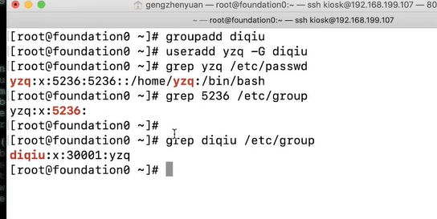

可以看到diqiu的组中有yzq,但是yzq的组中没有用户，因为yzq的私有组默认就是yzq，不需要写

`useradd lys -G yzq`

`grep yzq /etc/group`

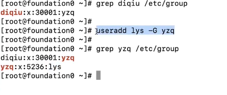

附加组理论上可以将任何一个用户组当作任何一个用户的附加组。但是理论上，应该尽可能的不将私有组作为某个用户的附加组。

id查看一个用户的时候，可以看到uid和gid还有这个用户属于的所有组

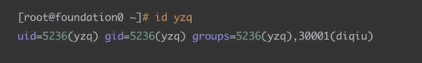

gid表示这个用户的primary group。除了gid之外的组都是附加组

## 5 从用户组中添加用户和删除用户操作

添加用户的时候直接指定附加组

`useradd username -G attacjed group`

`useradd goushen`

`id goushen`

`usermod -G lsj gousheng`

`id goushen`

`usermod -G kcq gousheng`

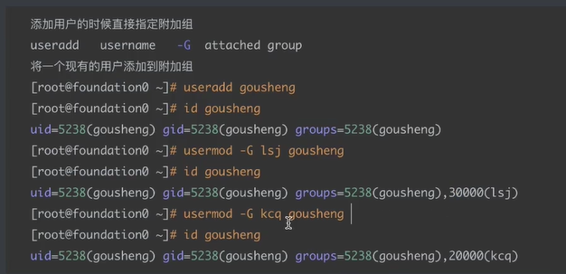

发现gousheng之前加入的lsj在第二次usermod -G命令后不复存在了。这说明usermod这个命令其实是有限制的，只能指定一个。

`usermod -aG lsj gousheng`

需要参数-aG才能添加两个附加组。

`usermod -Ga lys gousheng`

`gpasswd --help`

`gpasswd -a gousheng lys`

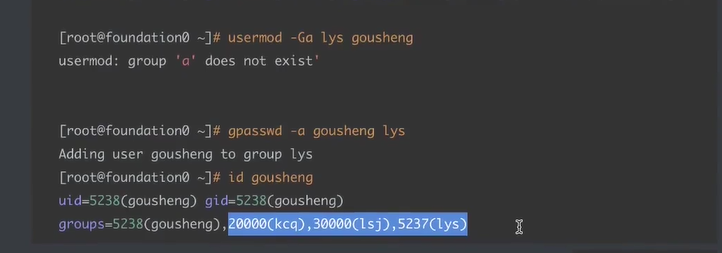

gpasswd -d gousheng lys

将lys从gousheng这个组当中删除掉

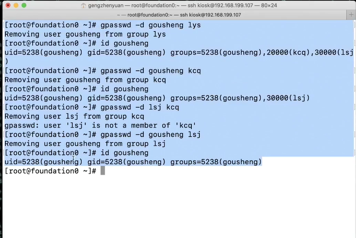

## 6 用户密码信息配置文件详解

用户密码的管理

1. 给用户设置密码（最常见的运维操作）

`id wjx`

`passwd wjx`

`grep wjx /etc/shadow`

`grep tgb /etc/shadow`

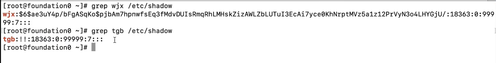

为什么wjx这么长，tgb这么短，是因为wjx设密码了，tgb没有设置密码。

/etc/shadow存放的是密码信息，每一列密码信息都被冒号分割开来。

第一列表示存放的哪个用户的密码信息。

第二列存放的是密码，该密码并不是明文，而是使用算法生成，算法在`/etc/login.defs`中指定。

grep tgb /etc/shadow

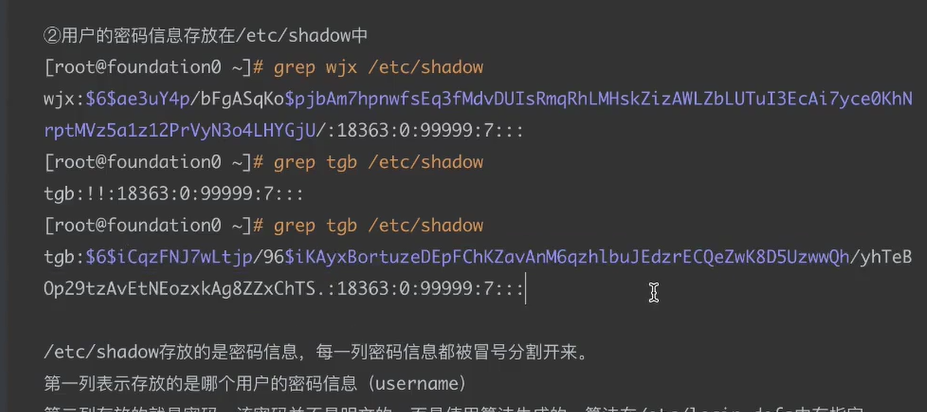

第三列存放的是上次修改密码的时间（从1970年1月1日开始到当时的天数）

第四列存放的是密码最小有效期

第五列存放的密码最大有效期。如果数字是3，就表示密码会在3天后过期，如果还想继续使用，必须在密码到期之前修改。

第六列存放密码到期前多少天警告的时间信息。该数字如果为7，就是密码到期之前的7天就会发出警告，告诉你密码即将过期。

第七列表示用户密码到期后的宽限日期，数字如果是2，就表示密码到期后，你还能够使用这个密码2天，如果2天到了，你还没有让管理员修改密码，密码就失效了。

第八列表示账号失效日期，如果到了第八列的时间，账号直接失效，不可登录。

第九列保留

上面这些如果作为开发者的话都是可以更改的

## 7 passwd命令修改密码信息详解

`grep tgb /etc/shadow`

`passwd --help`

使用passwd命令控制用户的信息

`passwd -d tgb`

`grep tgb /etc/shadow`

-d参数可以删除一个用户的密码，也可以删除密码锁定。passwd不能修改密码的

`passwd -n 3 -x 10 -w 5 -i 2 tgb`

密码最小有效期3天最大有效期10天，密码到期前5天发出警告，-i就是密码到期之后还能宽限2天

passwd的账号失效日期-e,直接加用户名， -e tgb，能将该用户的密码直接设置过期

-l参数某个账户锁定密码

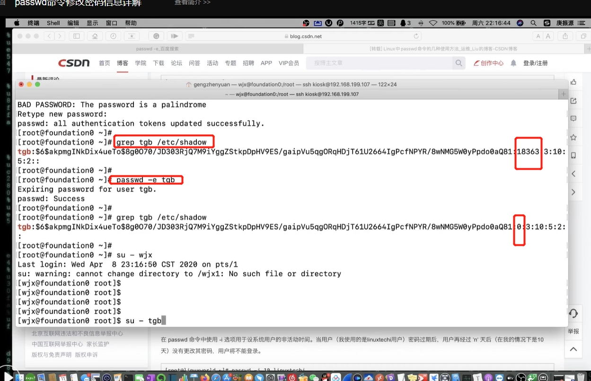

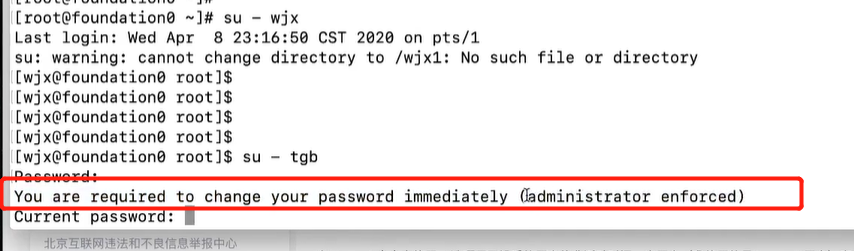

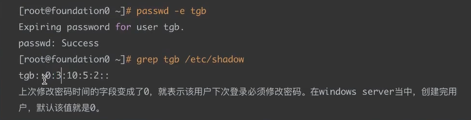

上次修改密码的时间的字段变成了0，就表示用户下次登录必须修改密码。在windows server当中，创建完用户，默认该值就是0。

## 8 chage管理密码信息详解

使用chage (change age)来修改用户的密码信息，相比于passwd能够更灵活的修改密码信息。

`chage -d 1300 -m 2 -M 20 -W 10 -I 4 -E 2021-1-1 tgb`

passwd改不了密码的修改日期这个字段。但是chage能够更改基本的所有的内容。

一般来说，针对上次修改密码的时候，要么不修改，要么设置为0，表示让用户下次登录的时候必须修改密码（tgb登录的时候，先输入tgb原来的密码，新的密码必须有一定的密码强度）

`chage -d 0 tgb`

`passwd -e tgb`

这俩命令是等效的。

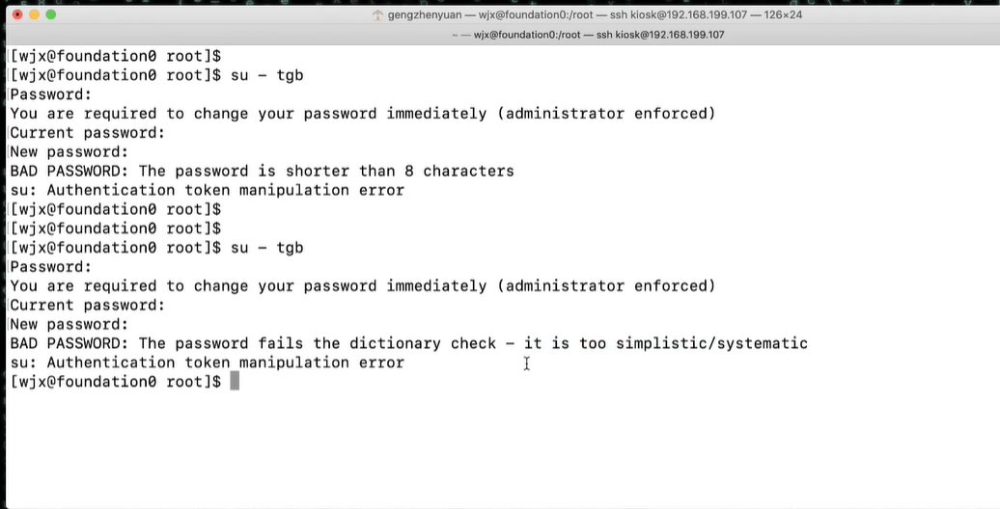

这里修改密码必须要符合高的强度密码才能通过密码认证。

## 9 passwd的一些特殊用法

如何锁定用户的密码

passwd -l tgb

grep tgb /etc/shadow

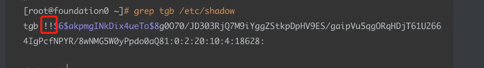

可以看到这个用户前面有俩叹号，除了root用户其他任何用户都切换不到这个用户上

`passwd -l` 就是锁定

`passwd -u` 就是解锁

chage 没有锁的功能，但是对时间的设置比passd多

passwd改不了密码创建时间，但是能锁定用户

普通用户想修改自己的密码，直接`passwd`就可以了

passwd --stdin 可以让passwd命令接受标准输入

`echo 123 | passwd --stdin tgb`

这样子直接把tgb的密码设置成123了

将tgb的密码设置为123

## 10 理解用户组密码的作用

`cat /etc/gshadow`

`grep lsj /etc/gshadow`

`usermod -G lsj tgb`

组密码的第二列记录的是组密码,gpasswd可以给组设置密码

gpasswd --help

gpasswd lsj

可以给lsj这个组设置密码

`grep lsj /etc/gshadow`

`useradd tgb -G lsj`

对于任何一个用户来说，创建的文件，默认的拥有人就是该用户，默认的所属组就是该用户的primary group。

现在tgb属于lsj这个组

newgrp lsj

touch bbb.avi

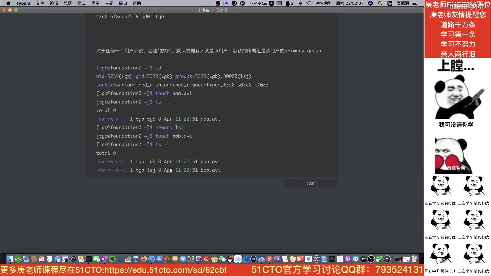

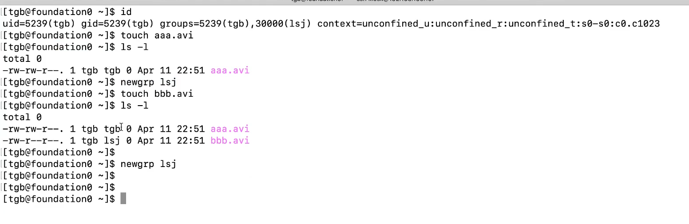

敲完`newgrp lsj`后，能临时的把shell更改为lsj

`newgrp 组名`

newgrp能临时的切换当前用户的组

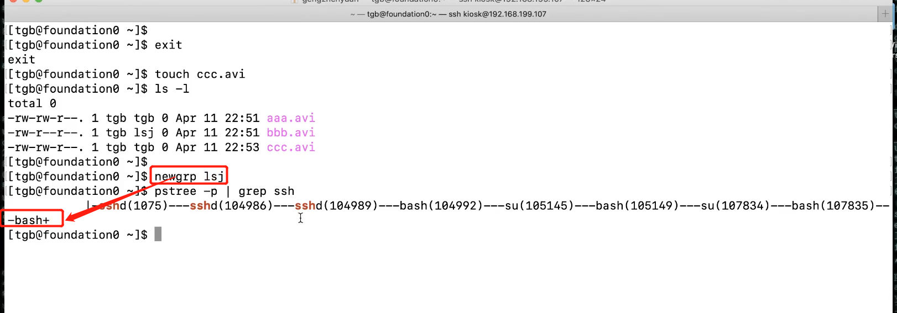

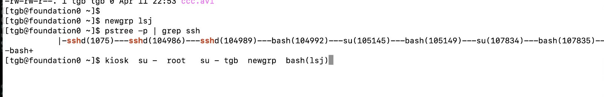

`grep kcq /etc/group`

`newgrp kcq`

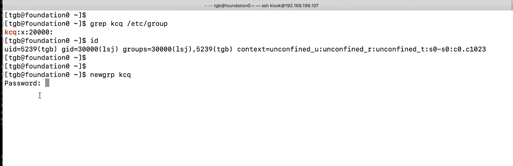

这里需要输入kcq这个组的组密码

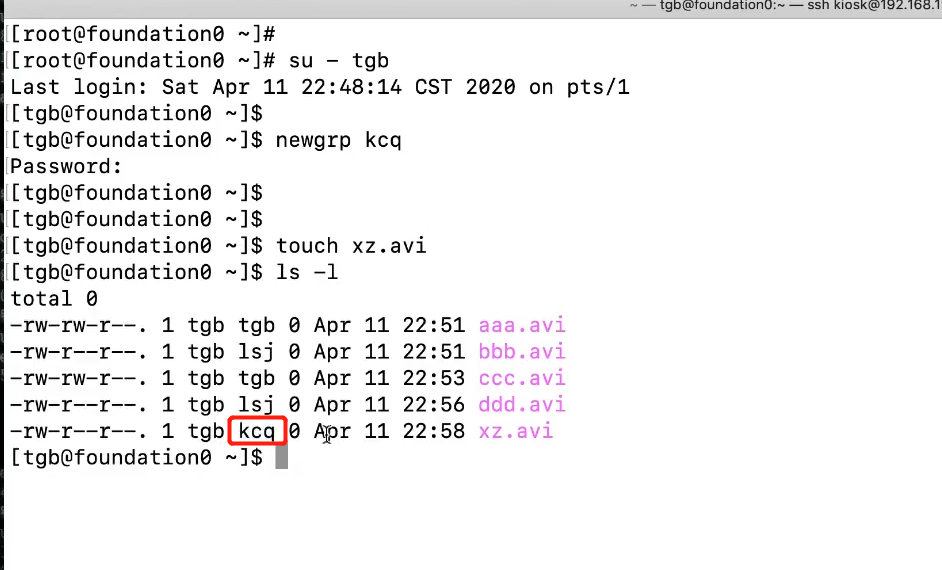

这就是组密码的作用，可以让不属于该组的用户可以切换到该组的一种方式，只要提供正确的密码，即可切换成功

# 第四模块 Linux基础权限特殊权限ACL权限管理

## 1 Linux权限介绍

权限（无论考试还是应用都非常重要）

## 2 Linux文件权限9列详解

权限的作用

权限对于普通文件和目录文件的作用是不一样的

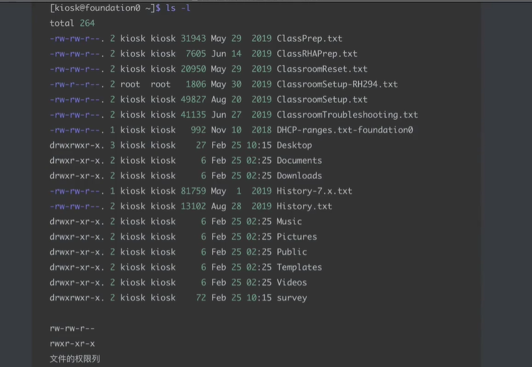

权限对普通文本文件的作用

9列权限，前三列表示文件的拥有者对文件具有的权限，中间三列表示文件的所属组对文件拥有的权限，后三列表示其他人对该文件的权限。其他人人的意思是既不是拥有者也不是所属组，就是其他人。对于一个文件来说，他的权限列表示它对世界上的三种人具备的权限，这三种人分别是owner(拥有者),group(所属组)，others(其他人)，任何一个文件的权限列所表达的意思都是这样的。

一般来说（并不强行规定），属主的权限 > group的权限 > others 的权限。注意一点，文件的owner不一定属于该文件的所属组。

权限列常见的内容有4个，分别是r , w , x , - ,9列，分割成3个3列。分别表示对三类人的权限。第一列要么是r要么是-。如果是r，则表示该类人对该文件具有读权限。第二列要么是w要么是-
，写权限。第三列要么x要么-，表示该类人对文件有执行权限。

r = read

w = write

x = execute

看文件权限3步：

1. 找到权限9列，将其分成3等分。
2. 确定拥有人权限的3列，所属组权限的三列，其他人权限的三列
3. 去欸的那个每一类人的权限，有r就是有读权限，有w就是有写权限，有w就是有读权限。

对于普通权限来说，r,w,x权限表达的意义是什么？

如果一个普通文件有r权限，就表示该文件的内容可以被查看到。


## 3 普通文件权限功能介绍

如果一个普通文件有w权限，表示该文件的内容可以被修改（加内容、删内容、修改内容）

如果一个普通文件有x权限，就表示该文件可以当作脚本一样执行

权限对应的可操作性内容就是上面描述的

## 4 目录文件权限功能介绍

对于目录文件来说，rwx权限表达的意义是什么呢？

如果一个目录文件有r权限，就表示该目录下的文件可以被查看属性（查看文件属性的命令ls）

如果一个目录文件有r权限，能否查看这个目录下的普通文件的内容（不一定）

一个普通文件能否查看它的内容和它所在的目录没有任何关系，而是和他自己是否具备r权限有关系。

如果一个目录文件有w权限，就表示可以在该目录下**创建**或**删除**或**修改文件属性**

如果一个目录文件有w权限，是否能修改这个目录下的普通文件的内容？（不一定）

一个普通文件能否修改他的内容和它自己是否有w权限有关系，和它的所在目录是否有w权限没有关系。

如果一个目录文件有x权限，就表示可以进入该目录，如果一个目录连x权限都没有，这个目录是无法进入的。

一个目录没有x权限，能不能在该目录下创建或删除，或者更改文件的权限？（可以）

可以直接写这个目录路径下的文件，可以增加文件，查看文件，但是我不进

`mkdir /etc/123`

如果一个目录没有执行权限，也没有r权限或者w权限，表示该目录是一个问题目录。

对于目录只有3类权限有意义

* --- 目录没有任何权限
* r-x 有读权限
* rwx 有写权限

-wx 能创建能写能删除能，能cd进目录，但是看不到目录下有什么文件，tab也不能补齐文件名但是能往文件里面写入

--x 这个目录能进但是看、操作不了。这是有问题的。
r-- 会有意外的错误

如果目录没有x权限，比如我设置了------rwx权限进行测试，可以看到没有x权限，最多看到目录下的文件名，但是什么都动不了，看不到文件的内容

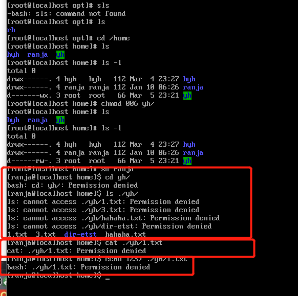

目录文件唯三有意义的权限就是

* --- 目录没有任何权限
* r-x 有读权限
* rwx 有写权限

## 5 设置文件的拥有人和所属组

针对一个文件设置权限(切换到root做)

`useradd hcj`

`useradd zk`

`id hcj`

`id zk`

一个文件的权限和文件的owner和group息息相关。

`cd /home/zk`

`touch women`

`ls -l`

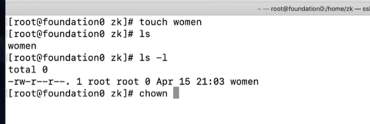

`chown hcj women`

更改属主

`chgrp zk women`

更改属组

所以，文件的属主并不一定属于属主的属组

`chown zk:hcj women`

同时更改属主和属组

`chown :zk women`

只更改属组

## 6 使用chmod命令修改文件权限

chmod u/g/o

u=user(owner) ; g=group ; o=others

`chmod u=rwx,g=rwx,o=rwc women`

`chmod u-x,g-wx,o-rwx women`

`chmod u-x,g-wx,o=--- women`

通过上面的加权限，减权限，等于权限，就能设置文件为任何权限

## 7 目录权限操作演示

测试权限的效果

当你操作linux的时候，必须要知道你是谁，你在哪，你要干什么？

3个角色测试权限的效果

我(root) ; zk ; hcj

`mkdir dir-test`

## 8 Linux普通文件权限操作演示

ls -l

chmod o-r file

chmod o+r file

chown zk file

ls -l file

我们所讲的任何权限的规则，对于root都是不生效的

chmod u-w file

非root用户无法更改文件的属主属组

这里zk没有w权限，vim编辑wq保存不了，但是wq！保存成功

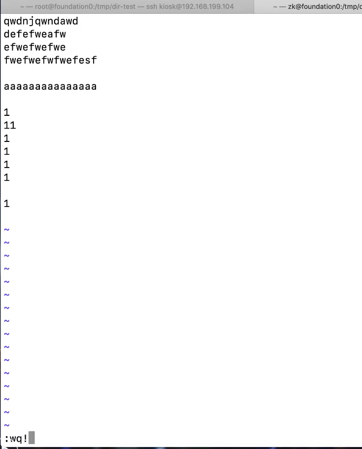

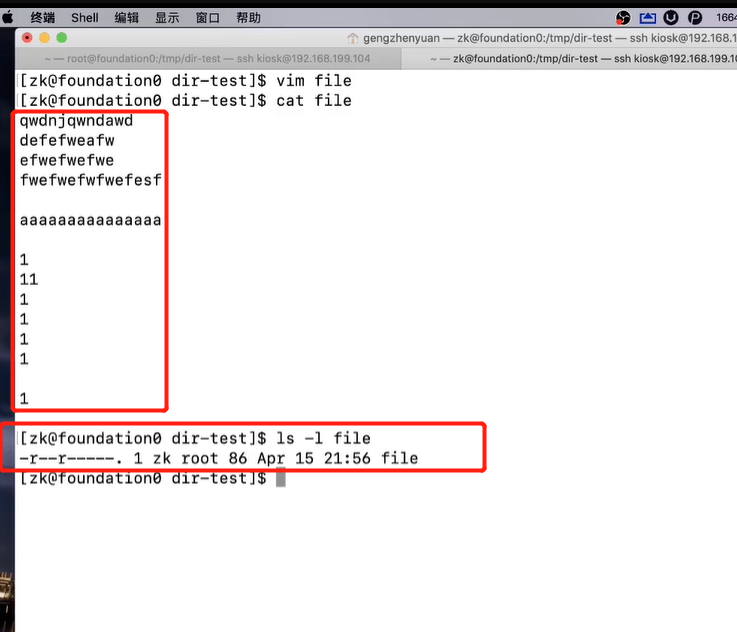

其他用户wq！也无法写入。

为什么，文件的拥有者和root对文件可以为所欲为

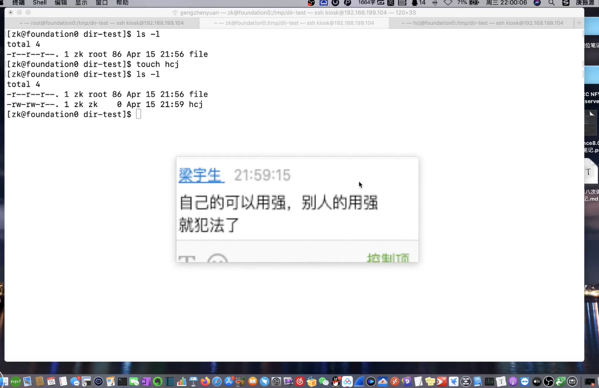

```
老庚语录

咋也不知道什么意思，但是我估计其他同学懂他什么意思，咋也不知道，咋也不敢问，梁宇生说出了自己的理解
```

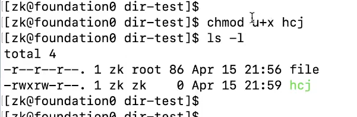

```
老庚语录

张凯做了什么，把黄成吉整绿了。你看着他绿了，其实他没绿。linux默认行为把他变绿了。ls --color默认带着颜色渲染。文件有执行权限。
```

对文件的执行权限解释（shell脚本）

当执行一个普通文本文件的时候，相当于将该文件里面的每一行都当成linux的命令去执行。

如何执行一个文件

以绝对路径或相对路径执行那个文件。如果文件有权限，那么就会执行成功。

执行脚本的时候在执行过程中尽量使用绝对路径，建议不要相对路径

## 9 使用十进制的方法设置权限

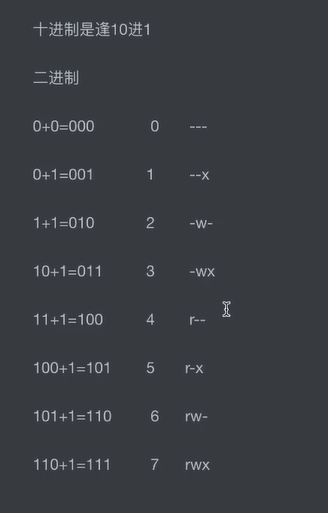

chmod 421 file

chmod 777 file

## 10 Linux的特殊权限详解

linux的三种特殊权限（考试只考一种，实际在生产环境中用的并不是特别多）

1. SET UID

SET UID特殊权限应用可用于执行普通文件。当一个文件被设置SET UID特殊权限时，任何人一旦执行该文件，就会临时获得文件用有人的权限。

ls -l /etc/shadow

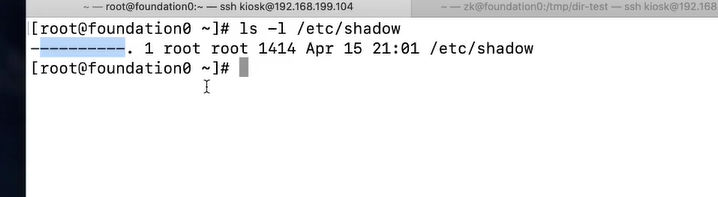

这个文件其实没有任何权限

那么root能不能编辑这个文件?肯定的，文件的拥有者可以对所有文件为所欲为。

`grep zk /etc/shadow`

zk怎么改自己的密码：`passwd zk`

`grep zk /etc/shadow`

`ls -l /bin/passwd`

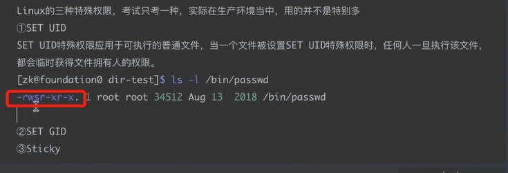

这里出现`S`的权限了

在文件拥有者的权限列的执行权限位置，如果该文件是s或者S，就表示该文件被设置了set UID特殊权限。

passwd这个软件的作用就是更新/etc/shadow这个文件

`ls -l /bin/passwd`

grep zk /etc/shadow

chmod u-s /bin/passwd


由于passwd命令被拿掉特殊权限，会导致非特权用户执行`passwd`命令会失败报错。

ls -l /bin/passwd

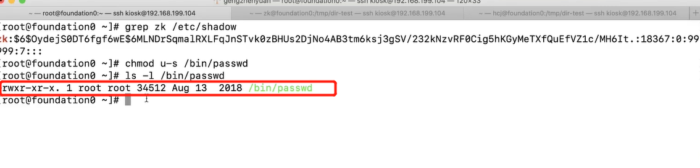

`chmod u+s /bin/passwd`

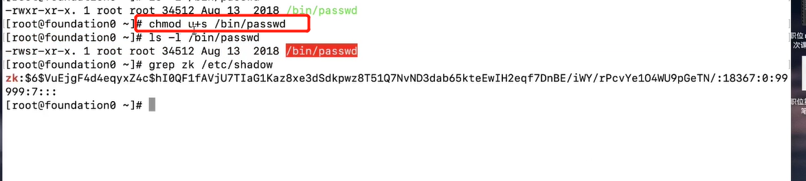

可以看到非特权用户执行`passwd`命令成功

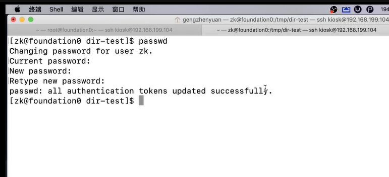

passwd后面如果要跟参数的话只有root才行，非特权用户不能在后面加参数

2. SET GID

SET GID特殊权限应用于目录文件，当一个目录被设置SET GID特殊权限时，任何用户在该目录下创建文件，文件的所属组都会变成被设置SET GID那个目录的所属组。

chmod g+s zk-dir1

ls -ls zk-dir1

在文件所属组的权限列的执行权限位置，如果该位置是s或S，就表示该文件被设置了set GID特殊权限。任何人在这个目录里创建的权限都会属于特殊组。

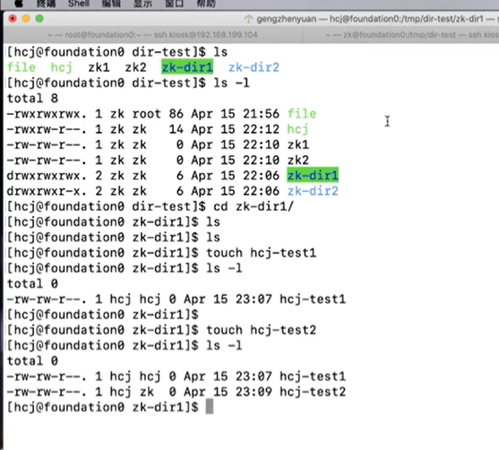

这是个很鸡肋的功能。如果想让一个目录下创建的文件都属于一个组，直接把这些用户加到这个组里面即可。

3. Sticky

在`/tmp`目录`zk`用户执行

touch zk1

意味着这个用户在`/tmp`下拥有写权限`rwx`

`hcj1`用户其实在这里也有写权限。能不能删？能删除。因为有写权限，怎么可能删除不了。

`rm -rf zk1`

但是删除不了: 报错`Operation not permitted`。其实意味着都没有权限。

原因是就是/tmp目录上：有Sticky(粘滞位)。

针对有写权限的目录设置的特殊权限位。当一个有写权限的目录被设置了sticky特殊权限，

原因：root用户在zk的家目录里面创建了文件`root-file`，zk用户在家目录中看到了`root-file`这个文件，然后直接`rm`删除。为什么可以这么轻松的删除root用户创建的文件？因为目录下的写权限过于庞大了。即时不是文件的owner，但是只要有目录的写权限，就可以删除。

对于目录的写权限，改权限太大了，所有有sticky的权限。

如果其他人的权限列的执行权限位置，被设置为t或者T，就表示该文件被设置了Sticky权限。

我们要删除这个t权限，只有文件的owner用户可以设置这个事情。

`chmod o-t root-file`

`chmod o+t root-file`

当设置特殊权限时，执行权限会被覆盖。所以不能判断是不是有执行权限了。如果是**小写字母**的，那么执行权限还在。如果是**大写字母**，那么执行权限不在了。

（大无小有）

亲测：t属性只有设置目录才有用，设置文件的属性为t没用

## 11 缺省权限umask详解

系统缺省权限设置umask(相当有用)

`umask`

普通用户的umask和root用户的umask不一样。root是0022，普通用户是0002。一般来说只看后3位。

创建目录的缺省权限是777，创建普通文件的权限是666。

正常来说任何用���������建目录后，该目录的权限是rwxrwxrwx,任何用户创建普通文本文件，该文件的权限是rw-rw-rw-。

普通文件带上执行权限，是不安全的。万一里面有`rm -rf /*`就不安全了。

umask能帮助用户修改创建文件的默认权限。创建文件的默认权限是777-umask的后3位。

创建普通文件的权限就是666-umask的后3位

root创建的目录权限是777-022=755

root创建的普通文件权限666-022=644

普通用户创建的目录权限777-002=775

普通用户创建的文件权限666-002=664

umask是可以修改的

umask修改为0033： `umask 0033`

问题：创建目录权限是什么？创建文件权限是什么？

创建目录权限是什么？777-033=744 rwxr--r--

创建文件权限是什么？666-033=633 rw--wx-wx

**但是!**，测试后发现文件权限并不是预期的权限位

033表示的意思:

033=----wx-wx

666-033=(rw-rw-rw-)-(---wx-wx)=(rw-r--r--)

umask的缺省权限设置需要将umask转换成权限，再去和缺省权限做减法，才能得到正确的文件权限

命令行的修改知识临时修改，只在当权shell有效。

将所有用户的umask永久设置: `vim /etc/bashrc`

在里面搜索`umask`

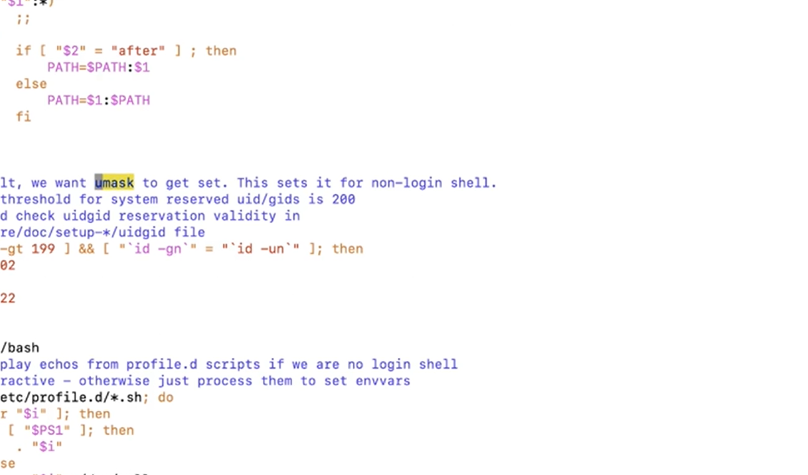

将某个用户的umask永久设置

`vim /etc/.bashrc`

加上下面的umask 这句话

```
umask 066
```

## 12 Linux文件的ACL权限背景

有一个普通文件file(`ls -l`是-打头的文件)，需要对文件进行权限设置，有3个用户,tgb,lxs,xzx。

要求：

1. tgb对file文件有rwx权限
2. lxs对file文件有rw权限
3. xzx对file文件有r权限


```
su -root
useradd tgb
useradd lxs
useradd xzx
cd /tmp/test/
ls
touch file
ls -l
```

两条命令来实现上面的需求

第一个问题：能否实现上面的需求？

第二个问题：如何实现？

chown tgb:lxs file

chmod u=rwx,g=rw,o=r file

要求：

1. tgb对file文件有rwx权限
2. lxs对file文件有rw权限
3. xzx对file文件有r权限
4. hzz对file没有任何权限

```useradd hzz```

能否实现上面的需求

现在是file要对4类人进行权限设置。用上节课学到的知识是无法实现的。

## 13 针对普通文件设置ACL权限

针对超出3类人以上的权限，我们使用文件表面的权限已经没有任何意义了。已经无法实现了。

应对类似这种非常复杂的权限问题，如何解决呢？

文件的ACL权限(Access Control List 访问控制列表)

ACL就是对访问进行控制的一张表。

文件的ACL设置可以通过ACL让指定的某个用户或用户组对某个文件设置特别的权限（后门）

文件的ACL设置可以通过ACL让hzz用户对file文件设置---权限。

要求：

1. tgb对file文件有rwx权限
2. lxs对file文件有rw权限
3. xzx对file文件有r权限
4. hzz对file没有任何权限
5. zz对file有w权限
6. zzb对file有wx权限

命令： setfacl

`setfacl`: set file acl

`setfacl -m u:hzz:--- file`

设置hzz用户对file没有任何权限

-m参数表示modify（修改）

u表示针对用户设置特殊的权限

u后面的hzz就是那个设置特殊的特殊权限的用户

hzz后面的'---'就表示针对hzz用户设置的权限

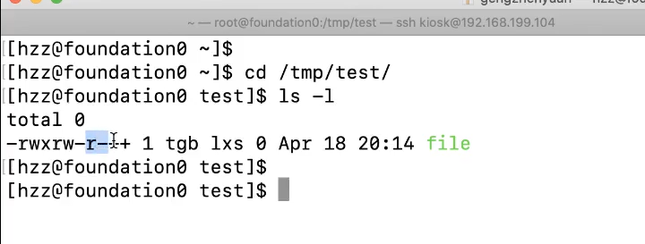

可以发现权限列后面多了一个`+`。

一旦针对文件设置了ACL权限，那么该文件的9列权限后就会变成+，此时文件表面上看到的权限不一定生效。如果要看到该文件的真实权限，需要使用getfacl来查看

`#`开头的有三列，分别表示文件的名字、拥有人、所属组。

```
#file: 文件名
#owner: 文件的拥有者
#group: 文件的所属组

前三列之后全部都是acl的表格内容。
表格的内容主要有两类，一类是user开头，一类是group开头，user开头表示针对用户，group开头表示针对用户组设置的权限，格式如下：

user:user1:rwx
user:user2:rw
group:group1:rwx
group:group2:rw

上面4行的意思是user1对该文件有rwx权限，user2对该文件有rwx权限，group2组内的用户对该文件有rw权限

```

我们能清晰的看出来，“:”将3列分隔开了，如果第二列没有值，就表示该行设置的是owner的权限。如果第1列是group，第二列没有值，就表示该行设置的是group的权限。

如果第一列是others，那么该行表示对其他人的权限，others行总在最后一行。

`setfacl -m g:hzz:r-- file`

`getfacl file`

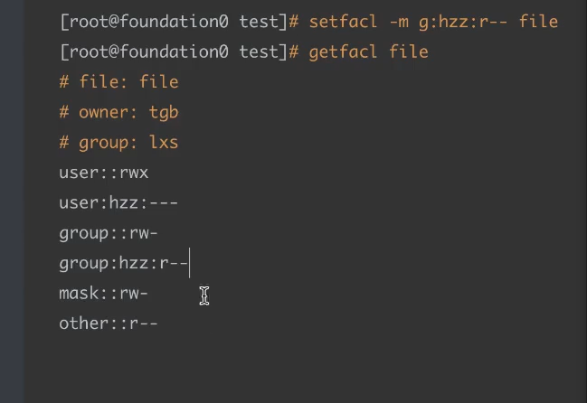

mask权限是针对目录的。

问题：hzz对这个file有什么权限？

一切的疑问，只需要使用hzz用户cat这个文件

没有权限

acl表是由上至下匹配的，匹配到之后就停止匹配。hzz匹配到第一行，接下来匹配第二行hzz，就是匹配到了，就不再进行匹配了。

ACL权限的添加、删除、修改、查看

`getfacl file`

`setfacl -h`

`setfacl -x u:hzz file`

移除掉了hzz的acl权限

`getfacl file`

`ls -l`

`setfacl -b file`

-b 删除所有扩展访问控制列表条目

针对普通文件设置acl权限就到此

## 14 针对目录文件设置ACL权限

针对目录设置acl权限意义不大。目录的权限只有三种组合才有意义。`---`，`r-x`，`rwx`。

因为普通的权限设置，只是针对3类人，恰好，目录只有三种权限有意义。那么针对三类人分别设置这3类权限就可以了。

一般我们对目录设置的acl权限和对普通文件设置的acl权限意义不一样。

我们希望对目录设置的acl权限是，当一个新的文件在目录被创建的时候，默认携带的acl权限。

对目录设置默认的acl权限

`getfacl test/`

多了一个default的行。default开头的所有字段，表示该目录下创建文件，会继承acl权限

mask表示文件acl的最大权限，在default权限存在的情况下，创建文件的acl权限，不能超过mask指定的权限。(文件拥有者的acl可以不考虑mask的影响)

`touch test/file`

`getfacl test/file`

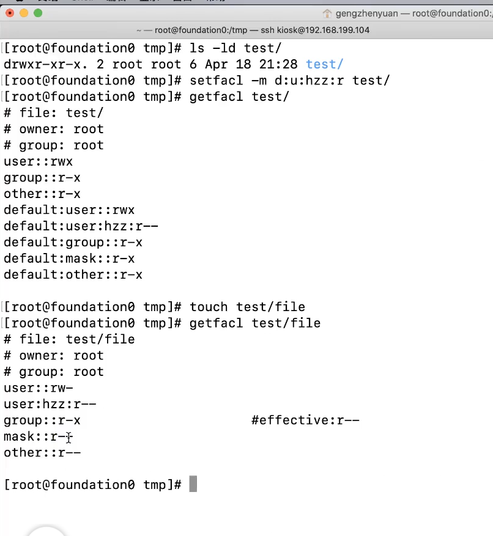

**test目录**

```
default:mask::r-x
```

**test目录下file文件**

拥有人的权限不会收到mask的影响

setfacl -m mask:r-x test/file

getfacl test/file

可以看到已经修改了file的mask权限

针对目录设置acl权限，目的不在于访问控制（庚老师不想讲这个，因为很容易混淆），而是目录创建文件的时候ACL继承。

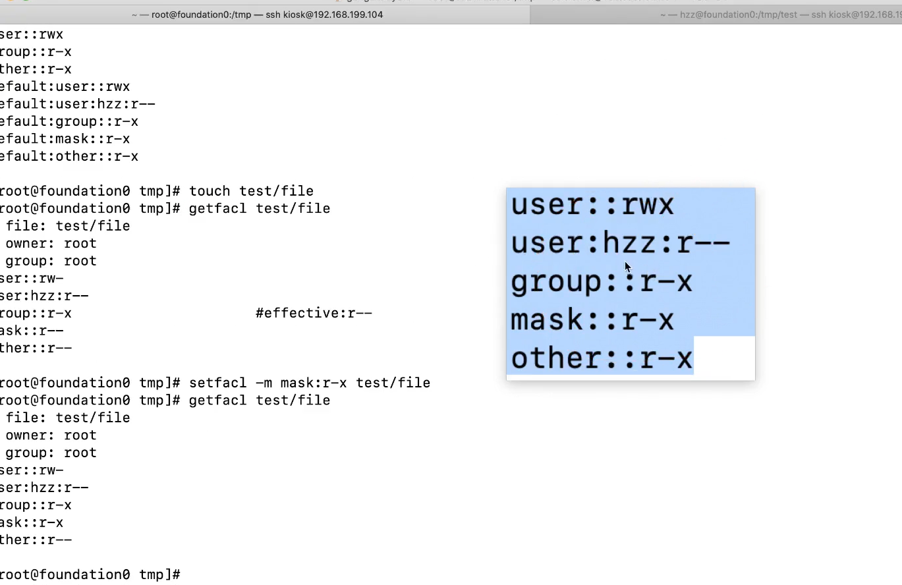

比如，在目录设置这个权限后，目录下的文件都会完全继承这个权限。但是，为什么会出现没继承的情况？

实际上是继承的。

`umask 0000`

`umask`

确认umask是`0000`

`setfacl -m d:mask:rwx test/`

`touch test/file1`

`getfacl test/file1`

（这里庚老师失误了失败了,以下重讲）

针对目录设置acl权限，要求以后在该目录创建的文件，acl权限如下：

1. 文件的拥有人有rwx权限
2. 文件的属组有rw权限
3. 文件的其他人有r权限
4. hzz没有任何权限
5. yzq对该文件有r-x权限

`setfacl -m d:user::rwx test/`

`setfacl -m d:group::rw test/`

`setfacl -m d:other::r test/`

`setfacl -m d:user:hzz:rw test/`

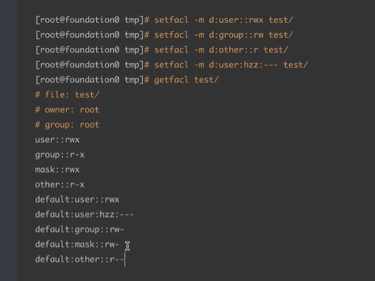

刚才的设置设置成果如上，mask不用看先

`touch test/file`

`getfacl test/`

`getfacl test/file`

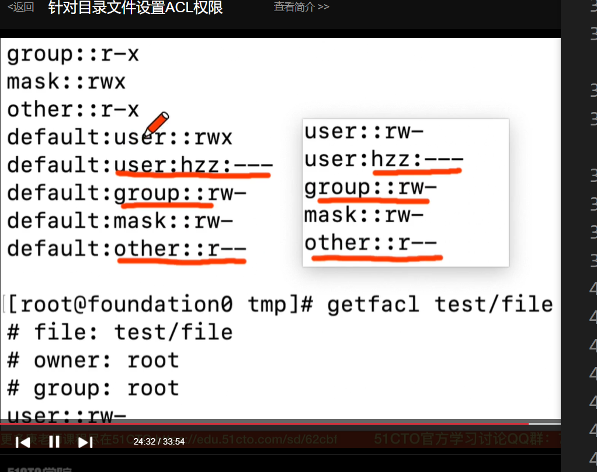

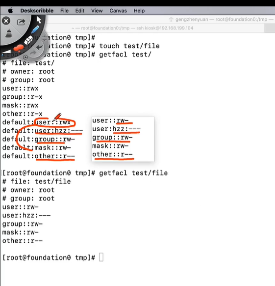

其实是集成了目录的权限，但是由于mask的权限，里面的文件权限作与运算，就少了一些

现在删除了mask权限

`setfacl -x d:mask test/`

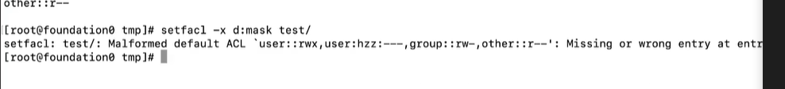

所以，目录的acl的意义，就是目录下创建新的文件后，文件会继承缺省的权限。会默认继承default的权限,但是最终的权限还取决于mask的权限


在软存储中acl的权限应用的比较广泛

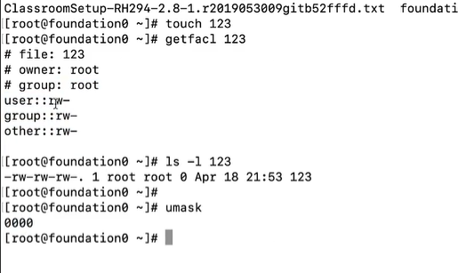

设置acl权限如上，umask设置为000。执行权限要后期去添加

创建普通文件的最大权限就是666，因为执行权限需要手动加一下。这就是菜鸡保护机制。

## 15 权限委派

生产环境必备的知识:权限委派

让普通用户能获得管理员权限的一种方式。

我们在权限委派部分只会讲/etc/sudoers文件操作，不会讲pam模块高级设计。

root用户操作

vim /etc/sudoers

sudoers文件运行特定的用户在运行某些命令的时候，能够将权限提升到root一样，甚至不需要使用root密码

`su - tgb`

现在tgb用户有点膨胀，想添加儿子用户

`useradd tgbson`

报错，许可拒绝。

`ls -l /usr/sbin/useradd`

可以看到这个命令的属主和属组都是root用户

如果希望tgb能够使用这个命令

我们进入sudoers找一行添加：

```
## Allow root to run any commands anywhere

root ALL=(ALL) ALL
tgb ALL=(ALL) ALL
```

这个文件保存退出还不行，得加上叹号强制保存退出。因为这个文件是没有写权限的，但是root什么都能做。

切换成tgb用户，发现`useradd tgbson`还是是用不了，但是实际上是可以正常使用的:`sudo useradd tgbson`

接下来系统要求输入tgb的密码，只要输入tgb的密码就可以

`echo 1 | passwd --stdin`

让tgb的密码变成`1`

`userdel tgbson`(肯定执行不力)

`sudo userdel tgbson` (可以正常执行的)

现在tgb的权限和root其实差不多，只不过tgb需要使用`sudo`来实现root的权限

权限委派是一个比较危险的功能，如下命令都可以实现

`sudo su -`（可以直接变成root用户的权限）

`sudo cd /root`

`su - tgb`

tgb用户目前唯一的缺陷就是有时候需要输入密码。

如果更改sudoers文件为:

```
tgb ALL=(ALL) NOPASSWD:ALL
```

这时候tgb都不需要输入密码就可以直接sudo加命令执行root的权限。

接下来按组来说：

```
## Allows people in group wheel to run all commands
%wheel ALL=(ALL) ALL
%tgb ALL=(ALL) ALL
```

现在不太能切入`/root`目录

`sudo cd /root`可以切入root目录，但是环境变量什么的并不是root的变量。

但是注意，本质是root执行这个目录。

sudo的底层原理是root用户代理去做事情，而不是tgb自己能做这个行为。

`sudo touch aaa`

现在ls -l看aaa文件的属主，并不是tgb，而是root。

现在把tgb废掉

```
# %user ALL=/sbin/mount /mnt/cdrom, /sbin/umount /mnt/cdrom
tgb ALL=/sbin/useradd
```

`sudo useradd tgb2`

`id tgb2`

现在tgb只能执行特定的命令`useradd`，但是不能`userdel`

`tgb ALL=(ALL) ALL`

表示tgb能在任何地方运行任何命令

`%tgb ALL=(ALL) ALL`

表示tgb用户组内用户能在任何地方运行任何命令

`tgb ALL=/sbin/useradd`

表示tgb用户只能运行useradd管理命令(阉割版的root)

`%tgb ALL=(ALL) NOPASSWD:ALL`

表示tgb用户组内的用户能在任何地方运行任何命令，且不需要输入tgb自己的密码

后面讲到ansible，所有的被管理主机都不能使用root权限操作，都需要使用普通用户提权到root来进行自动化操作。

大部分生产环境都会有个类root的用户。

# 第五模块 Linux进程管理和Linux服务管理

## 1 进程管理介绍

进程管理在Linux中的地位非常高

进程就是运行中的程序（Process）

windows安装qq

下载qq.exe的包（程序，软件），安装

把qq程序打开之后就相当于运行了qq程序，那这个运行中的程序就是进程

cpu(Centrol Processor Unit),显然cpu是处理进程的

进程会占用三类资源，cpu，memory，network

进程至少会占用cpu和内存

```
RHEL8进程

1. 进程概念
2. 进程管理
3. 进程查看
4. 终止进程
```

什么是进程

进程是一个正在执行的程序或命令，每一个进程都是一个运行的实体，都有自己的地址空间，并占用一定的系统资源。程序消耗的是磁盘资源，进程消耗的是内存和CPU资源。

进程管理的作用

（1）判断服务器的健康状态

（2）查看系统中所有进程

（3）"杀死"进程

## 2 使用ps查看当前时刻的进程状态

庚老师一般喜欢看进程的命令:

`ps aux`

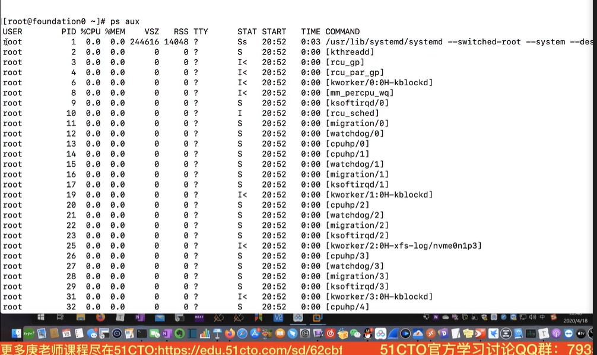

```
分析输出结果

1.USER: 该进程是由哪个用户产生的
2.PID: 进程的ID号
系统运行时间越长，会发现PID会越来越大。PID都是从小往大变的
3.%CPU: 该进程占用CPU资源的百分比，占用越高，进程越消耗资源

```
使用tgb用户 `cat /dev/zero`
切换到另一个shell `ps aux| grep tgb`

可以看到tgb运行的那个zero占用cpu可以达到7%
```

4.%MEM: 该进程占用物理内存的百分比，占用越高，进程越消耗资源
5.VSZ: 该进程占用虚拟内存的大小，单位KB
6.RSS，该进程占用实际物理内存的大小，单位KB
7.TTY： 该进程是在哪个终端中运行的。其中TTY1-TTY6代表本地控制台终端。TTY2-6是本地的字符界面终端，TTY1是图形终端，PTS/0-255代表虚拟终端。如果是"?"，则表示该进程是由内核直接产生，而不是任何的终端产生。
8.STAT： 进程状态。常见的状态有R:运行，S:睡眠，T：停止，s：包含子进程，+：位于后台
9.START: 该进程的启动时间
10.TIME: 该进程占用CPU的运算时间，注意不是系统时间
11.COMMAND:产生此进程的命令名
```

打开第二个shell使用tgb运行cat

然后回到第一个shell用ps，可以看到tgb用户一直在运行cat

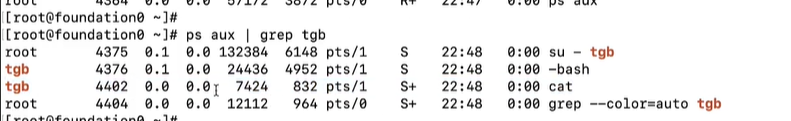

tgb运行shell，tgb运行car


## 3 使用top查看进程动态

## 4 使用pstree查看进程树

## 5 使用kill来给进程发送信号

## 6 Linux的前台进程和后台进程详解

## 7 作业调度详解

## 8 调整进程优先级

## 9 Linux服务概念介绍

## 10 SysV和system介绍

## 11 使用systemd来管理服务

## 12 使用systemd来管理target


# 计划任务

## 4-1 计划任务背景介绍

计划任务，就是有计划的任务，安装我们想按照我们的计划自动执行的任务。关键点有两个，一个是计划，一个是任务。

背景：

公司里有一个很核心的应用数据库。数据很重要，需要每天执行一次备份操作。备份需要选择在数据库的工作负载比较低的情况下。经过监控系统的数据统计，每天在凌晨2点到凌晨3点数据库的工作负载时全天最低的时间段。所以为了不影响数据库备份，需要在凌晨2、3点进行数据库备份。

如果没有计划任务（现实中当然有），那么对你们公司来说需要一个运维（至少执行备份操作的工程师）每天凌晨2点-3点蹲守在服务器面前（可以是远程）等待备份时机的来临，然后执行备份。备份成功了就下班睡觉或者开启夜生活，备份失败了，估计做什么心思都没了，会赶紧想着备份失败的原因（正常人）。如果凌晨3点还备份不了，需要等待高级的工程师在第二天检查具体问题出现在哪里。

上面的方法看起来没什么问题，但是不靠谱。所有运维轮流干都不这么做。最后这个工作被运维标记为`最不愿意干的工作`

## 4-2 一次性计划任务详解

2.1 一次性计划任务介绍

所谓一次性计划任务，就是按照计划只执行一次的任务

无论是windows还是linux都具备执行一次性计划任务的功能。

windows参考图形操作自己慢慢点。

linux中的at命令是用来创建一次性计划任务的。

at命令: 管理工具 -> 任务计划程序 -> 创建任务

at命令有个服务atd会以后台模式运行，检查当前时间来决定是否允许。atd服务会检查系统上的一个特殊目录来获取at命令的提交的`计划`，默认情况下，atd服务每60秒检查一次目录，有“计划”时，会检查“计划”运行时间，如果“计划时间”与当前时间匹配，则运行此“计划”。

`systemctl status atd`

可以看到atd是个服务一直在跑。

有一个yum仓库文件备份的脚本: `/root/backup-yum-repo.sh`

```
mkdir /opt/yum-repo-backup-dir -p
cp -r /etc/yum.repos.d/ /opt/yum-repo-backup-dir/yum.repos.d-`date "+%Y-%m-%d-%H:%M:%S"`.bak
```

使用 at 命令来执行一次性备份yum仓库文件，为了顺利的查看at的执行结果，使用下面命令来关闭ntp同步，并设置你的时间

`timedatectl set-ntp 0`

该命令关闭了ntp同步。把ntp关了，系统就不会去找时间服务器进行时间同步

`date -s "2017-12-4 18:30:50"`

关了NTP下，我们就可以自由的命令设置日期和时间

下午的5点执行命令，如果此时时间已经过了当天下午，那么顺延到第二天

```
at 5:00PM
at> /root/backup-yum-repo.sh
at> <EOT>
```
注意，这个at是个交互式的工具，一般在at里面敲的都是shell脚本文件，而不是一句一句命令敲在这里面

提交at的计划任务使用 `ctrl + D` 来提交任务（就相当于<EOT>）


## 4-3 周期性计划任务详解


